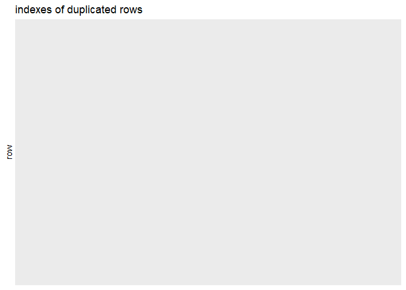

cleaning for camera data set
================

|                          |
|--------------------------|
| \#\# purpose of notebook |

-   [x] initial look at data to get a basic understanding and gather
    todos  
-   [ ] tidy up and cleaning of data set  
-   [ ] save pre-processed data set

|                   |
|-------------------|
| \#\# observations |

-   column information:

| \#  |                   Attribute                    |                                               Description                                               |
|:---:|:----------------------------------------------:|:-------------------------------------------------------------------------------------------------------:|
|  1  |                      rank                      |         numeric, ordered, unique, can serve as identifier, rank of producer according to index          |
|  2  |               polymer\_producer                |                               string, unique identifier, name of producer                               |
|  3  |                 no\_of\_assets                 |                            numeric, metric, number of assets of the producer                            |
|  4  |      production\_of\_in\_scope\_polymers       | numeric, metric in million metric tons, production of plolymers that are in-scope of preceding analysis |
|  5  | flexible\_format\_contribution\_to\_sup\_waste |           numeric, metric in million metric tons, flexible form of contribution to sup waste            |
|  6  |  rigid\_format\_contribution\_to\_sup\_waste   |             numeric, metric in million metric tons, rigid form of contribution to sup waste             |
|  7  |      total\_contribution\_to\_sup\_waste       |       numeric, metric in million metric tons, total contribution is the sum of flexible and rigid       |

-   missing values are in rows 346 and 347, we will just drop them,
    since there is no need for the dataset to be complete (actually it
    is incomplete by nature), and there are still enough observations,
    also they seem to be missing at random
-   no duplicated rows
-   no changes were made to data set
-   added a variable which gives the percentage of the sup\_waste from
    the produced polymers

|                    |
|--------------------|
| \#\# load packages |

``` r
library(tidyverse) # tidy data frame
library(lubridate) # functions to work with date-times and time-spans
library(scrubr) # like dplyr but specifically for occurrence data
```

|                  |
|------------------|
| \#\# import data |

``` r
df_raw <- read_csv(file = '../data/camera_dataset.csv')
```

    ## 
    ## -- Column specification --------------------------------------------------------
    ## cols(
    ##   Model = col_character(),
    ##   `Release date` = col_double(),
    ##   `Max resolution` = col_double(),
    ##   `Low resolution` = col_double(),
    ##   `Effective pixels` = col_double(),
    ##   `Zoom wide (W)` = col_double(),
    ##   `Zoom tele (T)` = col_double(),
    ##   `Normal focus range` = col_double(),
    ##   `Macro focus range` = col_double(),
    ##   `Storage included` = col_double(),
    ##   `Weight (inc. batteries)` = col_double(),
    ##   Dimensions = col_double(),
    ##   Price = col_double()
    ## )

``` r
df <- df_raw
```

|                         |
|-------------------------|
| \#\# first look at data |

``` r
head(df_raw, 25)
```

    ## # A tibble: 25 x 13
    ##    Model       `Release date` `Max resolution` `Low resolution` `Effective pixe~
    ##    <chr>                <dbl>            <dbl>            <dbl>            <dbl>
    ##  1 Agfa ePhot~           1997             1024              640                0
    ##  2 Agfa ePhot~           1998             1280              640                1
    ##  3 Agfa ePhot~           2000              640                0                0
    ##  4 Agfa ePhot~           1999             1152              640                0
    ##  5 Agfa ePhot~           1999             1152              640                0
    ##  6 Agfa ePhot~           2001             1600              640                1
    ##  7 Agfa ePhot~           1999             1280              640                1
    ##  8 Canon Powe~           1997              640                0                0
    ##  9 Canon Powe~           1996              832              640                0
    ## 10 Canon Powe~           2001             1280             1024                1
    ## # ... with 15 more rows, and 8 more variables: Zoom wide (W) <dbl>,
    ## #   Zoom tele (T) <dbl>, Normal focus range <dbl>, Macro focus range <dbl>,
    ## #   Storage included <dbl>, Weight (inc. batteries) <dbl>, Dimensions <dbl>,
    ## #   Price <dbl>

``` r
tail(df_raw)
```

    ## # A tibble: 6 x 13
    ##   Model       `Release date` `Max resolution` `Low resolution` `Effective pixel~
    ##   <chr>                <dbl>            <dbl>            <dbl>             <dbl>
    ## 1 Toshiba PD~           2001             1792              896                 2
    ## 2 Toshiba PD~           2001             2048             1024                 3
    ## 3 Toshiba PD~           2000             2048             1024                 3
    ## 4 Toshiba PD~           2001             2048             1024                 3
    ## 5 Toshiba PD~           2001             2400             1200                 3
    ## 6 Toshiba PD~           2002             1600              800                 1
    ## # ... with 8 more variables: Zoom wide (W) <dbl>, Zoom tele (T) <dbl>,
    ## #   Normal focus range <dbl>, Macro focus range <dbl>, Storage included <dbl>,
    ## #   Weight (inc. batteries) <dbl>, Dimensions <dbl>, Price <dbl>

``` r
summary(df_raw)
```

    ##     Model            Release date  Max resolution Low resolution
    ##  Length:1038        Min.   :1994   Min.   :   0   Min.   :   0  
    ##  Class :character   1st Qu.:2002   1st Qu.:2048   1st Qu.:1120  
    ##  Mode  :character   Median :2004   Median :2560   Median :2048  
    ##                     Mean   :2004   Mean   :2475   Mean   :1774  
    ##                     3rd Qu.:2006   3rd Qu.:3072   3rd Qu.:2560  
    ##                     Max.   :2007   Max.   :5616   Max.   :4992  
    ##                                                                 
    ##  Effective pixels Zoom wide (W)   Zoom tele (T)   Normal focus range
    ##  Min.   : 0.000   Min.   : 0.00   Min.   :  0.0   Min.   :  0.00    
    ##  1st Qu.: 3.000   1st Qu.:35.00   1st Qu.: 96.0   1st Qu.: 30.00    
    ##  Median : 4.000   Median :36.00   Median :108.0   Median : 50.00    
    ##  Mean   : 4.596   Mean   :32.96   Mean   :121.5   Mean   : 44.15    
    ##  3rd Qu.: 7.000   3rd Qu.:38.00   3rd Qu.:117.0   3rd Qu.: 60.00    
    ##  Max.   :21.000   Max.   :52.00   Max.   :518.0   Max.   :120.00    
    ##                                                                     
    ##  Macro focus range Storage included Weight (inc. batteries)   Dimensions   
    ##  Min.   : 0.000    Min.   :  0.00   Min.   :   0.0          Min.   :  0.0  
    ##  1st Qu.: 3.000    1st Qu.:  8.00   1st Qu.: 180.0          1st Qu.: 92.0  
    ##  Median : 6.000    Median : 16.00   Median : 226.0          Median :101.0  
    ##  Mean   : 7.788    Mean   : 17.45   Mean   : 319.3          Mean   :105.4  
    ##  3rd Qu.:10.000    3rd Qu.: 20.00   3rd Qu.: 350.0          3rd Qu.:115.0  
    ##  Max.   :85.000    Max.   :450.00   Max.   :1860.0          Max.   :240.0  
    ##  NA's   :1         NA's   :2        NA's   :2               NA's   :2      
    ##      Price       
    ##  Min.   :  14.0  
    ##  1st Qu.: 149.0  
    ##  Median : 199.0  
    ##  Mean   : 457.4  
    ##  3rd Qu.: 399.0  
    ##  Max.   :7999.0  
    ## 

|                     |
|---------------------|
| \#\# missing values |

missing values are in rows 346 and 347, we will just drop them, since
there is no need for the dataset to be complete (actually it is
incomplete by nature), and there are still enough observations, also
they seem to be missing at random

``` r
#create data frame with information on whether the value in each cell is missing
missing_by_column <- df_raw %>%
  is.na %>% # check is each cell is na
  as_tibble %>% # convert to data frame
  mutate(row_number = 1:nrow(.)) %>% # add a column with the row number
  gather(variable, is_missing, -row_number) # turn wide data into narrow data

# plot the missing values in our data frame
ggplot(missing_by_column, aes(x = variable, y = row_number, fill =  is_missing)) +
  geom_tile() +
  theme_minimal() +
  scale_fill_grey(name = "",
                  labels = c("present", "missing")) +
  theme(axis.text.x = element_text(angle=45, vjust=0.7, size=8)) +
  labs(x = "vairables in dataset",
       y = "rows / observations")
```

<!-- -->

``` r
# drop the rows with missing values 
df <- df[-c(346, 347), ]
```

|                      |
|----------------------|
| \#\# duplicated rows |

no duplicated rows

``` r
# get row number of duplicated rows
duplicated_rows = tibble(duplicated = duplicated(df_raw), row = 1:nrow(df_raw)) %>%
  filter(duplicated == T)

# plot duplicated rows as black lines
ggplot(duplicated_rows, aes(xintercept = row)) +
  geom_vline(aes(xintercept = row)) + # plot a black line for each duplicated row
  ggtitle("indexes of duplicated rows") + # add title
  coord_flip() + # flip x and y axis
  scale_x_reverse() # reverse x axis
```

<!-- -->

|               |
|---------------|
| \#\# cleaning |

nothing to clean

|                           |
|---------------------------|
| \#\# additional variables |

we can get the producer from the model name

|                          |
|--------------------------|
| \#\# save processed data |

no changes were made to data set
