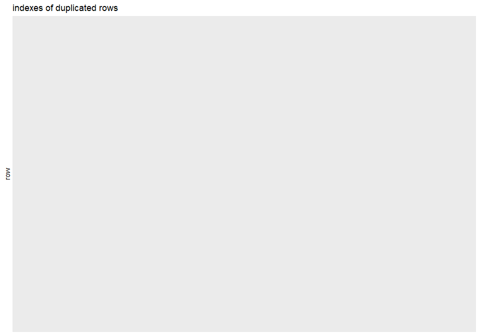

cleaning for camera data set
================

## purpose of notebook

-   [x] initial look at data to get a basic understanding and gather
    todos -&gt; df\_raw
-   [x] tidy up and cleaning of data set -&gt; df
-   [x] all processing of the data set happens here and is saved to
    pre-/processed csv-&gt; df

## observations

-   column information:

| \#  |        attribute        |                                          description & properties                                          |                     missing values                      |           dependent?            |
|:---:|:-----------------------:|:----------------------------------------------------------------------------------------------------------:|:-------------------------------------------------------:|:-------------------------------:|
|  1  |          Model          |                    brand and model of the camera, chr, unique, can serve as identifier                     |                           non                           |               no                |
|  2  |      Release date       |                          release date of camera, time series, ordered, numerical                           |                           non                           |               no                |
|  3  |     Max resolution      |               numerical, metric in number of pixel columns (width), maximal image resolution               |                       almost non                        |               no                |
|  4  |     Low resolution      |              numerical, metric in number of pixel columns (width), standard image resolution               |         some, not MAR, there is only max option         |  yes, capped by max resolution  |
|  5  |    Effective pixels     | numerical, metric in megapixels, arbitrarily rounded, count of image pixel contributing to the final image |                           no                            | yes, directly by max resolution |
|  6  |      Zoom wide (W)      |            numerical, metric in mm, focal lengths that create a wide field of view beyond 35mm             | some, not MAR, professional cameras don’t include lens  |          yes, by lens           |
|  7  |      Zoom tele (T)      |           numerical, metric in mm, focal lengths that create a narrow field of view beyond 80mm            | some, not MAR, professional cameras don’t include lens  |          yes, by lens           |
|  8  |   Normal focus range    |         numerical, metric in mm, minimum distance at which focus can be obtained, feature of lens          | some, some MAR, professional cameras don’t include lens |          yes, by lens           |
|  9  |    Macro focus range    |         numerical, metric in mm, reduced focus range (or working range) to focus on close objects          | some, some MAR, professional cameras don’t include lens |          yes, by lens           |
| 10  |    Storage included     |                         numerical, metric in megabyte, storage of included SD-card                         |        a few, not MAR, SD-card just not included        |               no                |
| 11  | Weight (inc. batteries) |                      numerical, metric in g, weight of the camera including batteries                      |                       a few, MAR                        |               no                |
| 12  |       Dimensions        |                          numerical, metric in mm, width of the camera dimensions                           |                       a few, MAR                        |               no                |
| 13  |          Price          |                         numerical, metric in unknown currency, price when released                         |                           non                           |               no                |

-   missing values with NA are in rows 346 and 347, but there are a lot
    more 0 which are mostly not missing at random (MAR), but some times
    they do, later we will replace the 0 with NA, but for investigation
    not drop or impute them
-   no duplicated rows
-   cleaning:
    -   replace 0 with NA, since these entries would disturb the picture
        of the data set otherwise, except for Effective pixels column
    -   get clean column names with janitor package, without () and
        white space
    -   column Model serves as unique identifier, and thus can be set as
        row name (number)
-   added variables:
    -   we can get the brand from the model name as a new variable
        (categorical, no order)

## load packages

``` r
library(tidyverse) # tidy data frame
library(lubridate) # functions to work with date-times and time-spans
library(scrubr) # like dplyr but specifically for occurrence data
library(janitor) # expedite the initial data exploration and cleaning that comes with any new data set
```

## import data

``` r
df_raw <- read_csv(file = '../data/camera_dataset.csv')
```

    ## 
    ## -- Column specification --------------------------------------------------------
    ## cols(
    ##   Model = col_character(),
    ##   `Release date` = col_double(),
    ##   `Max resolution` = col_double(),
    ##   `Low resolution` = col_double(),
    ##   `Effective pixels` = col_double(),
    ##   `Zoom wide (W)` = col_double(),
    ##   `Zoom tele (T)` = col_double(),
    ##   `Normal focus range` = col_double(),
    ##   `Macro focus range` = col_double(),
    ##   `Storage included` = col_double(),
    ##   `Weight (inc. batteries)` = col_double(),
    ##   Dimensions = col_double(),
    ##   Price = col_double()
    ## )

``` r
df <- df_raw
```

## first look at data

``` r
head(df_raw, 25)
```

    ## # A tibble: 25 x 13
    ##    Model       `Release date` `Max resolution` `Low resolution` `Effective pixe~
    ##    <chr>                <dbl>            <dbl>            <dbl>            <dbl>
    ##  1 Agfa ePhot~           1997             1024              640                0
    ##  2 Agfa ePhot~           1998             1280              640                1
    ##  3 Agfa ePhot~           2000              640                0                0
    ##  4 Agfa ePhot~           1999             1152              640                0
    ##  5 Agfa ePhot~           1999             1152              640                0
    ##  6 Agfa ePhot~           2001             1600              640                1
    ##  7 Agfa ePhot~           1999             1280              640                1
    ##  8 Canon Powe~           1997              640                0                0
    ##  9 Canon Powe~           1996              832              640                0
    ## 10 Canon Powe~           2001             1280             1024                1
    ## # ... with 15 more rows, and 8 more variables: Zoom wide (W) <dbl>,
    ## #   Zoom tele (T) <dbl>, Normal focus range <dbl>, Macro focus range <dbl>,
    ## #   Storage included <dbl>, Weight (inc. batteries) <dbl>, Dimensions <dbl>,
    ## #   Price <dbl>

``` r
tail(df_raw)
```

    ## # A tibble: 6 x 13
    ##   Model       `Release date` `Max resolution` `Low resolution` `Effective pixel~
    ##   <chr>                <dbl>            <dbl>            <dbl>             <dbl>
    ## 1 Toshiba PD~           2001             1792              896                 2
    ## 2 Toshiba PD~           2001             2048             1024                 3
    ## 3 Toshiba PD~           2000             2048             1024                 3
    ## 4 Toshiba PD~           2001             2048             1024                 3
    ## 5 Toshiba PD~           2001             2400             1200                 3
    ## 6 Toshiba PD~           2002             1600              800                 1
    ## # ... with 8 more variables: Zoom wide (W) <dbl>, Zoom tele (T) <dbl>,
    ## #   Normal focus range <dbl>, Macro focus range <dbl>, Storage included <dbl>,
    ## #   Weight (inc. batteries) <dbl>, Dimensions <dbl>, Price <dbl>

``` r
summary(df_raw)
```

    ##     Model            Release date  Max resolution Low resolution
    ##  Length:1038        Min.   :1994   Min.   :   0   Min.   :   0  
    ##  Class :character   1st Qu.:2002   1st Qu.:2048   1st Qu.:1120  
    ##  Mode  :character   Median :2004   Median :2560   Median :2048  
    ##                     Mean   :2004   Mean   :2475   Mean   :1774  
    ##                     3rd Qu.:2006   3rd Qu.:3072   3rd Qu.:2560  
    ##                     Max.   :2007   Max.   :5616   Max.   :4992  
    ##                                                                 
    ##  Effective pixels Zoom wide (W)   Zoom tele (T)   Normal focus range
    ##  Min.   : 0.000   Min.   : 0.00   Min.   :  0.0   Min.   :  0.00    
    ##  1st Qu.: 3.000   1st Qu.:35.00   1st Qu.: 96.0   1st Qu.: 30.00    
    ##  Median : 4.000   Median :36.00   Median :108.0   Median : 50.00    
    ##  Mean   : 4.596   Mean   :32.96   Mean   :121.5   Mean   : 44.15    
    ##  3rd Qu.: 7.000   3rd Qu.:38.00   3rd Qu.:117.0   3rd Qu.: 60.00    
    ##  Max.   :21.000   Max.   :52.00   Max.   :518.0   Max.   :120.00    
    ##                                                                     
    ##  Macro focus range Storage included Weight (inc. batteries)   Dimensions   
    ##  Min.   : 0.000    Min.   :  0.00   Min.   :   0.0          Min.   :  0.0  
    ##  1st Qu.: 3.000    1st Qu.:  8.00   1st Qu.: 180.0          1st Qu.: 92.0  
    ##  Median : 6.000    Median : 16.00   Median : 226.0          Median :101.0  
    ##  Mean   : 7.788    Mean   : 17.45   Mean   : 319.3          Mean   :105.4  
    ##  3rd Qu.:10.000    3rd Qu.: 20.00   3rd Qu.: 350.0          3rd Qu.:115.0  
    ##  Max.   :85.000    Max.   :450.00   Max.   :1860.0          Max.   :240.0  
    ##  NA's   :1         NA's   :2        NA's   :2               NA's   :2      
    ##      Price       
    ##  Min.   :  14.0  
    ##  1st Qu.: 149.0  
    ##  Median : 199.0  
    ##  Mean   : 457.4  
    ##  3rd Qu.: 399.0  
    ##  Max.   :7999.0  
    ## 

## missing values

missing values with NA are in rows 346 and 347, but there are a lot more
0 which are mostly not missing at random (MAR), but some times they do,
later we will replace the 0 with NA, but for investigation not drop or
impute them

``` r
#create data frame with information on whether the value in each cell is zero
tmp_df <- df_raw == 0
missing_by_column <- tmp_df %>%
  as_tibble %>% # convert to data frame
  mutate(row_number = 1:nrow(.)) %>% # add a column with the row number
  gather(variable, is_missing, -row_number) # turn wide data into narrow data

# plot the missing values in our data frame
ggplot(missing_by_column, aes(x = variable, y = row_number, fill =  is_missing)) +
  geom_tile() +
  theme_minimal() +
  scale_fill_grey(name = "",
                  labels = c("present", "is zero", "is NA")) +
  theme(axis.text.x = element_text(angle=45, vjust=0.7, size=12)) +
  labs(x = "vairables in dataset",
       y = "rows / observations")
```

<!-- -->

## duplicated rows

no duplicated rows

``` r
# get row number of duplicated rows
duplicated_rows <- tibble(duplicated = duplicated(df_raw), row = 1:nrow(df_raw)) %>%
  filter(duplicated == T)

# plot duplicated rows as black lines
ggplot(duplicated_rows, aes(xintercept = row)) +
  geom_vline(aes(xintercept = row)) + # plot a black line for each duplicated row
  ggtitle("indexes of duplicated rows") + # add title
  coord_flip() + # flip x and y axis
  scale_x_reverse() # reverse x axis
```

<!-- -->

## cleaning

replace 0 with NA, since these entries would disturb the picture of the
data set otherwise, except for Effective pixels column  
get clean column names with janitor package, without () and white
space  
column Model serves as unique identifier, and thus can be set as row
name (number)

``` r
df[df == 0] <- NA # replace all 0 with NA

df <- df %>%
  mutate(`Effective pixels` = df_raw$`Effective pixels`) %>% # bring back the zeros for Effective pixels column
  clean_names() %>% # get clean column names with janitor package
  column_to_rownames(var = 'model') # set model columns as the row name
```

## additional variables

we can get the brand from the model name as a new variable (categorical,
no order)

``` r
df <- df %>%
  mutate(brand = str_extract(df_raw$Model,"(\\w+)")) %>% # extract the first word of the model column, since this is the brand
  relocate(brand) # relocate the brand column at the first position in the df
```

``` r
# check results from cleaning and added variables
head(df)
```

    ##                        brand release_date max_resolution low_resolution
    ## Agfa ePhoto 1280        Agfa         1997           1024            640
    ## Agfa ePhoto 1680        Agfa         1998           1280            640
    ## Agfa ePhoto CL18        Agfa         2000            640             NA
    ## Agfa ePhoto CL30        Agfa         1999           1152            640
    ## Agfa ePhoto CL30 Clik!  Agfa         1999           1152            640
    ## Agfa ePhoto CL45        Agfa         2001           1600            640
    ##                        effective_pixels zoom_wide_w zoom_tele_t
    ## Agfa ePhoto 1280                      0          38         114
    ## Agfa ePhoto 1680                      1          38         114
    ## Agfa ePhoto CL18                      0          45          45
    ## Agfa ePhoto CL30                      0          35          35
    ## Agfa ePhoto CL30 Clik!                0          43          43
    ## Agfa ePhoto CL45                      1          51          51
    ##                        normal_focus_range macro_focus_range storage_included
    ## Agfa ePhoto 1280                       70                40                4
    ## Agfa ePhoto 1680                       50                NA                4
    ## Agfa ePhoto CL18                       NA                NA                2
    ## Agfa ePhoto CL30                       NA                NA                4
    ## Agfa ePhoto CL30 Clik!                 50                NA               40
    ## Agfa ePhoto CL45                       50                20                8
    ##                        weight_inc_batteries dimensions price
    ## Agfa ePhoto 1280                        420         95   179
    ## Agfa ePhoto 1680                        420        158   179
    ## Agfa ePhoto CL18                         NA         NA   179
    ## Agfa ePhoto CL30                         NA         NA   269
    ## Agfa ePhoto CL30 Clik!                  300        128  1299
    ## Agfa ePhoto CL45                        270        119   179

## save processed data

``` r
df %>% rownames_to_column(var = 'model') %>% write_csv(file = '../data/camera_dataset_processed.csv')
```
