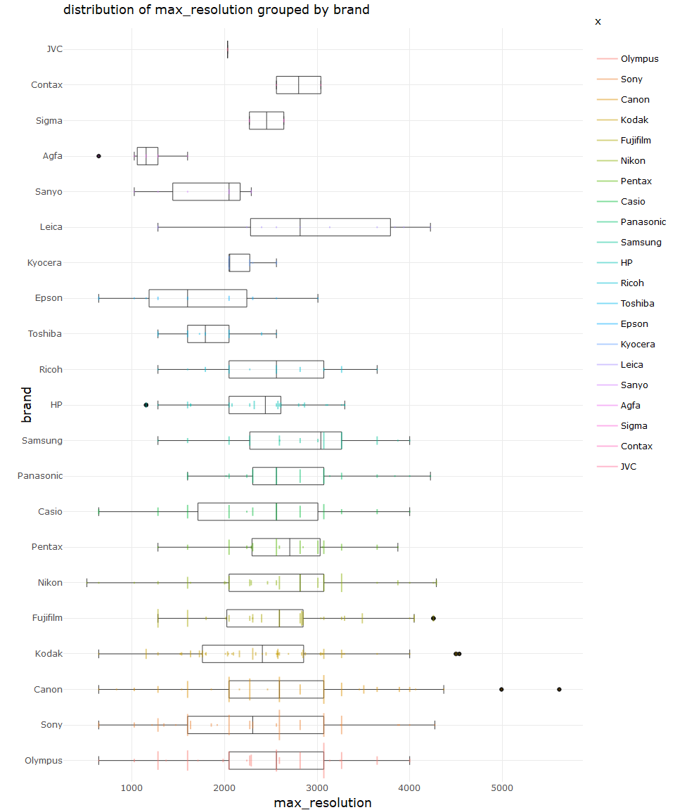
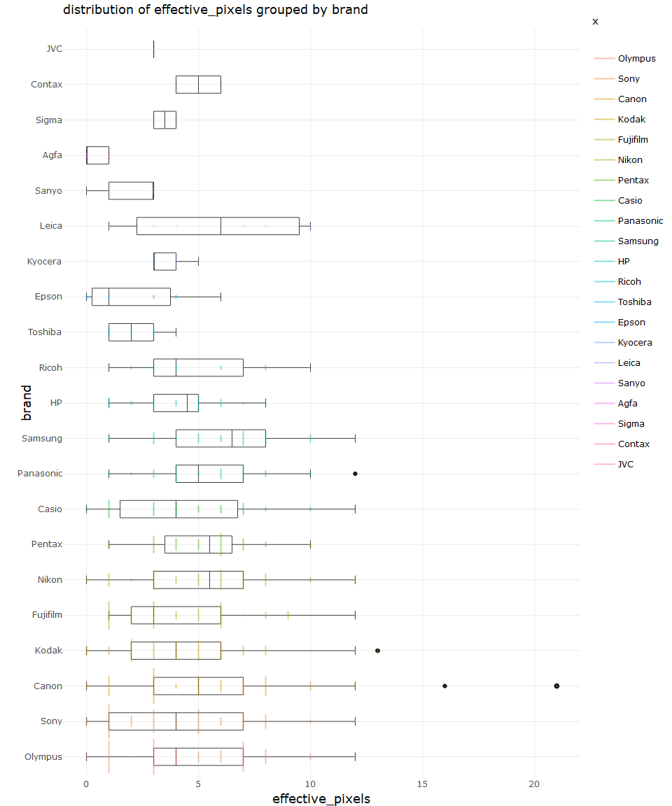
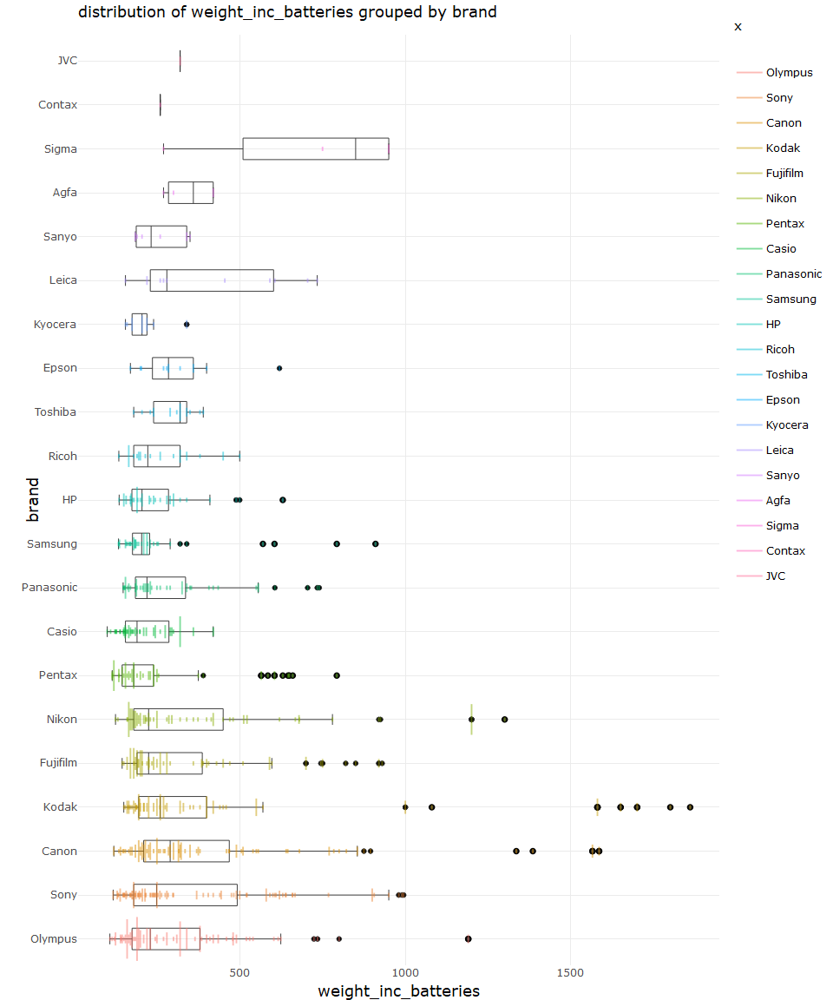

describe univariate for camera data set
================
Sascha Siegmund
2021-07-31

## purpose of notebook

-   [ ] describe & visualize relationship between variables
    (multivariate)
-   [ ] gather interesting observations for further investigation
-   [ ] gather possible new features for extraction

## insights

-   

## load packages

``` r
library(tidyverse) # tidy data frame
library(ggthemes) # for extra plot themes
library(plotly) # make ggplots interactive
```

## import data

``` r
df <- read_csv(file = '../data/camera_dataset_processed.csv') %>% column_to_rownames(var = 'model')
```

## overview

``` r
head(df)
```

    ##                        brand release_date max_resolution low_resolution
    ## Agfa ePhoto 1280        Agfa         1997           1024            640
    ## Agfa ePhoto 1680        Agfa         1998           1280            640
    ## Agfa ePhoto CL18        Agfa         2000            640             NA
    ## Agfa ePhoto CL30        Agfa         1999           1152            640
    ## Agfa ePhoto CL30 Clik!  Agfa         1999           1152            640
    ## Agfa ePhoto CL45        Agfa         2001           1600            640
    ##                        effective_pixels zoom_wide_w zoom_tele_t
    ## Agfa ePhoto 1280                      0          38         114
    ## Agfa ePhoto 1680                      1          38         114
    ## Agfa ePhoto CL18                      0          45          45
    ## Agfa ePhoto CL30                      0          35          35
    ## Agfa ePhoto CL30 Clik!                0          43          43
    ## Agfa ePhoto CL45                      1          51          51
    ##                        normal_focus_range macro_focus_range storage_included
    ## Agfa ePhoto 1280                       70                40                4
    ## Agfa ePhoto 1680                       50                NA                4
    ## Agfa ePhoto CL18                       NA                NA                2
    ## Agfa ePhoto CL30                       NA                NA                4
    ## Agfa ePhoto CL30 Clik!                 50                NA               40
    ## Agfa ePhoto CL45                       50                20                8
    ##                        weight_inc_batteries dimensions price
    ## Agfa ePhoto 1280                        420         95   179
    ## Agfa ePhoto 1680                        420        158   179
    ## Agfa ePhoto CL18                         NA         NA   179
    ## Agfa ePhoto CL30                         NA         NA   269
    ## Agfa ePhoto CL30 Clik!                  300        128  1299
    ## Agfa ePhoto CL45                        270        119   179

``` r
summary(df)
```

    ##     brand            release_date  max_resolution low_resolution
    ##  Length:1038        Min.   :1994   Min.   : 512   Min.   : 320  
    ##  Class :character   1st Qu.:2002   1st Qu.:2048   1st Qu.:1280  
    ##  Mode  :character   Median :2004   Median :2560   Median :2048  
    ##                     Mean   :2004   Mean   :2477   Mean   :1871  
    ##                     3rd Qu.:2006   3rd Qu.:3072   3rd Qu.:2560  
    ##                     Max.   :2007   Max.   :5616   Max.   :4992  
    ##                                    NA's   :1      NA's   :54    
    ##  effective_pixels  zoom_wide_w    zoom_tele_t    normal_focus_range
    ##  Min.   : 0.000   Min.   :23.0   Min.   : 28.0   Min.   :  1.00    
    ##  1st Qu.: 3.000   1st Qu.:35.0   1st Qu.:102.0   1st Qu.: 40.00    
    ##  Median : 4.000   Median :36.0   Median :111.0   Median : 50.00    
    ##  Mean   : 4.596   Mean   :35.9   Mean   :132.4   Mean   : 50.86    
    ##  3rd Qu.: 7.000   3rd Qu.:38.0   3rd Qu.:117.0   3rd Qu.: 60.00    
    ##  Max.   :21.000   Max.   :52.0   Max.   :518.0   Max.   :120.00    
    ##                   NA's   :85     NA's   :85      NA's   :137       
    ##  macro_focus_range storage_included weight_inc_batteries   dimensions   
    ##  Min.   : 1.000    Min.   :  1.0    Min.   : 100.0       Min.   : 30.0  
    ##  1st Qu.: 4.000    1st Qu.:  8.0    1st Qu.: 180.0       1st Qu.: 92.0  
    ##  Median : 7.000    Median : 16.0    Median : 230.0       Median :102.0  
    ##  Mean   : 8.875    Mean   : 19.8    Mean   : 325.9       Mean   :106.8  
    ##  3rd Qu.:10.000    3rd Qu.: 24.0    3rd Qu.: 350.0       3rd Qu.:116.0  
    ##  Max.   :85.000    Max.   :450.0    Max.   :1860.0       Max.   :240.0  
    ##  NA's   :128       NA's   :125      NA's   :23           NA's   :16     
    ##      price       
    ##  Min.   :  14.0  
    ##  1st Qu.: 149.0  
    ##  Median : 199.0  
    ##  Mean   : 457.4  
    ##  3rd Qu.: 399.0  
    ##  Max.   :7999.0  
    ## 

## bivariate numeric max\_resolution over categorical brand

-   

``` r
# two variables, continuous/discrete x, categorical y, show trend and distribution
name = c('max_resolution', 'brand')
tmp_df <- df %>% rename(x = brand, y = max_resolution) %>% select(x, y) %>% mutate(x = fct_infreq(x))

p1 <- tmp_df %>%
  ggplot(aes(x = x, y = y)) +
    # geom_jitter(aes(color = x), alpha = I(0.5), width = 0.2, height = 0.1) + # for continuous x
    geom_count(aes(color = x), alpha = I(0.5)) +  # for discrete x
    geom_boxplot(fill=NA, lwd = 0.25) +
    coord_flip() +
    theme_minimal() +
    ggtitle(paste("distribution of", name[1], "grouped by", name[2], sep=" ")) 
fig <- ggplotly(p1) %>% layout(xaxis = list(title = name[1]), yaxis = list(title = name[2]))

fig
```

<!-- -->

``` r
# two variables, continuous/discrete x, categorical y, show trend and distribution
name = c('max_resolution', 'brand')
tmp_df <- df %>% rename(x = brand, y = max_resolution) %>% select(x, y) %>% mutate(x = fct_infreq(x)) %>% 
  add_count(x, y)

p1 <- tmp_df %>%
  ggplot(aes(x = x, y = y)) +
    geom_boxplot(fill=NA, lwd = 0.25) +
    geom_spoke(aes(x = as.numeric(x) + n/max(tmp_df$n)/2, radius = n/max(tmp_df$n), angle = pi, color = x),
               alpha = I(0.5), lwd = 1, stat = "unique") +  # y = 0, radius = n for one-sided spoke plot
    coord_flip() +
    theme_minimal() +
    ggtitle(paste("distribution of", name[1], "grouped by", name[2], sep=" ")) 
fig <- ggplotly(p1) %>% layout(xaxis = list(title = name[1]), yaxis = list(title = name[2]))

fig
```

<!-- -->

## bivariate numeric effective\_pixels over categorical brand

-   

``` r
# two variables, continuous x, categorical y, show trend and distribution
name = c('effective_pixels', 'brand')
tmp_df <- df %>% rename(x = brand, y = effective_pixels) %>% select(x, y) %>% mutate(x = fct_infreq(x))

p1 <- tmp_df %>%
  ggplot(aes(x = x, y = y)) +
    # geom_jitter(aes(color = x), alpha = I(0.5), width = 0.2, height = 0.1) + # for continuous x
    geom_count(aes(color = x), alpha = I(0.5)) +  # for discrete x
    geom_boxplot(fill=NA, lwd = 0.25) +
    coord_flip() +
    theme_minimal() +
    ggtitle(paste("distribution of", name[1], "grouped by", name[2], sep=" ")) 
fig <- ggplotly(p1) %>% layout(xaxis = list(title = name[1]), yaxis = list(title = name[2]))

fig
```

<!-- -->

``` r
# two variables, continuous/discrete x, categorical y, show trend and distribution
name = c('effective_pixels', 'brand')
tmp_df <- df %>% rename(x = brand, y = effective_pixels) %>% select(x, y) %>% mutate(x = fct_infreq(x)) %>% 
  add_count(x, y)

p1 <- tmp_df %>%
  ggplot(aes(x = x, y = y)) +
    geom_boxplot(fill=NA, lwd = 0.25) +
    geom_spoke(aes(x = as.numeric(x) + n/max(tmp_df$n)/2, radius = n/max(tmp_df$n), angle = pi, color = x),
               alpha = I(0.5), lwd = 1, stat = "unique") +  # y = 0, radius = n for one-sided spoke plot
    coord_flip() +
    theme_minimal() +
    ggtitle(paste("distribution of", name[1], "grouped by", name[2], sep=" ")) 
fig <- ggplotly(p1) %>% layout(xaxis = list(title = name[1]), yaxis = list(title = name[2]))

fig
```

<!-- -->

## bivariate numeric weight\_inc\_batteries over categorical brand

-   

``` r
# two variables, continuous/discrete x, categorical y, show trend and distribution
name = c('weight_inc_batteries', 'brand')
tmp_df <- df %>% rename(x = brand, y = weight_inc_batteries) %>% select(x, y) %>% mutate(x = fct_infreq(x))

p1 <- tmp_df %>%
  ggplot(aes(x = x, y = y)) +
    # geom_jitter(aes(color = x), alpha = I(0.5), width = 0.2, height = 0.1) + # for continuous x
    geom_count(aes(color = x), alpha = I(0.5)) +  # for discrete x
    geom_boxplot(fill=NA, lwd = 0.25) +
    coord_flip() +
    theme_minimal() +
    ggtitle(paste("distribution of", name[1], "grouped by", name[2], sep=" ")) 
fig <- ggplotly(p1) %>% layout(xaxis = list(title = name[1]), yaxis = list(title = name[2]))

fig
```

<!-- -->

``` r
# two variables, continuous/discrete x, categorical y, show trend and distribution
name = c('weight_inc_batteries', 'brand')
tmp_df <- df %>% rename(x = brand, y = weight_inc_batteries) %>% select(x, y) %>% mutate(x = fct_infreq(x)) %>% 
  add_count(x, y)

p1 <- tmp_df %>%
  ggplot(aes(x = x, y = y)) +
    geom_boxplot(fill=NA, lwd = 0.25) +
    geom_spoke(aes(x = as.numeric(x) + n/max(tmp_df$n)/2, radius = n/max(tmp_df$n), angle = pi, color = x),
               alpha = I(0.5), lwd = 1, stat = "unique") +  # y = 0, radius = n for one-sided spoke plot
    coord_flip() +
    theme_minimal() +
    ggtitle(paste("distribution of", name[1], "grouped by", name[2], sep=" ")) 
fig <- ggplotly(p1) %>% layout(xaxis = list(title = name[1]), yaxis = list(title = name[2]))

fig
```

<!-- -->

## bivariate numeric price over categorical brand

-   

``` r
# two variables, continuous/discrete x, categorical y, show trend and distribution
name = c('price', 'brand')
tmp_df <- df %>% rename(x = brand, y = price) %>% select(x, y) %>% mutate(x = fct_infreq(x))

p1 <- tmp_df %>%
  ggplot(aes(x = x, y = y)) +
    # geom_jitter(aes(color = x), alpha = I(0.5), width = 0.2, height = 0.1) + # for continuous x
    geom_count(aes(color = x), alpha = I(0.5)) +  # for discrete x
    geom_boxplot(fill=NA, lwd = 0.25) +
    coord_flip() +
    theme_minimal() +
    ggtitle(paste("distribution of", name[1], "grouped by", name[2], sep=" ")) 
fig <- ggplotly(p1) %>% layout(xaxis = list(title = name[1]), yaxis = list(title = name[2]))

fig
```

<!-- -->

``` r
# two variables, continuous/discrete x, categorical y, show trend and distribution
name = c('price', 'brand')
tmp_df <- df %>% rename(x = brand, y = price) %>% select(x, y) %>% mutate(x = fct_infreq(x)) %>% 
  add_count(x, y)

p1 <- tmp_df %>%
  ggplot(aes(x = x, y = y)) +
    geom_boxplot(fill=NA, lwd = 0.25) +
    geom_spoke(aes(x = as.numeric(x) + n/max(tmp_df$n)/2, radius = n/max(tmp_df$n), angle = pi, color = x),
               alpha = I(0.5), lwd = 1, stat = "unique") +  # y = 0, radius = n for one-sided spoke plot
    coord_flip() +
    theme_minimal() +
    ggtitle(paste("distribution of", name[1], "grouped by", name[2], sep=" ")) 
fig <- ggplotly(p1) %>% layout(xaxis = list(title = name[1]), yaxis = list(title = name[2]))

fig
```

<!-- -->

## bivariate numeric … over numeric …

-   

``` r
# # two variables, continuous x, continuous y, show trend and distribution
# name = c('rank', 'no_of_assets')
# df <- plastic %>% rename(x = rank, y = no_of_assets) %>% select(x, y) %>% mutate(x = -x) # x = -x to show rank as increasing from low to high 
# 
# # https://ggplot2.tidyverse.org/reference/geom_smooth.html
# point_plot <- df %>%
#   ggplot(aes(x = x, y = y)) +
#     # geom_jitter(alpha = 0.5, size = 1) +
#     geom_rug(alpha = 0.5) + # two 1d marginal distributions, display individual cases so are best used with smaller datasets
#     geom_density_2d(alpha = 0.2, bins = 4) +# 2D kernel density estimation using MASS::kde2d() and display the results with contours
#     geom_smooth(fill = "grey90") + # aids the eye in seeing patterns in the presence of overplotting
#     geom_point(alpha = 0.75) + # point geom is used to create scatterplots
#     theme_minimal() +
#     ggtitle(paste("trend of", name[2], "over", name[1], sep=" ")) 
# point_plot <- ggplotly(point_plot) %>% layout(xaxis = list(showticklabels = FALSE))
# 
# x_density_plot <- df %>%
#   ggplot(aes(x = x)) +
#     stat_density(geom="line") + # draws kernel density estimate, which is a smoothed version of the histogram
#     # geom_histogram(binwidth = 1) +
#     theme_minimal() 
# x_density_plot <- ggplotly(x_density_plot) %>% layout(yaxis = list(showticklabels = FALSE, showgrid = FALSE), xaxis = list(showticklabels = FALSE, showgrid = FALSE))
# 
# y_density_plot <- df %>%
#   ggplot(aes(x = y)) +
#     stat_density(geom="line") + # draws kernel density estimate, which is a smoothed version of the histogram
#     # geom_histogram(binwidth = 1) +
#     coord_flip() +
#     theme_minimal() 
# y_density_plot <- ggplotly(y_density_plot) %>% layout(yaxis = list(showticklabels = FALSE, showgrid = FALSE), xaxis = list(showticklabels = FALSE, showgrid = FALSE))
# 
# # https://ggplot2.tidyverse.org/reference/geom_quantile.html
# qualtile_plot <- df %>%
#   ggplot(aes(x = x, y = y)) +
#     geom_quantile(alpha = 0.8) + # fits a quantile regression to the data and draws the fitted quantiles with lines
#     theme_minimal() 
# qualtile_plot <- ggplotly(qualtile_plot) %>% layout(yaxis = list(showticklabels = FALSE, showgrid = FALSE))
# 
# # merge figures into one plot, via subplots, https://plotly-r.com/arranging-views.html
# sub1 <- subplot(x_density_plot, plotly_empty(), point_plot, y_density_plot, nrows = 2, margin = 0, heights = c(0.15, 0.85), widths = c(0.9, 0.1), shareX = TRUE, shareY = TRUE, titleX = FALSE, titleY = FALSE) %>% layout()
# sub2 <- subplot(qualtile_plot, plotly_empty(), margin = 0, widths = c(0.9, 0.1), titleX = FALSE, titleY = FALSE) %>% layout()
# fig <- subplot(sub1, sub2, nrows = 2, margin = 0, heights = c(0.8, 0.2), shareX = TRUE) %>% layout(xaxis = list(title = name[1]), yaxis = list(title = name[2]))
#   
# fig
```
