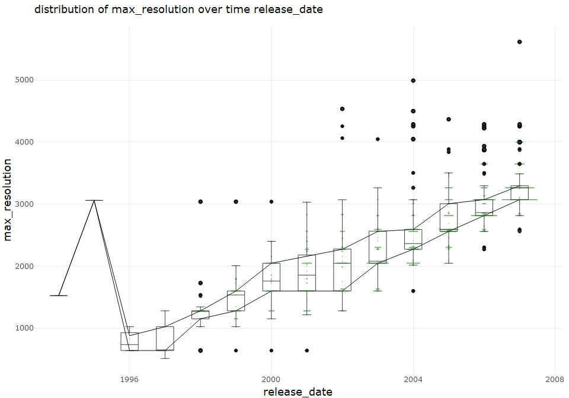
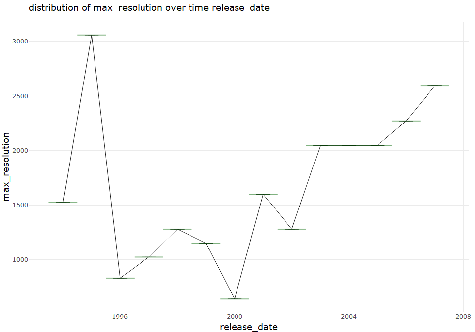
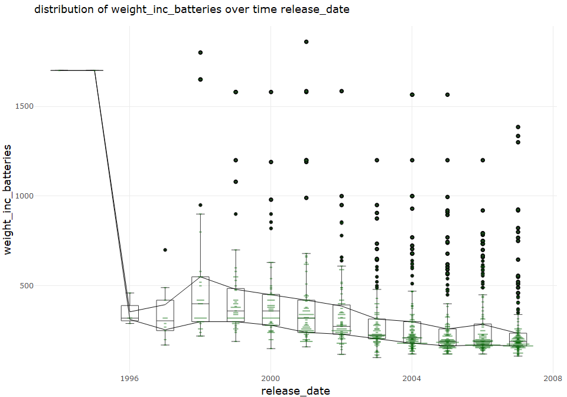
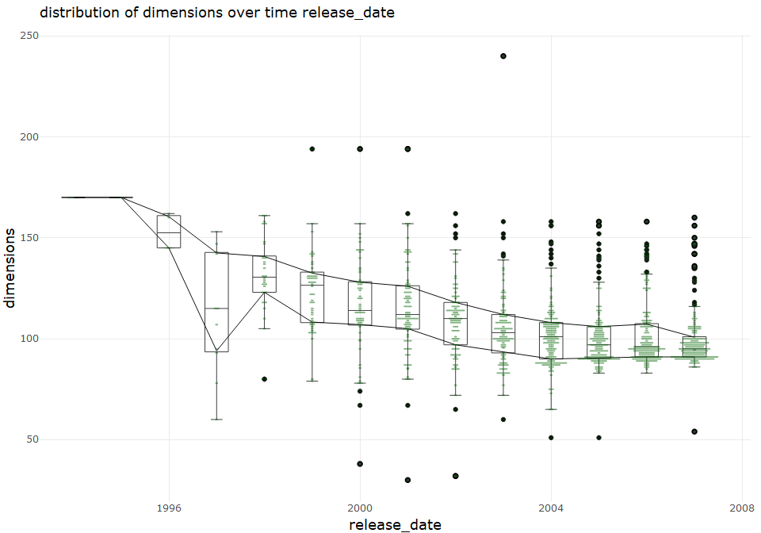
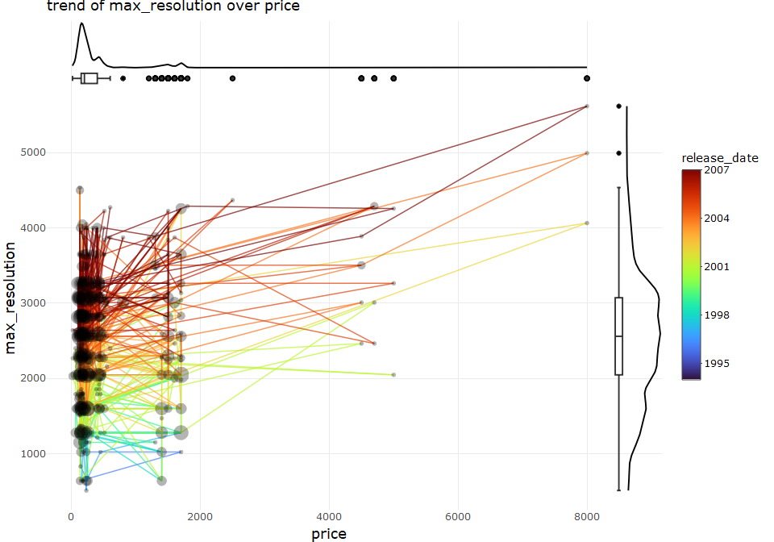
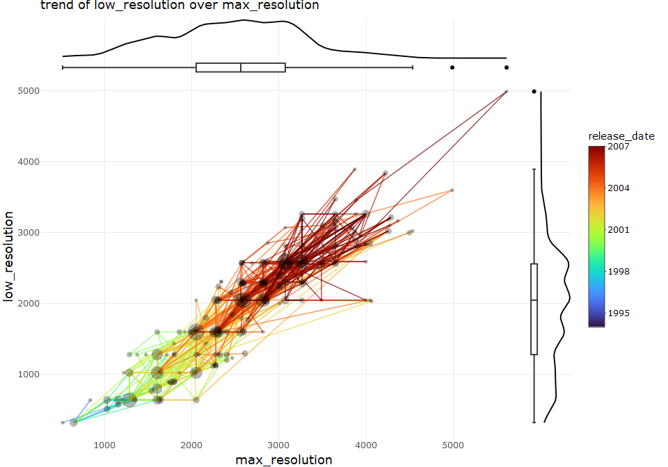

describe univariate for camera data set
================
Sascha Siegmund
2021-08-01

## purpose of notebook

-   [ ] describe & visualize relationship between variables, one of them
    time-like
-   [ ] gather interesting observations for further investigation
-   [ ] gather possible new features for extraction

## insights

-   

## load packages

``` r
library(tidyverse) # tidy data frame
library(ggthemes) # for extra plot themes
library(plotly) # make ggplots interactive
```

## import data

``` r
df <- read_csv(file = '../data/camera_dataset_processed.csv') %>% column_to_rownames(var = 'model')
```

## overview

``` r
head(df)
```

    ##                        brand release_date max_resolution low_resolution
    ## Agfa ePhoto 1280        Agfa         1997           1024            640
    ## Agfa ePhoto 1680        Agfa         1998           1280            640
    ## Agfa ePhoto CL18        Agfa         2000            640             NA
    ## Agfa ePhoto CL30        Agfa         1999           1152            640
    ## Agfa ePhoto CL30 Clik!  Agfa         1999           1152            640
    ## Agfa ePhoto CL45        Agfa         2001           1600            640
    ##                        effective_pixels zoom_wide_w zoom_tele_t
    ## Agfa ePhoto 1280                      0          38         114
    ## Agfa ePhoto 1680                      1          38         114
    ## Agfa ePhoto CL18                      0          45          45
    ## Agfa ePhoto CL30                      0          35          35
    ## Agfa ePhoto CL30 Clik!                0          43          43
    ## Agfa ePhoto CL45                      1          51          51
    ##                        normal_focus_range macro_focus_range storage_included
    ## Agfa ePhoto 1280                       70                40                4
    ## Agfa ePhoto 1680                       50                NA                4
    ## Agfa ePhoto CL18                       NA                NA                2
    ## Agfa ePhoto CL30                       NA                NA                4
    ## Agfa ePhoto CL30 Clik!                 50                NA               40
    ## Agfa ePhoto CL45                       50                20                8
    ##                        weight_inc_batteries dimensions price
    ## Agfa ePhoto 1280                        420         95   179
    ## Agfa ePhoto 1680                        420        158   179
    ## Agfa ePhoto CL18                         NA         NA   179
    ## Agfa ePhoto CL30                         NA         NA   269
    ## Agfa ePhoto CL30 Clik!                  300        128  1299
    ## Agfa ePhoto CL45                        270        119   179

``` r
summary(df)
```

    ##     brand            release_date  max_resolution low_resolution
    ##  Length:1038        Min.   :1994   Min.   : 512   Min.   : 320  
    ##  Class :character   1st Qu.:2002   1st Qu.:2048   1st Qu.:1280  
    ##  Mode  :character   Median :2004   Median :2560   Median :2048  
    ##                     Mean   :2004   Mean   :2477   Mean   :1871  
    ##                     3rd Qu.:2006   3rd Qu.:3072   3rd Qu.:2560  
    ##                     Max.   :2007   Max.   :5616   Max.   :4992  
    ##                                    NA's   :1      NA's   :54    
    ##  effective_pixels  zoom_wide_w    zoom_tele_t    normal_focus_range
    ##  Min.   : 0.000   Min.   :23.0   Min.   : 28.0   Min.   :  1.00    
    ##  1st Qu.: 3.000   1st Qu.:35.0   1st Qu.:102.0   1st Qu.: 40.00    
    ##  Median : 4.000   Median :36.0   Median :111.0   Median : 50.00    
    ##  Mean   : 4.596   Mean   :35.9   Mean   :132.4   Mean   : 50.86    
    ##  3rd Qu.: 7.000   3rd Qu.:38.0   3rd Qu.:117.0   3rd Qu.: 60.00    
    ##  Max.   :21.000   Max.   :52.0   Max.   :518.0   Max.   :120.00    
    ##                   NA's   :85     NA's   :85      NA's   :137       
    ##  macro_focus_range storage_included weight_inc_batteries   dimensions   
    ##  Min.   : 1.000    Min.   :  1.0    Min.   : 100.0       Min.   : 30.0  
    ##  1st Qu.: 4.000    1st Qu.:  8.0    1st Qu.: 180.0       1st Qu.: 92.0  
    ##  Median : 7.000    Median : 16.0    Median : 230.0       Median :102.0  
    ##  Mean   : 8.875    Mean   : 19.8    Mean   : 325.9       Mean   :106.8  
    ##  3rd Qu.:10.000    3rd Qu.: 24.0    3rd Qu.: 350.0       3rd Qu.:116.0  
    ##  Max.   :85.000    Max.   :450.0    Max.   :1860.0       Max.   :240.0  
    ##  NA's   :128       NA's   :125      NA's   :23           NA's   :16     
    ##      price       
    ##  Min.   :  14.0  
    ##  1st Qu.: 149.0  
    ##  Median : 199.0  
    ##  Mean   : 457.4  
    ##  3rd Qu.: 399.0  
    ##  Max.   :7999.0  
    ## 

## univariate numeric max\_resolution over time release\_date

-   

``` r
# two variables, continuous/discrete x, time t, show trend and distribution
name = c('max_resolution', 'release_date')
tmp_df <- df %>% rename(t = release_date, y = max_resolution) %>% select(t, y) %>% 
  add_count(t, y)


so.q2 <- function(y){ quantile(y, na.rm = TRUE)[2] }
so.q4 <- function(y){ quantile(y, na.rm = TRUE)[4] }

p1 <- tmp_df %>%
  ggplot(aes(x = t, y = y)) +
    geom_boxplot(fill=NA, lwd = 0.25) +
    stat_summary(fun.y = so.q2, geom = 'line', size = 0.25) + 
    stat_summary(fun.y = so.q4, geom = 'line', size = 0.25) + 
    # stat_summary(fun.y = 'median', geom = 'line', size = 0.25) + 
    geom_spoke(aes(x = t + n/max(tmp_df$n)/2, radius = n/max(tmp_df$n), angle = pi),
               alpha = I(0.4), lwd = 1, stat = 'unique', color = 'darkgreen') + 
    theme_minimal() +
    ggtitle(paste("distribution of", name[1], "over time", name[2], sep=" ")) 
fig <- ggplotly(p1) %>% layout(xaxis = list(title = name[2]), yaxis = list(title = name[1]))

fig
```

<!-- -->

``` r
# two variables, continuous/discrete x, time t, show trend and distribution
name = c('max_resolution', 'release_date')
tmp_df <- df %>% rename(t = release_date, y = max_resolution) %>% select(t, y) %>% 
  distinct(t, .keep_all = TRUE) %>% # distinct only for testing same code for single y per t
  add_count(t, y)


so.q2 <- function(y){ quantile(y, na.rm = TRUE)[2] }
so.q4 <- function(y){ quantile(y, na.rm = TRUE)[4] }

p1 <- tmp_df %>%
  ggplot(aes(x = t, y = y)) +
    geom_boxplot(fill=NA, lwd = 0.25) +
    stat_summary(fun.y = so.q2, geom = 'line', size = 0.25) + 
    stat_summary(fun.y = so.q4, geom = 'line', size = 0.25) + 
    # stat_summary(fun.y = 'median', geom = 'line', size = 0.25) + 
    geom_spoke(aes(x = t + n/max(tmp_df$n)/2, radius = n/max(tmp_df$n), angle = pi),
               alpha = I(0.4), lwd = 1, stat = 'unique', color = 'darkgreen') +
    theme_minimal() +
    ggtitle(paste("distribution of", name[1], "over time", name[2], sep=" ")) 
fig <- ggplotly(p1) %>% layout(xaxis = list(title = name[2]), yaxis = list(title = name[1]))

fig
```

<!-- -->

## univariate numeric weight\_inc\_batteries over time release\_date

-   

``` r
# two variables, continuous/discrete x, time t, show trend and distribution
name = c('weight_inc_batteries', 'release_date')
tmp_df <- df %>% rename(t = release_date, y = weight_inc_batteries) %>% select(t, y) %>% 
  add_count(t, y)


so.q2 <- function(y){ quantile(y, na.rm = TRUE)[2] }
so.q4 <- function(y){ quantile(y, na.rm = TRUE)[4] }

p1 <- tmp_df %>%
  ggplot(aes(x = t, y = y)) +
    geom_boxplot(fill=NA, lwd = 0.25) +
    stat_summary(fun.y = so.q2, geom = 'line', size = 0.25) + 
    stat_summary(fun.y = so.q4, geom = 'line', size = 0.25) + 
    # stat_summary(fun.y = 'median', geom = 'line', size = 0.25) + 
    geom_spoke(aes(x = t + n/max(tmp_df$n)/2, radius = n/max(tmp_df$n), angle = pi),
               alpha = I(0.4), lwd = 1, stat = 'unique', color = 'darkgreen') +
    theme_minimal() +
    ggtitle(paste("distribution of", name[1], "over time", name[2], sep=" ")) 
fig <- ggplotly(p1) %>% layout(xaxis = list(title = name[2]), yaxis = list(title = name[1]))

fig
```

<!-- -->

## univariate numeric price over time release\_date

-   

``` r
# two variables, continuous/discrete x, time t, show trend and distribution
name = c('price', 'release_date')
tmp_df <- df %>% rename(t = release_date, y = price) %>% select(t, y) %>% 
  add_count(t, y)


so.q2 <- function(y){ quantile(y, na.rm = TRUE)[2] }
so.q4 <- function(y){ quantile(y, na.rm = TRUE)[4] }

p1 <- tmp_df %>%
  ggplot(aes(x = t, y = y)) +
    geom_boxplot(fill=NA, lwd = 0.25) +
    stat_summary(fun.y = so.q2, geom = 'line', size = 0.25) + 
    stat_summary(fun.y = so.q4, geom = 'line', size = 0.25) + 
    # stat_summary(fun.y = 'median', geom = 'line', size = 0.25) + 
    geom_spoke(aes(x = t + n/max(tmp_df$n)/2, radius = n/max(tmp_df$n), angle = pi),
               alpha = I(0.4), lwd = 1, stat = 'unique', color = 'darkgreen') + 
    theme_minimal() +
    ggtitle(paste("distribution of", name[1], "over time", name[2], sep=" ")) 
fig <- ggplotly(p1) %>% layout(xaxis = list(title = name[2]), yaxis = list(title = name[1]))

fig
```

<!-- -->

## univariate numeric dimensions over time release\_date

-   

``` r
# two variables, continuous/discrete x, time t, show trend and distribution
name = c('dimensions', 'release_date')
tmp_df <- df %>% rename(t = release_date, y = dimensions) %>% select(t, y) %>% 
  add_count(t, y)


so.q2 <- function(y){ quantile(y, na.rm = TRUE)[2] }
so.q4 <- function(y){ quantile(y, na.rm = TRUE)[4] }

p1 <- tmp_df %>%
  ggplot(aes(x = t, y = y)) +
    geom_boxplot(fill=NA, lwd = 0.25) +
    stat_summary(fun.y = so.q2, geom = 'line', size = 0.25) + 
    stat_summary(fun.y = so.q4, geom = 'line', size = 0.25) + 
    # stat_summary(fun.y = 'median', geom = 'line', size = 0.25) + 
    geom_spoke(aes(x = t + n/max(tmp_df$n)/2, radius = n/max(tmp_df$n), angle = pi),
               alpha = I(0.4), lwd = 1, stat = 'unique', color = 'darkgreen') + 
    theme_minimal() +
    ggtitle(paste("distribution of", name[1], "over time", name[2], sep=" ")) 
fig <- ggplotly(p1) %>% layout(xaxis = list(title = name[2]), yaxis = list(title = name[1]))

fig
```

<!-- -->

## bivariate numeric max\_resolution over numeric price over time release date

-   

``` r
# two variables, continuous x, continuous y, show trend and distribution
name = c('price', 'max_resolution', 'release_date')
tmp_df <- df %>% rename(t = release_date, x = price, y = max_resolution) %>% select(t, x, y) %>%  
  add_count(x, y) %>% arrange(t)


p1 <- tmp_df %>%
  ggplot(aes(x = x, y = y)) +
    geom_segment(aes(xend = c(tail(x, n=-1), NA), yend = c(tail(y, n=-1), NA), color = t), lwd=0.4, alpha=0.7) +
    viridis::scale_color_viridis(name = name[3], option = 'H') +
    geom_point(aes(size = n), alpha = 0.3, stat = "unique") + 
    theme_minimal() +
    ggtitle(paste("trend of", name[2], "over", name[1], sep=" "))
p1 <- ggplotly(p1) %>% layout(xaxis = list(title = name[1]), yaxis = list(title = name[2]))

p2 <- tmp_df %>%
  ggplot(aes(x = x)) +
    stat_density(geom="line") + 
    theme_minimal()
p2 <- ggplotly(p2) %>% layout(yaxis = list(showticklabels = FALSE, showgrid = FALSE, title = ''), 
                              xaxis = list(showticklabels = FALSE, showgrid = FALSE, title = ''))

p3 <- tmp_df %>%
  ggplot(aes(x = 1, y = x)) +
    geom_boxplot() +
    theme_minimal() +
    coord_flip() 
p3 <- ggplotly(p3) %>% layout(yaxis = list(showticklabels = FALSE, showgrid = FALSE, title = ''), 
                              xaxis = list(showticklabels = FALSE, showgrid = FALSE, title = ''))

p4 <- tmp_df %>%
  ggplot(aes(x = y)) +
    stat_density(geom="line") + 
    coord_flip() +
    theme_minimal()
p4 <- ggplotly(p4) %>% layout(yaxis = list(showticklabels = FALSE, showgrid = FALSE, title = ''), 
                              xaxis = list(showticklabels = FALSE, showgrid = FALSE, title = ''))

p5 <- tmp_df %>%
  ggplot(aes(x = 1, y = y)) +
    geom_boxplot() +
    theme_minimal() 
p5 <- ggplotly(p5) %>% layout(yaxis = list(showticklabels = FALSE, showgrid = FALSE, title = ''), 
                              xaxis = list(showticklabels = FALSE, showgrid = FALSE, title = ''))

# merge figures into one plot, via subplots, https://plotly-r.com/arranging-views.html
fig <- subplot(p2, plotly_empty(), plotly_empty(),
               p3, plotly_empty(), plotly_empty(),
               p1, p5, p4, 
               nrows = 3, margin = 0, heights = c(0.1, 0.035, 0.865), widths = c(0.92, 0.02, 0.06), 
               shareX = TRUE, shareY = TRUE, titleX = TRUE, titleY = TRUE) %>% layout()

fig
```

<!-- -->

``` r
# two variables, continuous x, continuous y, show trend and distribution
name = c('price', 'max_resolution', 'release_date')
tmp_df <- df %>% filter(brand == 'Epson')  # filter for testing purpose
tmp_df <- tmp_df %>% rename(t = release_date, x = price, y = max_resolution) %>% select(t, x, y) %>%  
  add_count(x, y) %>% arrange(t)


p1 <- tmp_df %>%
  ggplot(aes(x = x, y = y)) +
    geom_segment(aes(xend = c(tail(x, n=-1), NA), yend = c(tail(y, n=-1), NA), color = t), lwd=0.4, alpha=0.7) +
    viridis::scale_color_viridis(name = name[3], option = 'H') +
    geom_point(aes(size = n), alpha = 0.3, stat = "unique") + 
    theme_minimal() +
    ggtitle(paste("trend of", name[2], "over", name[1], sep=" "))
p1 <- ggplotly(p1) %>% layout(xaxis = list(title = name[1]), yaxis = list(title = name[2]))

p2 <- tmp_df %>%
  ggplot(aes(x = x)) +
    stat_density(geom="line") + 
    theme_minimal()
p2 <- ggplotly(p2) %>% layout(yaxis = list(showticklabels = FALSE, showgrid = FALSE, title = ''), 
                              xaxis = list(showticklabels = FALSE, showgrid = FALSE, title = ''))

p3 <- tmp_df %>%
  ggplot(aes(x = 1, y = x)) +
    geom_boxplot() +
    theme_minimal() +
    coord_flip() 
p3 <- ggplotly(p3) %>% layout(yaxis = list(showticklabels = FALSE, showgrid = FALSE, title = ''), 
                              xaxis = list(showticklabels = FALSE, showgrid = FALSE, title = ''))

p4 <- tmp_df %>%
  ggplot(aes(x = y)) +
    stat_density(geom="line") + 
    coord_flip() +
    theme_minimal()
p4 <- ggplotly(p4) %>% layout(yaxis = list(showticklabels = FALSE, showgrid = FALSE, title = ''), 
                              xaxis = list(showticklabels = FALSE, showgrid = FALSE, title = ''))

p5 <- tmp_df %>%
  ggplot(aes(x = 1, y = y)) +
    geom_boxplot() +
    theme_minimal() 
p5 <- ggplotly(p5) %>% layout(yaxis = list(showticklabels = FALSE, showgrid = FALSE, title = ''), 
                              xaxis = list(showticklabels = FALSE, showgrid = FALSE, title = ''))

# merge figures into one plot, via subplots, https://plotly-r.com/arranging-views.html
fig <- subplot(p2, plotly_empty(), plotly_empty(),
               p3, plotly_empty(), plotly_empty(),
               p1, p5, p4, 
               nrows = 3, margin = 0, heights = c(0.1, 0.035, 0.865), widths = c(0.92, 0.02, 0.06), 
               shareX = TRUE, shareY = TRUE, titleX = TRUE, titleY = TRUE) %>% layout()

fig
```

<!-- -->

## bivariate numeric max\_resolution over numeric low\_resolution over time release date

-   

``` r
# two variables, continuous x, continuous y, show trend and distribution
name = c('max_resolution', 'low_resolution', 'release_date')
tmp_df <- df %>% rename(t = release_date, x = max_resolution, y = low_resolution) %>% select(t, x, y) %>%  
  add_count(x, y) %>% arrange(t)


p1 <- tmp_df %>%
  ggplot(aes(x = x, y = y)) +
    geom_segment(aes(xend = c(tail(x, n=-1), NA), yend = c(tail(y, n=-1), NA), color = t), lwd=0.4, alpha=0.7) +
    viridis::scale_color_viridis(name = name[3], option = 'H') +
    geom_point(aes(size = n), alpha = 0.3, stat = "unique") + 
    theme_minimal() +
    ggtitle(paste("trend of", name[2], "over", name[1], sep=" "))
p1 <- ggplotly(p1) %>% layout(xaxis = list(title = name[1]), yaxis = list(title = name[2]))

p2 <- tmp_df %>%
  ggplot(aes(x = x)) +
    stat_density(geom="line") + 
    theme_minimal()
p2 <- ggplotly(p2) %>% layout(yaxis = list(showticklabels = FALSE, showgrid = FALSE, title = ''), 
                              xaxis = list(showticklabels = FALSE, showgrid = FALSE, title = ''))

p3 <- tmp_df %>%
  ggplot(aes(x = 1, y = x)) +
    geom_boxplot() +
    theme_minimal() +
    coord_flip() 
p3 <- ggplotly(p3) %>% layout(yaxis = list(showticklabels = FALSE, showgrid = FALSE, title = ''), 
                              xaxis = list(showticklabels = FALSE, showgrid = FALSE, title = ''))

p4 <- tmp_df %>%
  ggplot(aes(x = y)) +
    stat_density(geom="line") + 
    coord_flip() +
    theme_minimal()
p4 <- ggplotly(p4) %>% layout(yaxis = list(showticklabels = FALSE, showgrid = FALSE, title = ''), 
                              xaxis = list(showticklabels = FALSE, showgrid = FALSE, title = ''))

p5 <- tmp_df %>%
  ggplot(aes(x = 1, y = y)) +
    geom_boxplot() +
    theme_minimal() 
p5 <- ggplotly(p5) %>% layout(yaxis = list(showticklabels = FALSE, showgrid = FALSE, title = ''), 
                              xaxis = list(showticklabels = FALSE, showgrid = FALSE, title = ''))

# merge figures into one plot, via subplots, https://plotly-r.com/arranging-views.html
fig <- subplot(p2, plotly_empty(), plotly_empty(),
               p3, plotly_empty(), plotly_empty(),
               p1, p5, p4, 
               nrows = 3, margin = 0, heights = c(0.1, 0.035, 0.865), widths = c(0.92, 0.02, 0.06), 
               shareX = TRUE, shareY = TRUE, titleX = TRUE, titleY = TRUE) %>% layout()

fig
```

<!-- -->

## bivariate numeric normal\_focus\_range over numeric macro\_focus\_range over time release date

-   

``` r
# two variables, continuous x, continuous y, show trend and distribution
name = c('normal_focus_range', 'macro_focus_range', 'release_date')
tmp_df <- df %>% rename(t = release_date, x = normal_focus_range, y = macro_focus_range) %>% select(t, x, y) %>%  
  add_count(x, y) %>% arrange(t)


p1 <- tmp_df %>%
  ggplot(aes(x = x, y = y)) +
    geom_segment(aes(xend = c(tail(x, n=-1), NA), yend = c(tail(y, n=-1), NA), color = t), lwd=0.4, alpha=0.7) +
    viridis::scale_color_viridis(name = name[3], option = 'H') +
    geom_point(aes(size = n), alpha = 0.3, stat = "unique") + 
    theme_minimal() +
    ggtitle(paste("trend of", name[2], "over", name[1], sep=" "))
p1 <- ggplotly(p1) %>% layout(xaxis = list(title = name[1]), yaxis = list(title = name[2]))

p2 <- tmp_df %>%
  ggplot(aes(x = x)) +
    stat_density(geom="line") + 
    theme_minimal()
p2 <- ggplotly(p2) %>% layout(yaxis = list(showticklabels = FALSE, showgrid = FALSE, title = ''), 
                              xaxis = list(showticklabels = FALSE, showgrid = FALSE, title = ''))

p3 <- tmp_df %>%
  ggplot(aes(x = 1, y = x)) +
    geom_boxplot() +
    theme_minimal() +
    coord_flip() 
p3 <- ggplotly(p3) %>% layout(yaxis = list(showticklabels = FALSE, showgrid = FALSE, title = ''), 
                              xaxis = list(showticklabels = FALSE, showgrid = FALSE, title = ''))

p4 <- tmp_df %>%
  ggplot(aes(x = y)) +
    stat_density(geom="line") + 
    coord_flip() +
    theme_minimal()
p4 <- ggplotly(p4) %>% layout(yaxis = list(showticklabels = FALSE, showgrid = FALSE, title = ''), 
                              xaxis = list(showticklabels = FALSE, showgrid = FALSE, title = ''))

p5 <- tmp_df %>%
  ggplot(aes(x = 1, y = y)) +
    geom_boxplot() +
    theme_minimal() 
p5 <- ggplotly(p5) %>% layout(yaxis = list(showticklabels = FALSE, showgrid = FALSE, title = ''), 
                              xaxis = list(showticklabels = FALSE, showgrid = FALSE, title = ''))

# merge figures into one plot, via subplots, https://plotly-r.com/arranging-views.html
fig <- subplot(p2, plotly_empty(), plotly_empty(),
               p3, plotly_empty(), plotly_empty(),
               p1, p5, p4, 
               nrows = 3, margin = 0, heights = c(0.1, 0.035, 0.865), widths = c(0.92, 0.02, 0.06), 
               shareX = TRUE, shareY = TRUE, titleX = TRUE, titleY = TRUE) %>% layout()

fig
```

<!-- -->

## bivariate numeric dimensions over numeric max\_resolution over time release date

-   

``` r
# two variables, continuous x, continuous y, show trend and distribution
name = c('max_resolution', 'dimensions', 'release_date')
tmp_df <- df %>% rename(t = release_date, x = max_resolution, y = dimensions) %>% select(t, x, y) %>%  
  add_count(x, y) %>% arrange(t)


p1 <- tmp_df %>%
  ggplot(aes(x = x, y = y)) +
    geom_segment(aes(xend = c(tail(x, n=-1), NA), yend = c(tail(y, n=-1), NA), color = t), lwd=0.4, alpha=0.7) +
    viridis::scale_color_viridis(name = name[3], option = 'H') +
    geom_point(aes(size = n), alpha = 0.3, stat = "unique") + 
    theme_minimal() +
    ggtitle(paste("trend of", name[2], "over", name[1], sep=" "))
p1 <- ggplotly(p1) %>% layout(xaxis = list(title = name[1]), yaxis = list(title = name[2]))

p2 <- tmp_df %>%
  ggplot(aes(x = x)) +
    stat_density(geom="line") + 
    theme_minimal()
p2 <- ggplotly(p2) %>% layout(yaxis = list(showticklabels = FALSE, showgrid = FALSE, title = ''), 
                              xaxis = list(showticklabels = FALSE, showgrid = FALSE, title = ''))

p3 <- tmp_df %>%
  ggplot(aes(x = 1, y = x)) +
    geom_boxplot() +
    theme_minimal() +
    coord_flip() 
p3 <- ggplotly(p3) %>% layout(yaxis = list(showticklabels = FALSE, showgrid = FALSE, title = ''), 
                              xaxis = list(showticklabels = FALSE, showgrid = FALSE, title = ''))

p4 <- tmp_df %>%
  ggplot(aes(x = y)) +
    stat_density(geom="line") + 
    coord_flip() +
    theme_minimal()
p4 <- ggplotly(p4) %>% layout(yaxis = list(showticklabels = FALSE, showgrid = FALSE, title = ''), 
                              xaxis = list(showticklabels = FALSE, showgrid = FALSE, title = ''))

p5 <- tmp_df %>%
  ggplot(aes(x = 1, y = y)) +
    geom_boxplot() +
    theme_minimal() 
p5 <- ggplotly(p5) %>% layout(yaxis = list(showticklabels = FALSE, showgrid = FALSE, title = ''), 
                              xaxis = list(showticklabels = FALSE, showgrid = FALSE, title = ''))

# merge figures into one plot, via subplots, https://plotly-r.com/arranging-views.html
fig <- subplot(p2, plotly_empty(), plotly_empty(),
               p3, plotly_empty(), plotly_empty(),
               p1, p5, p4, 
               nrows = 3, margin = 0, heights = c(0.1, 0.035, 0.865), widths = c(0.92, 0.02, 0.06), 
               shareX = TRUE, shareY = TRUE, titleX = TRUE, titleY = TRUE) %>% layout()

fig
```

<!-- -->
