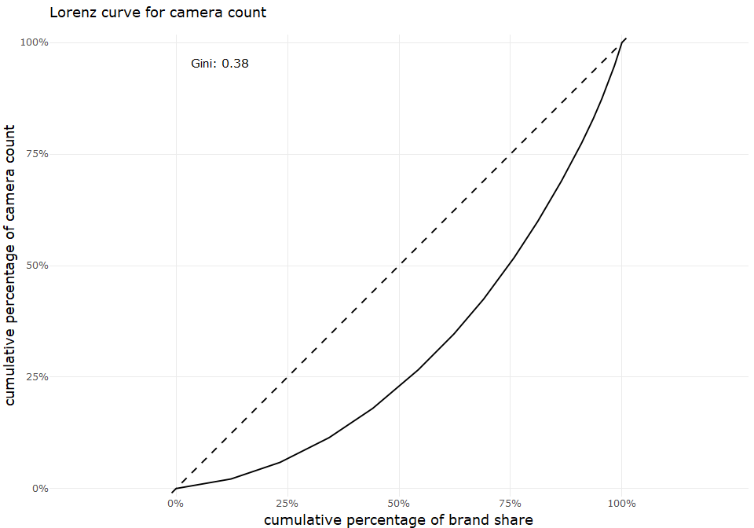

describe univariate for camera data set
================
Sascha Siegmund
2021-07-20

## purpose of notebook

-   [ ] describe & visualize single variables (univariate)
-   [ ] gather interesting observations for further investigation
-   [ ] gather possible new features for extraction

## insights

-   lorem

## load packages

``` r
library(tidyverse) # tidy data frame
library(ggthemes) # for extra plot themes
library(plotly) # make ggplots interactive
```

## import data

``` r
df <- read_csv(file = '../data/camera_dataset_processed.csv') %>% column_to_rownames(var = 'model')
```

    ## 
    ## -- Column specification --------------------------------------------------------
    ## cols(
    ##   model = col_character(),
    ##   brand = col_character(),
    ##   release_date = col_double(),
    ##   max_resolution = col_double(),
    ##   low_resolution = col_double(),
    ##   effective_pixels = col_double(),
    ##   zoom_wide_w = col_double(),
    ##   zoom_tele_t = col_double(),
    ##   normal_focus_range = col_double(),
    ##   macro_focus_range = col_double(),
    ##   storage_included = col_double(),
    ##   weight_inc_batteries = col_double(),
    ##   dimensions = col_double(),
    ##   price = col_double()
    ## )

## overview

``` r
head(df)
```

    ##                        brand release_date max_resolution low_resolution
    ## Agfa ePhoto 1280        Agfa         1997           1024            640
    ## Agfa ePhoto 1680        Agfa         1998           1280            640
    ## Agfa ePhoto CL18        Agfa         2000            640             NA
    ## Agfa ePhoto CL30        Agfa         1999           1152            640
    ## Agfa ePhoto CL30 Clik!  Agfa         1999           1152            640
    ## Agfa ePhoto CL45        Agfa         2001           1600            640
    ##                        effective_pixels zoom_wide_w zoom_tele_t
    ## Agfa ePhoto 1280                      0          38         114
    ## Agfa ePhoto 1680                      1          38         114
    ## Agfa ePhoto CL18                      0          45          45
    ## Agfa ePhoto CL30                      0          35          35
    ## Agfa ePhoto CL30 Clik!                0          43          43
    ## Agfa ePhoto CL45                      1          51          51
    ##                        normal_focus_range macro_focus_range storage_included
    ## Agfa ePhoto 1280                       70                40                4
    ## Agfa ePhoto 1680                       50                NA                4
    ## Agfa ePhoto CL18                       NA                NA                2
    ## Agfa ePhoto CL30                       NA                NA                4
    ## Agfa ePhoto CL30 Clik!                 50                NA               40
    ## Agfa ePhoto CL45                       50                20                8
    ##                        weight_inc_batteries dimensions price
    ## Agfa ePhoto 1280                        420         95   179
    ## Agfa ePhoto 1680                        420        158   179
    ## Agfa ePhoto CL18                         NA         NA   179
    ## Agfa ePhoto CL30                         NA         NA   269
    ## Agfa ePhoto CL30 Clik!                  300        128  1299
    ## Agfa ePhoto CL45                        270        119   179

``` r
summary(df)
```

    ##     brand            release_date  max_resolution low_resolution
    ##  Length:1038        Min.   :1994   Min.   : 512   Min.   : 320  
    ##  Class :character   1st Qu.:2002   1st Qu.:2048   1st Qu.:1280  
    ##  Mode  :character   Median :2004   Median :2560   Median :2048  
    ##                     Mean   :2004   Mean   :2477   Mean   :1871  
    ##                     3rd Qu.:2006   3rd Qu.:3072   3rd Qu.:2560  
    ##                     Max.   :2007   Max.   :5616   Max.   :4992  
    ##                                    NA's   :1      NA's   :54    
    ##  effective_pixels  zoom_wide_w    zoom_tele_t    normal_focus_range
    ##  Min.   : 0.000   Min.   :23.0   Min.   : 28.0   Min.   :  1.00    
    ##  1st Qu.: 3.000   1st Qu.:35.0   1st Qu.:102.0   1st Qu.: 40.00    
    ##  Median : 4.000   Median :36.0   Median :111.0   Median : 50.00    
    ##  Mean   : 4.596   Mean   :35.9   Mean   :132.4   Mean   : 50.86    
    ##  3rd Qu.: 7.000   3rd Qu.:38.0   3rd Qu.:117.0   3rd Qu.: 60.00    
    ##  Max.   :21.000   Max.   :52.0   Max.   :518.0   Max.   :120.00    
    ##                   NA's   :85     NA's   :85      NA's   :137       
    ##  macro_focus_range storage_included weight_inc_batteries   dimensions   
    ##  Min.   : 1.000    Min.   :  1.0    Min.   : 100.0       Min.   : 30.0  
    ##  1st Qu.: 4.000    1st Qu.:  8.0    1st Qu.: 180.0       1st Qu.: 92.0  
    ##  Median : 7.000    Median : 16.0    Median : 230.0       Median :102.0  
    ##  Mean   : 8.875    Mean   : 19.8    Mean   : 325.9       Mean   :106.8  
    ##  3rd Qu.:10.000    3rd Qu.: 24.0    3rd Qu.: 350.0       3rd Qu.:116.0  
    ##  Max.   :85.000    Max.   :450.0    Max.   :1860.0       Max.   :240.0  
    ##  NA's   :128       NA's   :125      NA's   :23           NA's   :16     
    ##      price       
    ##  Min.   :  14.0  
    ##  1st Qu.: 149.0  
    ##  Median : 199.0  
    ##  Mean   : 457.4  
    ##  3rd Qu.: 399.0  
    ##  Max.   :7999.0  
    ## 

## univariate categorical brand

-   lorem

``` r
# one variable, categorical x, show distribution
```

## univariate numeric release\_date

-   uni release\_date: with increasing year the number of cameras in the
    data also increase, almost linear, this could be a sign of more
    cameras available on the market or just from the data acquisition  
-   note on qq-plot with discrete: A staircase pattern is an inevitable
    side-effect of discreteness, but that is the only obvious
    limitation. The rule for quantile-quantile plots otherwise remains
    that departures from sameness of distributions are shown by
    departures from equality of quantiles. [see
    examples](https://stats.stackexchange.com/questions/113387/can-i-still-interpret-a-q-q-plot-that-uses-discrete-rounded-data)

``` r
# one variable, continuous x, show distribution
name = 'release_date'
tmp_df <- df %>% rename(value = release_date) %>% select(value)

# https://ggplot2.tidyverse.org/reference/geom_dotplot.html
p1 <- tmp_df %>%
  ggplot(aes(x = value)) +
    # geom_density() +
    geom_histogram(binwidth = 1) +
    # geom_dotplot(method="histodot", stackgroups = TRUE, stackratio = 1.1, dotsize = 1.2, binwidth = 1) +
    theme_minimal() +
    scale_y_continuous(breaks = NULL) 
p1 <- ggplotly(p1) %>% layout()

p2 <- tmp_df %>%
  ggplot(aes(x = 1, y = value)) +
    geom_boxplot() +
    theme_minimal() +
    coord_flip() +
    ggtitle(paste("distribution of", name, sep=" ")) +
    scale_y_continuous(breaks = NULL) 
p2 <- ggplotly(p2) %>% layout(yaxis = list(showticklabels = FALSE, showgrid = FALSE))

# https://ggplot2.tidyverse.org/reference/geom_qq.html 
p3 <- tmp_df %>%
  ggplot(aes(sample = value)) +
    geom_qq(alpha = 0.3) +
    geom_qq_line() +
    coord_flip() +
    theme_minimal() 
p3 <- ggplotly(p3) %>% layout(yaxis = list(showticklabels = FALSE, showgrid = FALSE))

# https://plotly.com/r/subplots/
fig <- subplot(p1, p2, p3, nrows = 3, margin = 0, heights = c(0.5, 0.2, 0.3), shareX = TRUE) %>% 
  layout(xaxis = list(title = name), autosize = TRUE)

fig
```

<!-- -->

## compare univariate …

-   lorem

``` r
# # two variables, both continuous x, compare distributions
# name = c('flexible_format_contribution_to_sup_waste', 'rigid_format_contribution_to_sup_waste')
# df <- plastic %>% rename(flexible = flexible_format_contribution_to_sup_waste, rigid = rigid_format_contribution_to_sup_waste) %>% 
#   select(flexible, rigid) %>% pivot_longer(cols = c(flexible,rigid))
# 
# boxplot <- df %>%
#   ggplot(aes(x = name, y = value, colour = name)) +
#     geom_boxplot() +
#     theme_minimal() +
#     coord_flip() +
#     ggtitle(paste("compare ", name[1], "and", name[2], sep=" ")) +
#     scale_y_continuous(breaks = NULL)
# boxplot <- ggplotly(boxplot) %>% layout(yaxis = list(showticklabels = FALSE, showgrid = FALSE))
# 
# # https://ggplot2.tidyverse.org/reference/geom_dotplot.html
# dotplot <- df %>%
#   ggplot(aes(x = value, fill = name)) +
#     # geom_density() +
#     geom_histogram(binwidth = 0.1, alpha = 0.5, position = "identity") +
#     # geom_dotplot(method="histodot", stackgroups = TRUE, stackratio = 1, dotsize = 0.23, binwidth = 0.1) +
#     theme_minimal() +
#     scale_y_continuous(breaks = NULL)
# dotplot <- ggplotly(dotplot) %>% layout(yaxis = list(showticklabels = FALSE, showgrid = FALSE))
# 
# # https://ggplot2.tidyverse.org/reference/geom_qq.html
# plot_qq <- df %>%
#   ggplot(aes(sample = value, colour = name)) +
#     geom_qq(alpha = 0.5) +
#     geom_qq_line(alpha = 0.5) +
#     coord_flip() +
#     theme_minimal()
# plot_qq <- ggplotly(plot_qq) %>% layout(yaxis = list(showticklabels = FALSE, showgrid = FALSE))
# 
# # https://plotly.com/r/subplots/
# fig <- subplot(dotplot, boxplot, plot_qq, nrows = 3, margin = 0, heights = c(0.5, 0.2, 0.3), shareX = TRUE) %>% 
#   layout(xaxis = list(title = paste(name[1], "<br>", name[2], sep="")))
# 
# fig
```
