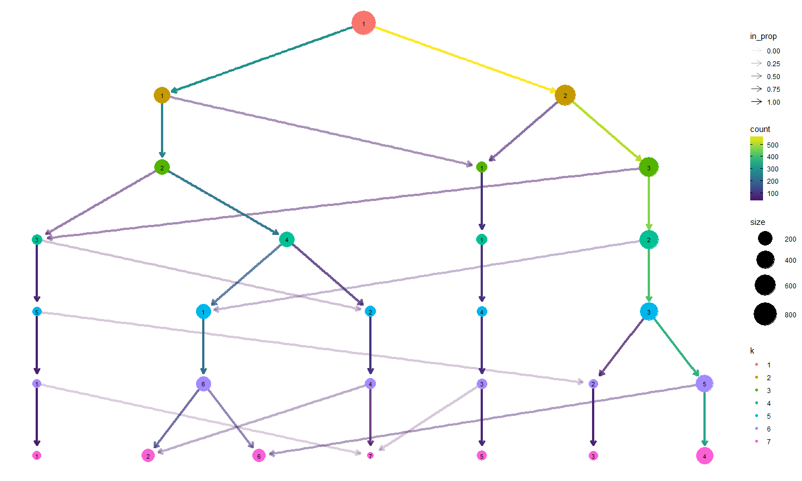
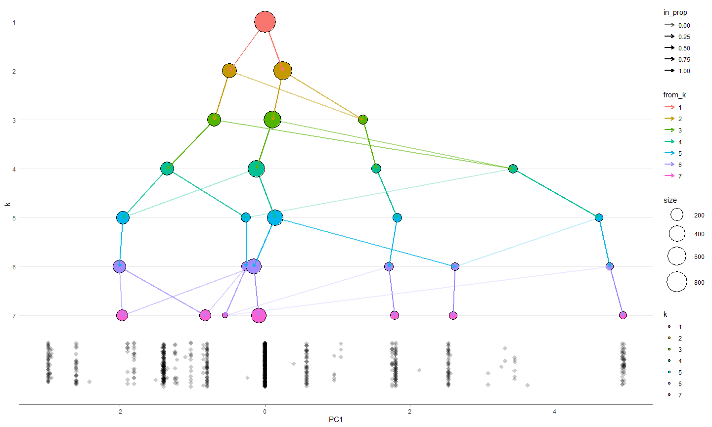
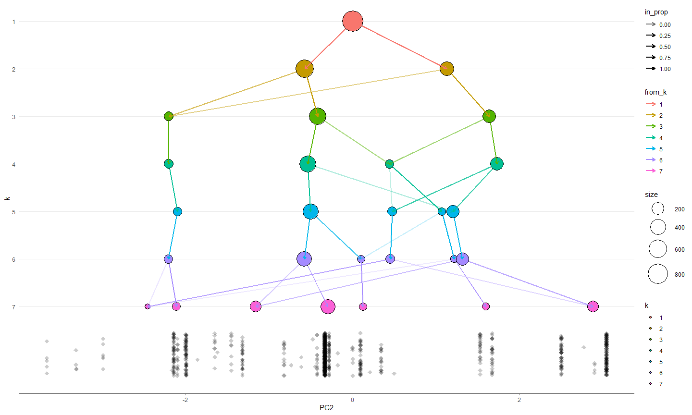
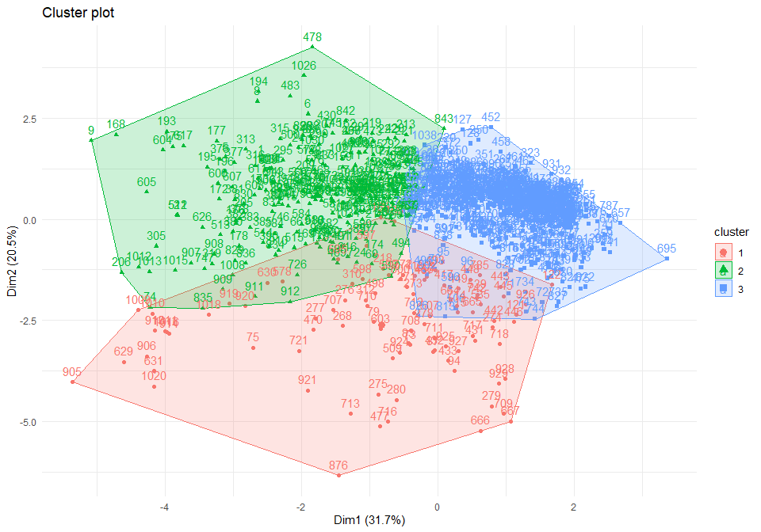
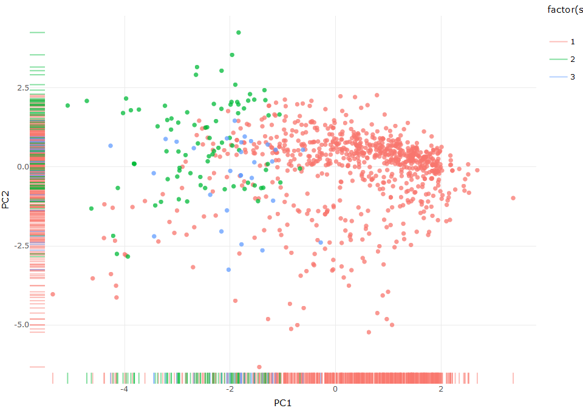
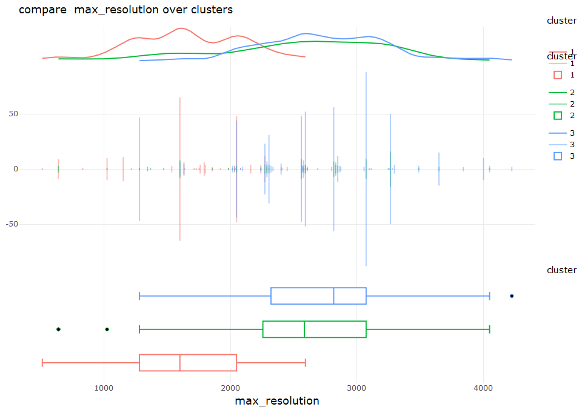
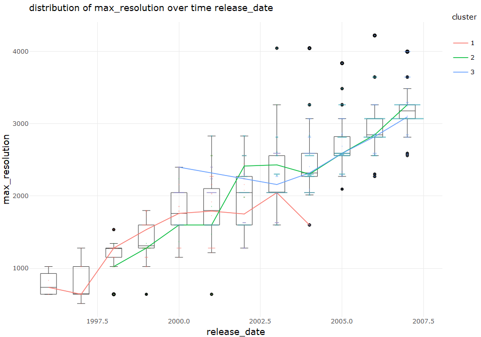

discover cluster with time for camera data set
================
Sascha Siegmund
2021-08-09

## purpose of notebook

-   \[ \]

## insights

-   

## load packages

## import data

``` r
df <- read_csv(file = '../data/camera_dataset_processed.csv') %>% column_to_rownames(var = 'model')
```

## overview

``` r
head(df)
```

    ##                        brand release_date max_resolution low_resolution
    ## Agfa ePhoto 1280        Agfa         1997           1024            640
    ## Agfa ePhoto 1680        Agfa         1998           1280            640
    ## Agfa ePhoto CL18        Agfa         2000            640             NA
    ## Agfa ePhoto CL30        Agfa         1999           1152            640
    ## Agfa ePhoto CL30 Clik!  Agfa         1999           1152            640
    ## Agfa ePhoto CL45        Agfa         2001           1600            640
    ##                        effective_pixels zoom_wide_w zoom_tele_t
    ## Agfa ePhoto 1280                      0          38         114
    ## Agfa ePhoto 1680                      1          38         114
    ## Agfa ePhoto CL18                      0          45          45
    ## Agfa ePhoto CL30                      0          35          35
    ## Agfa ePhoto CL30 Clik!                0          43          43
    ## Agfa ePhoto CL45                      1          51          51
    ##                        normal_focus_range macro_focus_range storage_included
    ## Agfa ePhoto 1280                       70                40                4
    ## Agfa ePhoto 1680                       50                NA                4
    ## Agfa ePhoto CL18                       NA                NA                2
    ## Agfa ePhoto CL30                       NA                NA                4
    ## Agfa ePhoto CL30 Clik!                 50                NA               40
    ## Agfa ePhoto CL45                       50                20                8
    ##                        weight_inc_batteries dimensions price
    ## Agfa ePhoto 1280                        420         95   179
    ## Agfa ePhoto 1680                        420        158   179
    ## Agfa ePhoto CL18                         NA         NA   179
    ## Agfa ePhoto CL30                         NA         NA   269
    ## Agfa ePhoto CL30 Clik!                  300        128  1299
    ## Agfa ePhoto CL45                        270        119   179

``` r
summary(df)
```

    ##     brand            release_date  max_resolution low_resolution
    ##  Length:1038        Min.   :1994   Min.   : 512   Min.   : 320  
    ##  Class :character   1st Qu.:2002   1st Qu.:2048   1st Qu.:1280  
    ##  Mode  :character   Median :2004   Median :2560   Median :2048  
    ##                     Mean   :2004   Mean   :2477   Mean   :1871  
    ##                     3rd Qu.:2006   3rd Qu.:3072   3rd Qu.:2560  
    ##                     Max.   :2007   Max.   :5616   Max.   :4992  
    ##                                    NA's   :1      NA's   :54    
    ##  effective_pixels  zoom_wide_w    zoom_tele_t    normal_focus_range
    ##  Min.   : 0.000   Min.   :23.0   Min.   : 28.0   Min.   :  1.00    
    ##  1st Qu.: 3.000   1st Qu.:35.0   1st Qu.:102.0   1st Qu.: 40.00    
    ##  Median : 4.000   Median :36.0   Median :111.0   Median : 50.00    
    ##  Mean   : 4.596   Mean   :35.9   Mean   :132.4   Mean   : 50.86    
    ##  3rd Qu.: 7.000   3rd Qu.:38.0   3rd Qu.:117.0   3rd Qu.: 60.00    
    ##  Max.   :21.000   Max.   :52.0   Max.   :518.0   Max.   :120.00    
    ##                   NA's   :85     NA's   :85      NA's   :137       
    ##  macro_focus_range storage_included weight_inc_batteries   dimensions   
    ##  Min.   : 1.000    Min.   :  1.0    Min.   : 100.0       Min.   : 30.0  
    ##  1st Qu.: 4.000    1st Qu.:  8.0    1st Qu.: 180.0       1st Qu.: 92.0  
    ##  Median : 7.000    Median : 16.0    Median : 230.0       Median :102.0  
    ##  Mean   : 8.875    Mean   : 19.8    Mean   : 325.9       Mean   :106.8  
    ##  3rd Qu.:10.000    3rd Qu.: 24.0    3rd Qu.: 350.0       3rd Qu.:116.0  
    ##  Max.   :85.000    Max.   :450.0    Max.   :1860.0       Max.   :240.0  
    ##  NA's   :128       NA's   :125      NA's   :23           NA's   :16     
    ##      price       
    ##  Min.   :  14.0  
    ##  1st Qu.: 149.0  
    ##  Median : 199.0  
    ##  Mean   : 457.4  
    ##  3rd Qu.: 399.0  
    ##  Max.   :7999.0  
    ## 

## prepare data

``` r
# remove variables which are depended on each other or not wanted in analysis
value_df <- df %>% select(-low_resolution, -effective_pixels, -macro_focus_range, -storage_included) %>% 
  remove_rownames %>%
  na.omit %>%
  rename()

# list with categorical columns to exclude
cat = c('brand')

# replace data with scaled columns
 # scale_df <- as_tibble(scale(df[, !names(df) %in% cat]))
preObj <- caret::preProcess(value_df[, !names(value_df) %in% cat], method=c("center", "scale"))
scale_df <- predict(preObj, value_df[, !names(value_df) %in% cat])
head(scale_df)
```

    ##   release_date max_resolution zoom_wide_w zoom_tele_t normal_focus_range
    ## 1   -2.4125610      -1.960810   0.6360856  -0.2097255         1.07985309
    ## 2   -2.0427555      -1.595567   0.6360856  -0.2097255        -0.03535724
    ## 5   -1.6729499      -1.778189   2.1730303  -0.9873902        -0.03535724
    ## 6   -0.9333388      -1.139014   4.6321420  -0.8997660        -0.03535724
    ## 8   -2.4125610      -2.508674   1.8656414  -0.9983433         1.07985309
    ## 9   -2.7823666      -2.234742   4.3247530  -0.9107191        -0.59296240
    ##   weight_inc_batteries dimensions      price
    ## 1          1.034062032 -0.4787838 -0.3823872
    ## 2          1.034062032  3.0896472 -0.3823872
    ## 5          0.203167802  1.3903943  2.0731506
    ## 6         -0.004555755  0.8806185 -0.3823872
    ## 8          0.341650174 -0.5920673 -0.4481606
    ## 9          1.311026775  3.2029307 -0.4700850

``` r
# find more methods here: https://stackoverflow.com/questions/15215457/standardize-data-columns-in-r
```

## config

``` r
no_k = 3 # number of clusters for clustering methods 
max_k = 7 # maximum clusters in scope 
min_k = 2 # minimum clusters in scope
```

## clValid to choose best clustering algo

<https://towardsdatascience.com/10-tips-for-choosing-the-optimal-number-of-clusters-277e93d72d92>
The cValid package can be used to simultaneously compare multiple
clustering algorithms, to identify the best clustering approach and the
optimal number of clusters. We will compare k-means, hierarchical and
PAM clustering. Connectivity and Silhouette are both measurements of
connectedness while the Dunn Index is the ratio of the smallest distance
between observations not in the same cluster to the largest
intra-cluster distance.

``` r
tmp_df <- scale_df

library(clValid) # Statistical and biological validation of clustering results
library(mclust) # BIC for parameterized Gaussian mixture models fitted by EM algorithm 

intern <- clValid(tmp_df, nClust = min_k:max_k, 
                  clMethods = c("hierarchical", "kmeans", "diana", "fanny", "som", 
                                "model", "sota", "pam", "clara", "agnes"),
                  validation = "internal", maxitems=nrow(scale_df))

summary(intern)
```

    ## 
    ## Clustering Methods:
    ##  hierarchical kmeans diana fanny som model sota pam clara agnes 
    ## 
    ## Cluster sizes:
    ##  2 3 4 5 6 7 
    ## 
    ## Validation Measures:
    ##                                   2        3        4        5        6        7
    ##                                                                                 
    ## hierarchical Connectivity    3.8579   6.7869  19.4536  42.8333  47.1202  63.8996
    ##              Dunn            0.5705   0.4630   0.1424   0.1424   0.1424   0.1548
    ##              Silhouette      0.6676   0.5652   0.3978   0.3755   0.3319   0.3174
    ## kmeans       Connectivity    3.8579 153.8036 161.0302 252.6667 236.2425 291.0651
    ##              Dunn            0.5705   0.0289   0.0191   0.0322   0.0368   0.0276
    ##              Silhouette      0.6676   0.2773   0.2936   0.2406   0.2578   0.2179
    ## diana        Connectivity    3.8579 127.7437 130.6726 137.7159 158.0718 170.1405
    ##              Dunn            0.5705   0.0344   0.0371   0.0403   0.0410   0.0509
    ##              Silhouette      0.6676   0.3210   0.3189   0.2904   0.3025   0.2934
    ## fanny        Connectivity  199.6746       NA       NA       NA       NA       NA
    ##              Dunn            0.0173       NA       NA       NA       NA       NA
    ##              Silhouette      0.2335       NA       NA       NA       NA       NA
    ## som          Connectivity  156.6861 161.7119 167.6786 236.4806 255.7500 272.5476
    ##              Dunn            0.0339   0.0212   0.0231   0.0362   0.0329   0.0028
    ##              Silhouette      0.2733   0.2911   0.2923   0.2533   0.2174   0.2201
    ## model        Connectivity  163.6623 211.3817 282.9437 268.1286 459.1813 472.8175
    ##              Dunn            0.0261   0.0272   0.0154   0.0162   0.0140   0.0235
    ##              Silhouette      0.2530   0.1842   0.1147   0.1752   0.0648   0.1132
    ## sota         Connectivity  163.3325 223.9313 239.6266 241.4679 245.9472 254.6333
    ##              Dunn            0.0265   0.0230   0.0230   0.0298   0.0298   0.0318
    ##              Silhouette      0.2659   0.2433   0.2386   0.2313   0.2272   0.2260
    ## pam          Connectivity  151.0385 150.2536 294.8067 280.0429 314.0619 310.4393
    ##              Dunn            0.0245   0.0265   0.0234   0.0276   0.0276   0.0276
    ##              Silhouette      0.2827   0.3023   0.1468   0.1675   0.1717   0.1789
    ## clara        Connectivity  178.6163 368.8917 240.3782 373.0698 383.2548 347.4829
    ##              Dunn            0.0212   0.0223   0.0245   0.0046   0.0048   0.0104
    ##              Silhouette      0.2569   0.1711   0.2357   0.1722   0.1684   0.1562
    ## agnes        Connectivity    3.8579   6.7869  19.4536  42.8333  47.1202  63.8996
    ##              Dunn            0.5705   0.4630   0.1424   0.1424   0.1424   0.1548
    ##              Silhouette      0.6676   0.5652   0.3978   0.3755   0.3319   0.3174
    ## 
    ## Optimal Scores:
    ## 
    ##              Score  Method       Clusters
    ## Connectivity 3.8579 hierarchical 2       
    ## Dunn         0.5705 hierarchical 2       
    ## Silhouette   0.6676 hierarchical 2

## Clustree

<https://towardsdatascience.com/10-tips-for-choosing-the-optimal-number-of-clusters-277e93d72d92>
In this figure the size of each node corresponds to the number of
samples in each cluster, and the arrows are colored according to the
number of samples each cluster receives. A separate set of arrows, the
transparent ones, called the incoming node proportion, are also colored
and shows how samples from one group end up in another group — an
indicator of cluster instability.

``` r
tmp_df <- scale_df

library(clustree) # produce clustering trees, a visualization to interrogate clusterings as resolution increase

tmp <- NULL
for (k in 1:max_k){
  tmp[k] <- kmeans(tmp_df, k, nstart = 30)
}

tmp_df <- data.frame(tmp)
colnames(tmp_df) <- seq(1:max_k) # add prefix to the column names
colnames(tmp_df) <- paste0("k", colnames(tmp_df)) 

# get individual PCA
tmp_df.pca <- prcomp(tmp_df, center = TRUE, scale. = FALSE)

ind.coord <- tmp_df.pca$x
ind.coord <- ind.coord[,1:2]

tmp_df <- bind_cols(as.data.frame(tmp_df), as.data.frame(ind.coord))

clustree(tmp_df, prefix = "k") # produce clustering trees, a visualization for interrogating clustering 
```

<!-- -->

``` r
overlay_list <- clustree_overlay(tmp_df, prefix = "k", x_value = "PC1", y_value = "PC2", plot_sides = TRUE)
overlay_list$overlay
```

<!-- -->

``` r
overlay_list$x_side
```

<!-- -->

``` r
overlay_list$y_side
```

<!-- -->

## hierarchical clustering

<https://statsandr.com/blog/clustering-analysis-k-means-and-hierarchical-clustering-by-hand-and-in-r/#optimal-number-of-clusters>
remind that the difference with the partition by k-means is that for
hierarchical clustering, the number of classes is not specified in
advance

``` r
tmp_df <- scale_df

# Hierarchical clustering: single linkage
hclust_res <- hclust(dist(tmp_df), method = 'single')
plot(hclust_res)
rect.hclust(hclust_res, k = no_k, border = 'blue')
```

<!-- -->

``` r
# fviz_dend(hclust_res, k = no_k, rect = TRUE) # can take some time for big data sets
 
# Hierarchical clustering: complete linkage
hclust_res <- hclust(dist(tmp_df), method = 'complete')
plot(hclust_res)
rect.hclust(hclust_res, k = no_k, border = 'blue')
```

<!-- -->

``` r
# fviz_dend(hclust_res, k = no_k, rect = TRUE) 

# Hierarchical clustering: average linkage
hclust_res <- hclust(dist(tmp_df), method = 'average')
plot(hclust_res)
rect.hclust(hclust_res, k = no_k, border = 'blue')
```

<!-- -->

``` r
# fviz_dend(hclust_res, k = no_k, rect = TRUE) 

# Hierarchical clustering: ward
hclust_res <- hclust(dist(tmp_df), method = 'ward.D2')
# plot(hclust_res)
# rect.hclust(hclust_res, k = no_k, border = 'blue')
fviz_dend(hclust_res, k = no_k, rect = TRUE)
```

<!-- -->

``` r
# Hierarchical clustering: mcquitty
hclust_res <- hclust(dist(tmp_df), method = 'mcquitty')
plot(hclust_res)
rect.hclust(hclust_res, k = no_k, border = 'blue')
```

<!-- -->

``` r
# fviz_dend(hclust_res, k = no_k, rect = TRUE) 

# Hierarchical clustering: centroid
hclust_res <- hclust(dist(tmp_df), method = 'centroid')
plot(hclust_res)
rect.hclust(hclust_res, k = no_k, border = 'blue')
```

<!-- -->

``` r
# fviz_dend(hclust_res, k = no_k, rect = TRUE) 
```

## k-means clustering

<https://statsandr.com/blog/clustering-analysis-k-means-and-hierarchical-clustering-by-hand-and-in-r/#optimal-number-of-clusters>
As a reminder, this method aims at partitioning n observations into k
clusters in which each observation belongs to the cluster with the
closest average, serving as a prototype of the cluster

``` r
tmp_df <- scale_df

library(NbClust) # determining the optimal number of clusters in a data set
library(cluster) # computes agglomerative hierarchical clustering of the dataset

# k-means clustering via the kmeans(), centers corresponds to the number of desired clusters
kmeans_model <- kmeans(tmp_df, centers = no_k, nstart = 30) 
# store cluster in original data set as column
df_cluster <- tibble(value_df, cluster = as.factor(kmeans_model$cluster)) 
df_cluster
```

    ## # A tibble: 880 x 10
    ##    brand release_date max_resolution zoom_wide_w zoom_tele_t normal_focus_range
    ##    <chr>        <dbl>          <dbl>       <dbl>       <dbl>              <dbl>
    ##  1 Agfa          1997           1024          38         114                 70
    ##  2 Agfa          1998           1280          38         114                 50
    ##  3 Agfa          1999           1152          43          43                 50
    ##  4 Agfa          2001           1600          51          51                 50
    ##  5 Canon         1997            640          42          42                 70
    ##  6 Canon         1996            832          50          50                 40
    ##  7 Canon         2001           1280          35         105                 76
    ##  8 Canon         2002           1280          39          39                 20
    ##  9 Canon         2001           1600          35         105                 76
    ## 10 Canon         2002           1600          39          39                 20
    ## # ... with 870 more rows, and 4 more variables: weight_inc_batteries <dbl>,
    ## #   dimensions <dbl>, price <dbl>, cluster <fct>

``` r
# check quality of a k-means partition
quality <- kmeans_model$betweenss / kmeans_model$totss 
print(paste("quality of kmeans is BSS/TSS: ", format(round(quality,2), nsmall = 2)))
```

    ## [1] "quality of kmeans is BSS/TSS:  0.34"

``` r
# find optimal number of clusters
fviz_nbclust(tmp_df, kmeans, method = 'wss') + # Elbow method
  # geom_vline(xintercept = 2, linetype = 2) + # add line for better visualization
  labs(subtitle = "Elbow method") # add subtitle
```

<!-- -->

``` r
fviz_nbclust(tmp_df, kmeans, method = 'silhouette') + # Silhouette method
  labs(subtitle = "Silhouette method") # add subtitle
```

<!-- -->

``` r
fviz_nbclust(tmp_df, kmeans, # Gap statistics
             nstart = 30,
             method = 'gap_stat',
             nboot = 100) + # reduce it for lower computation time, but less precise results
  labs(subtitle = "Gap statistics method")
```

<!-- -->

``` r
nbclust_out <- NbClust(data = tmp_df, # NbClust
                       distance = 'euclidean',
                       min.nc = min_k, # minimum number of clusters
                       max.nc = max_k, # maximum number of cluster
                       method = 'complete',
                       index = 'all')
```

<!-- -->

    ## *** : The Hubert index is a graphical method of determining the number of clusters.
    ##                 In the plot of Hubert index, we seek a significant knee that corresponds to a 
    ##                 significant increase of the value of the measure i.e the significant peak in Hubert
    ##                 index second differences plot. 
    ## 

<!-- -->

    ## *** : The D index is a graphical method of determining the number of clusters. 
    ##                 In the plot of D index, we seek a significant knee (the significant peak in Dindex
    ##                 second differences plot) that corresponds to a significant increase of the value of
    ##                 the measure. 
    ##  
    ## ******************************************************************* 
    ## * Among all indices:                                                
    ## * 8 proposed 2 as the best number of clusters 
    ## * 4 proposed 3 as the best number of clusters 
    ## * 10 proposed 4 as the best number of clusters 
    ## * 1 proposed 5 as the best number of clusters 
    ## * 1 proposed 7 as the best number of clusters 
    ## 
    ##                    ***** Conclusion *****                            
    ##  
    ## * According to the majority rule, the best number of clusters is  4 
    ##  
    ##  
    ## *******************************************************************

``` r
fviz_nbclust(nbclust_out) + theme_minimal() +
  labs(subtitle = "NbClust results")
```

    ## Among all indices: 
    ## ===================
    ## * 2 proposed  0 as the best number of clusters
    ## * 8 proposed  2 as the best number of clusters
    ## * 4 proposed  3 as the best number of clusters
    ## * 10 proposed  4 as the best number of clusters
    ## * 1 proposed  5 as the best number of clusters
    ## * 1 proposed  7 as the best number of clusters
    ## 
    ## Conclusion
    ## =========================
    ## * According to the majority rule, the best number of clusters is  4 .

<!-- -->

``` r
# check quality of clustering
#  if a large majority of the silhouette coefficients are positive, 
#  it indicates that the observations are placed in the correct group
sil <- silhouette(kmeans_model$cluster, dist(tmp_df)) 
fviz_silhouette(sil)
```

    ##   cluster size ave.sil.width
    ## 1       1   96          0.15
    ## 2       2  263          0.15
    ## 3       3  521          0.38

<!-- -->

``` r
fviz_cluster(kmeans_model, tmp_df, ellipse.type = 'norm') + theme_minimal()
```

<!-- -->

``` r
fviz_cluster(kmeans_model, tmp_df) + theme_minimal()
```

<!-- -->

``` r
tmp_df <- scale_df

kmean_calc <- function(df, ...){
  kmeans(df, scaled = ..., nstart = 30)
}

km2 <- kmean_calc(tmp_df, 2)
km3 <- kmean_calc(tmp_df, 3)
km4 <- kmeans(tmp_df, 4)
km5 <- kmeans(tmp_df, 5)
km6 <- kmeans(tmp_df, 6)
km7 <- kmeans(tmp_df, 7)

p1 <- fviz_cluster(km2, data = tmp_df, ellipse.type = "convex") + theme_minimal()
p1 <- ggplotly(p1) %>% layout(annotations = list(text = "k = 2", xref = "paper", yref = "paper", 
                                                 yanchor = "bottom", xanchor = "center", 
                                                 align = "center", x = 0.5, y = 1, showarrow = FALSE))
p2 <- fviz_cluster(km3, data = tmp_df, ellipse.type = "convex") + theme_minimal()
p2 <- ggplotly(p2) %>% layout(annotations = list(text = "k = 3", xref = "paper", yref = "paper", 
                                                 yanchor = "bottom", xanchor = "center", 
                                                 align = "center", x = 0.5, y = 1, showarrow = FALSE))
p3 <- fviz_cluster(km4, data = tmp_df, ellipse.type = "convex") + theme_minimal()
p3 <- ggplotly(p3) %>% layout(annotations = list(text = "k = 4", xref = "paper", yref = "paper", 
                                                 yanchor = "bottom", xanchor = "center", 
                                                 align = "center", x = 0.5, y = 1, showarrow = FALSE))
p4 <- fviz_cluster(km5, data = tmp_df, ellipse.type = "convex") + theme_minimal()
p4 <- ggplotly(p4) %>% layout(annotations = list(text = "k = 5", xref = "paper", yref = "paper", 
                                                 yanchor = "bottom", xanchor = "center", 
                                                 align = "center", x = 0.5, y = 1, showarrow = FALSE))
p5 <- fviz_cluster(km6, data = tmp_df, ellipse.type = "convex") + theme_minimal()
p5 <- ggplotly(p5) %>% layout(annotations = list(text = "k = 6", xref = "paper", yref = "paper", 
                                                 yanchor = "bottom", xanchor = "center", 
                                                 align = "center", x = 0.5, y = 1, showarrow = FALSE))
p6 <- fviz_cluster(km7, data = tmp_df, ellipse.type = "convex") + theme_minimal()
p6 <- ggplotly(p6) %>% layout(annotations = list(text = "k = 7", xref = "paper", yref = "paper", 
                                                 yanchor = "bottom", xanchor = "center", 
                                                 align = "center", x = 0.5, y = 1, showarrow = FALSE))
# TOOD: make all plots linked
fig <- subplot(p1, p2, p3 , p4, p5, p6, nrows = 2, shareX = TRUE, shareY = TRUE) %>% layout() 
fig
```

<!-- -->

## principal component analysis colored by self organizing map cluster

I need more knowledge how to work with and interpret SOM and PCA, maybe
also not enough observations in data set
<https://iamciera.github.io/SOMexample/html/SOM_RNAseq_tutorial_part2a_SOM.html>

``` r
tmp_df <- scale_df

library(kohonen) # functions to train self-organising maps (SOMs)

# principle component analysis
pca <- prcomp(tmp_df, scale=FALSE)
summary(pca)
```

    ## Importance of components:
    ##                           PC1    PC2    PC3    PC4    PC5     PC6     PC7
    ## Standard deviation     1.5937 1.2809 1.0514 0.9828 0.9148 0.71697 0.53980
    ## Proportion of Variance 0.3175 0.2051 0.1382 0.1207 0.1046 0.06425 0.03642
    ## Cumulative Proportion  0.3175 0.5226 0.6608 0.7815 0.8861 0.95037 0.98679
    ##                            PC8
    ## Standard deviation     0.32504
    ## Proportion of Variance 0.01321
    ## Cumulative Proportion  1.00000

``` r
# visualize pcs results
# Contributions of variables to PC1
fviz_contrib(pca, choice = "var", axes = 1, top = 10)
```

<!-- -->

``` r
# Contributions of variables to PC2
fviz_contrib(pca, choice = "var", axes = 2, top = 10)
```

<!-- -->

``` r
# Control variable colors using their contributions to the principle axis
fviz_pca_var(pca, col.var="contrib",
             gradient.cols = c("#00AFBB", "#E7B800", "#FC4E07"),
             repel = TRUE # Avoid text overlapping
             ) + theme_minimal() + ggtitle("Variables - PCA")
```

<!-- -->

``` r
# add back to original so everything is together
pca_scores <- data.frame(pca$x)
data_val <- cbind(value_df, pca_scores)

# clustering is performed using the som() function on the scaled gene expression values.
set.seed(3)

# define a grid for the SOM and train
grid_size <- ncol(tmp_df)
som_grid <- somgrid(xdim = grid_size, ydim = grid_size, topo = 'hexagonal')
som_model <- som(as.matrix(tmp_df), grid = som_grid)
summary(som_model)
```

    ## SOM of size 8x8 with a hexagonal topology and a bubble neighbourhood function.
    ## The number of data layers is 1.
    ## Distance measure(s) used: sumofsquares.
    ## Training data included: 880 objects.
    ## Mean distance to the closest unit in the map: 1.284.

``` r
# generate som plots after training
plot(som_model, type = 'mapping')
```

<!-- -->

``` r
plot(som_model, type = 'codes')
```

<!-- -->

``` r
# plot(som_model, type = 'counts')
# plot(som_model, type = 'dist.neighbours')
# plot(som_model, type = 'quality')
# plot(som_model, type = 'changes')

# further split the clusters into a smaller set of clusters using hierarchical clustering.
# use hierarchical clustering to cluster the codebook vectors
som_cluster <- cutree(hclust(dist(som_model$codes[[1]])), no_k) 

plot(som_model, type="mapping", bgcol = som_cluster, main = "Clusters")
add.cluster.boundaries(som_model, som_cluster)
```

<!-- -->

``` r
# attach the hierchal cluster to the larger dataset data_val.
gridSquare <- grid_size * grid_size
som_clusterKey <- data.frame(som_cluster)
som_clusterKey$unit_classif <- c(1:gridSquare)
data_val <- cbind(data_val,som_model$unit.classif,som_model$distances) %>% 
  rename(unit_classif = 'som_model$unit.classif', distances = 'som_model$distances')
data_val <- merge(data_val, som_clusterKey, by.x = "unit_classif" )
head(data_val)
```

    ##   unit_classif brand release_date max_resolution zoom_wide_w zoom_tele_t
    ## 1            1  Sony         2001           1920          36          36
    ## 2            1 Nikon         2002           1600          37         111
    ## 3            1 Canon         2002           1600          39          39
    ## 4            1  Sony         2003           2048          41          82
    ## 5            1  Sony         2000           1600          39         117
    ## 6            1  Sony         2002           1600          41          82
    ##   normal_focus_range weight_inc_batteries dimensions price        PC1       PC2
    ## 1                 25                  194        113   429 -0.9512153 0.8305996
    ## 2                 30                  250        114   229 -1.1093493 0.4533084
    ## 3                 20                  225        110   139 -0.9771238 1.1822314
    ## 4                  8                  280        123   429 -1.0792154 0.2151400
    ## 5                 25                  370        113   149 -1.8782417 0.3828046
    ## 6                  8                  275        127   429 -1.7050127 0.4644175
    ##          PC3       PC4        PC5         PC6         PC7         PC8 distances
    ## 1 -1.1136299 -1.147449 -0.7961607  0.44059195 -0.19807622 -0.30909598 1.9215988
    ## 2 -0.1499270 -1.174429 -0.6736929  0.13582125 -0.45053950  0.21017644 1.3557232
    ## 3 -0.2864340 -1.864915 -0.8374861  0.48765078  0.02629926  0.30409797 0.5625969
    ## 4 -0.2589089 -2.580426 -0.2031946  1.38143200  0.13116061  0.18697284 2.5127843
    ## 5  0.2851004 -1.631266 -0.6227195 -0.03125929  0.33896399 -0.07868027 1.6617248
    ## 6 -0.2672296 -2.630673 -0.3097317  1.22463936 -0.18345368  0.26796378 2.5910250
    ##   som_cluster
    ## 1           1
    ## 2           1
    ## 3           1
    ## 4           1
    ## 5           1
    ## 6           1

``` r
# plot pca with colored clusters
pcasom_plot <- ggplot(data_val, aes(x = PC1, y = PC2, color = factor(som_cluster))) +
    geom_rug(alpha = 0.5) + 
    geom_point(alpha = 0.75) + 
    theme_minimal()
pcasom_plot <- ggplotly(pcasom_plot) %>% layout()

pcasom_plot
```

<!-- -->

## Extracting Features of Clusters

<https://towardsdatascience.com/10-tips-for-choosing-the-optimal-number-of-clusters-277e93d72d92>
Ultimately, we would like to answer questions like “what is it that
makes this cluster unique from others?” and “what are the clusters that
are similar to one another”. Let’s select some clusters and interrogate
the features of these clusters.

``` r
tmp_df <- scale_df

# compute dissimilarity matrix with euclidean distances
d <- dist(tmp_df, method = 'euclidean')

# hierarchical clustering using Ward's method
res_hc <- hclust(d, method = 'ward.D2')

# cut tree into 3 groups
grp <- cutree(res_hc, k = no_k)

# visualize
plot(res_hc, cex = 0.6) # plot tree
rect.hclust(res_hc, k = no_k, border = 2:5) # add rectangles
```

<!-- -->

``` r
# execution of k-means with k = 4
final <- kmeans(tmp_df, no_k, nstart = 30)

fviz_cluster(final, data = tmp_df) + theme_minimal() + ggtitle("k = 4")
```

<!-- -->

``` r
as.tibble(scale_df) %>% 
  mutate(cluster = final$cluster) %>%
  group_by(cluster) %>%
  summarise_all('mean')
```

    ## # A tibble: 3 x 9
    ##   cluster release_date max_resolution zoom_wide_w zoom_tele_t normal_focus_range
    ##     <int>        <dbl>          <dbl>       <dbl>       <dbl>              <dbl>
    ## 1       1      -1.15           -1.05       0.195       -0.505             0.214 
    ## 2       2       0.0798          0.179     -0.187        2.39             -0.333 
    ## 3       3       0.565           0.496     -0.0642      -0.185            -0.0468
    ## # ... with 3 more variables: weight_inc_batteries <dbl>, dimensions <dbl>,
    ## #   price <dbl>

``` r
as.tibble(value_df) %>% 
  mutate(cluster = final$cluster) %>%
  group_by(cluster) %>%
  summarise_all('mean')
```

    ## # A tibble: 3 x 10
    ##   cluster brand release_date max_resolution zoom_wide_w zoom_tele_t
    ##     <int> <dbl>        <dbl>          <dbl>       <dbl>       <dbl>
    ## 1       1    NA        2000.          1663.        36.6        87.0
    ## 2       2    NA        2004.          2524.        35.3       351. 
    ## 3       3    NA        2005.          2746.        35.7       116. 
    ## # ... with 4 more variables: normal_focus_range <dbl>,
    ## #   weight_inc_batteries <dbl>, dimensions <dbl>, price <dbl>

``` r
tmp_df <- as_tibble(scale_df) %>% rownames_to_column()

cluster_pos <- as_tibble(final$cluster) %>% rownames_to_column()
colnames(cluster_pos) <- c("rowname", "cluster")

final <- inner_join(cluster_pos, tmp_df, by = "rowname")

library(ggiraphExtra) # for exploratory plots, see https://rpubs.com/cardiomoon/231820

radar <- ggRadar(final[-1], aes(group = cluster), rescale = FALSE,
        legend.position = "none", size = 1, interactive = FALSE, use.label = TRUE) +
  facet_wrap(~cluster) +
  scale_y_discrete(breaks = NULL) + # don't show ticks
  theme_minimal()

radar
```

<!-- -->

``` r
tmp_df <- as_tibble(scale_df)
tmp_df$cluster <- as.factor(final$cluster)

library(GGally) # extends ggplot2 by adding several functions to reduce the complexity

ggpairs(tmp_df, 1:ncol(tmp_df), mapping = ggplot2::aes(color = cluster, alpha = 0.5),
        diag = list(continuous = wrap("densityDiag")),
        lower = list(continuous = wrap("points", alpha = 0.6)),
        progress = FALSE) +
  theme_minimal()
```

<!-- -->

``` r
tmp_df <- as_tibble(scale_df)
tmp_df$cluster <- as.factor(final$cluster)

library(GGally) # extends ggplot2 by adding several functions to reduce the complexity 

# https://www.r-graph-gallery.com/parallel-plot-ggally.html#custom
parcoord_plot <- ggparcoord(tmp_df,
           columns = 1:ncol(scale_df), groupColumn = ncol(tmp_df),
           scale='center', # scaling: standardize and center variables
           showPoints = FALSE,
           alphaLines = 0.3) +
  theme_minimal() 
parcoord_plot <- ggplotly(parcoord_plot) %>% layout(autosize=T)

parcoord_plot
```

<!-- -->

## testing clusters

``` r
# one variable, continuous x, show distribution
name = c('max_resolution')
tmp_df <- value_df %>% rename(x = max_resolution) %>%
  select(x) %>% 
  mutate(cluster = as.factor(final$cluster)) %>%
  add_count(x, cluster)

p1 <- tmp_df %>%
  ggplot(aes(x = x, fill = cluster, color = cluster)) +
    geom_spoke(aes(y = -n, radius = 2*n, angle = pi/2, text = paste0("value: ", x, "\ncount: ", n)),
               alpha = 0.5, stat = "unique") +  # y = 0, radius = n for one-sided spoke plot
    # stat_density(aes(y = ..scaled.. * max(tmp_df$n)), geom = 'line', position = 'identity', trim = TRUE) +
    theme_minimal()  
p1 <- ggplotly(p1, tooltip = 'text') %>% layout()

p2 <- tmp_df %>%
  ggplot(aes(x = cluster, y = x, color = cluster)) +
    geom_boxplot() +
    theme_minimal() +
    coord_flip() +
    ggtitle(paste("compare ", name[1], "over clusters", sep=" "))
p2 <- ggplotly(p2) %>% layout(yaxis = list(showticklabels = FALSE, showgrid = FALSE))

p3 <- tmp_df %>%
  ggplot(aes(x = x, color = cluster)) +
    stat_density(geom="line", position = 'identity', trim = TRUE) + 
    theme_minimal()
p3 <- ggplotly(p3) %>% layout(yaxis = list(showticklabels = FALSE, showgrid = FALSE, title = ''), 
                              xaxis = list(showticklabels = FALSE, showgrid = FALSE, title = ''))

# https://plotly.com/r/subplots/
fig <- subplot(p3, p1, p2, nrows = 3, margin = 0, heights = c(0.1, 0.6, 0.3), shareX = TRUE) %>%
  layout(xaxis = list(title =name[1]))

fig
```

<!-- -->

``` r
name = c('max_resolution')
tmp_df <- value_df %>% rename(x = max_resolution) %>%
  select(x) %>% 
  mutate(cluster = as.factor(final$cluster)) %>%
  add_count(x, cluster)

p1 <- tmp_df %>%
  ggplot(aes(x = cluster, y = x)) +
    geom_boxplot(fill=NA, lwd = 0.25) +
    geom_spoke(aes(x = as.numeric(cluster) + n/max(tmp_df$n)/2, 
                   radius = n/max(tmp_df$n), angle = pi, color = cluster),
               alpha = I(0.5), stat = "unique") +  # y = 0, radius = n for one-sided spoke plot
    coord_flip() +
    theme_minimal() +
    ggtitle(paste("compare ", name[1], "over clusters", sep=" ")) 
fig <- ggplotly(p1) %>% layout(xaxis = list(title = name[1]))

fig
```

<!-- -->

``` r
# two variables, continuous x, continuous y, show trend and distribution
name = c('weight_inc_batteries', 'max_resolution')
tmp_df <- value_df %>% rename(x = weight_inc_batteries, y = max_resolution) %>% select(x, y) %>% 
  mutate(cluster = as.factor(final$cluster)) %>% add_count(x, y)

p1 <- tmp_df %>%
  ggplot(aes(x = x, y = y, color = cluster)) +
    geom_vline(aes(xintercept = quantile(tmp_df$x, na.rm = TRUE)[2]), color = 'blue', alpha = 0.25) + 
    geom_vline(aes(xintercept = quantile(tmp_df$x, na.rm = TRUE)[4]), color = 'blue', alpha = 0.25) +
    geom_hline(aes(yintercept = quantile(tmp_df$y, na.rm = TRUE)[2]), color = 'blue', alpha = 0.25) + 
    geom_hline(aes(yintercept = quantile(tmp_df$y, na.rm = TRUE)[4]), color = 'blue', alpha = 0.25) +
    geom_point(aes(size = n), alpha = 0.3, stat = "unique") + 
    geom_density2d(alpha = 0.5, bins = 4) +
    # geom_quantile(alpha = 0.4) +
    # geom_smooth(fill = "grey90") +
    theme_minimal() +
    ggtitle(paste("trend of", name[2], "over", name[1], sep=" "))
p1 <- ggplotly(p1) %>% layout(xaxis = list(title = name[1]), yaxis = list(title = name[2]))

p2 <- tmp_df %>%
  ggplot(aes(x = x, color = cluster)) +
    stat_density(geom="line", position = 'identity', trim = TRUE) + 
    theme_minimal()
p2 <- ggplotly(p2) %>% layout(yaxis = list(showticklabels = FALSE, showgrid = FALSE, title = ''), 
                              xaxis = list(showticklabels = FALSE, showgrid = FALSE, title = ''))

p3 <- tmp_df %>%
  ggplot(aes(x = 1, y = x)) +
    geom_boxplot() +
    theme_minimal() +
    coord_flip() 
p3 <- ggplotly(p3) %>% layout(yaxis = list(showticklabels = FALSE, showgrid = FALSE, title = ''), 
                              xaxis = list(showticklabels = FALSE, showgrid = FALSE, title = ''))

p4 <- tmp_df %>%
  ggplot(aes(x = y, color = cluster)) +
    stat_density(geom="line", position = 'identity', trim = TRUE) + 
    coord_flip() +
    theme_minimal()
p4 <- ggplotly(p4) %>% layout(yaxis = list(showticklabels = FALSE, showgrid = FALSE, title = ''), 
                              xaxis = list(showticklabels = FALSE, showgrid = FALSE, title = ''))

p5 <- tmp_df %>%
  ggplot(aes(x = 1, y = y)) +
    geom_boxplot() +
    theme_minimal() 
p5 <- ggplotly(p5) %>% layout(yaxis = list(showticklabels = FALSE, showgrid = FALSE, title = ''), 
                              xaxis = list(showticklabels = FALSE, showgrid = FALSE, title = ''))

# merge figures into one plot, via subplots, https://plotly-r.com/arranging-views.html
fig <- subplot(p2, plotly_empty(), plotly_empty(),
               p3, plotly_empty(), plotly_empty(),
               p1, p5, p4, 
               nrows = 3, margin = 0, heights = c(0.1, 0.035, 0.865), widths = c(0.92, 0.02, 0.06), 
               shareX = TRUE, shareY = TRUE, titleX = TRUE, titleY = TRUE) %>% layout()

fig
```

<!-- -->

``` r
# two variables, continuous/discrete x, time t, show trend and distribution
name = c('max_resolution', 'release_date')
tmp_df <- value_df %>% rename(t = release_date, y = max_resolution) %>% select(t, y) %>% 
  mutate(cluster = as.factor(final$cluster)) %>% add_count(t, y)


so.q2 <- function(y){ quantile(y, na.rm = TRUE)[2] }
so.q4 <- function(y){ quantile(y, na.rm = TRUE)[4] }

p1 <- tmp_df %>%
  ggplot(aes(x = t, y = y)) +
    geom_boxplot(fill=NA, lwd = 0.25) +
    # stat_summary(fun.y = so.q2, geom = 'line', size = 0.25) + 
    # stat_summary(fun.y = so.q4, geom = 'line', size = 0.25) + 
    stat_summary(aes(color = cluster), fun.y = 'median', geom = 'line', size = 0.4) + 
    geom_spoke(aes(x = t + n/max(tmp_df$n)/2, radius = n/max(tmp_df$n), angle = pi, color = cluster),
               alpha = I(0.5), stat = 'unique') + 
    theme_minimal() +
    ggtitle(paste("distribution of", name[1], "over time", name[2], sep=" ")) 
fig <- ggplotly(p1) %>% layout(xaxis = list(title = name[2]), yaxis = list(title = name[1]))

fig
```

<!-- -->

``` r
name = c('weight_inc_batteries', 'max_resolution')
tmp_df <- scale_df %>% rename(x = weight_inc_batteries, y = max_resolution) %>% select(x, y) %>% 
  mutate(cluster = as.factor(final$cluster))


# https://r-charts.com/ranking/parallel-coordinates-ggplot2/
p1 <- GGally::ggparcoord(tmp_df,
           columns = 1:(ncol(tmp_df)-1), groupColumn = ncol(tmp_df),
           scale='globalminmax', # data already scaled
           showPoints = FALSE,
           splineFactor = TRUE,
           alphaLines = 0.1) +
    theme_minimal() +
    ggtitle(paste("correlation of", name[1], "and", name[2], sep=" "))
p1 <- ggplotly(p1) %>% layout(yaxis = list(title = ''), xaxis = list(title = '')) %>%
  add_annotations(text = name[1], align = 'left', yref='paper', yref = 'paper', x = 1, y = 0, showarrow=FALSE) %>%
  add_annotations(text = name[2], align = 'left', yref='paper', yref = 'paper', x = 2, y = 0, showarrow=FALSE)

p2 <- tmp_df %>%
  ggplot(aes(x = y, color = cluster)) +
    stat_density(geom="line", position = 'identity', trim = TRUE) + 
    scale_x_continuous(limits = c(min(tmp_df$x, tmp_df$y), max(tmp_df$x, tmp_df$y))) +
    coord_flip() +
    theme_minimal()
p2 <- ggplotly(p2) %>% layout(yaxis = list(showticklabels = FALSE, showgrid = FALSE, title = ''), 
                              xaxis = list(showticklabels = FALSE, showgrid = FALSE, title = ''))

p3 <- tmp_df %>%
  ggplot(aes(x = 1, y = y)) +
    geom_boxplot() +
    theme_minimal() 
p3 <- ggplotly(p3) %>% layout(yaxis = list(showticklabels = FALSE, showgrid = FALSE, title = ''), 
                              xaxis = list(showticklabels = FALSE, showgrid = FALSE, title = ''))

p4 <- tmp_df %>%
  ggplot(aes(x = x, color = cluster)) +
    stat_density(geom="line", position = 'identity', trim = TRUE) + 
    scale_x_continuous(limits = c(min(tmp_df$x, tmp_df$y), max(tmp_df$x, tmp_df$y))) +
    coord_flip() +
    theme_minimal()
p4 <- ggplotly(p4) %>% layout(yaxis = list(showticklabels = TRUE, showgrid = TRUE, title = ''),
                              xaxis = list(showticklabels = FALSE, showgrid = FALSE, title = '', 
                                           autorange = "reversed"))

p5 <- tmp_df %>%
  ggplot(aes(x = 1, y = x)) +
    geom_boxplot() +
    theme_minimal() 
p5 <- ggplotly(p5) %>% layout(yaxis = list(showticklabels = FALSE, showgrid = FALSE, title = ''), 
                              xaxis = list(showticklabels = FALSE, showgrid = FALSE, title = ''))

# merge figures into one plot, via subplots, https://plotly-r.com/arranging-views.html
fig <- subplot(p4, p5, p1, p3, p2,  
               margin = 0, widths = c(0.05, 0.02, 0.86, 0.02, 0.05), 
               shareX = TRUE, shareY = TRUE, titleX = TRUE, titleY = TRUE) %>% layout()

fig
```

<!-- -->
