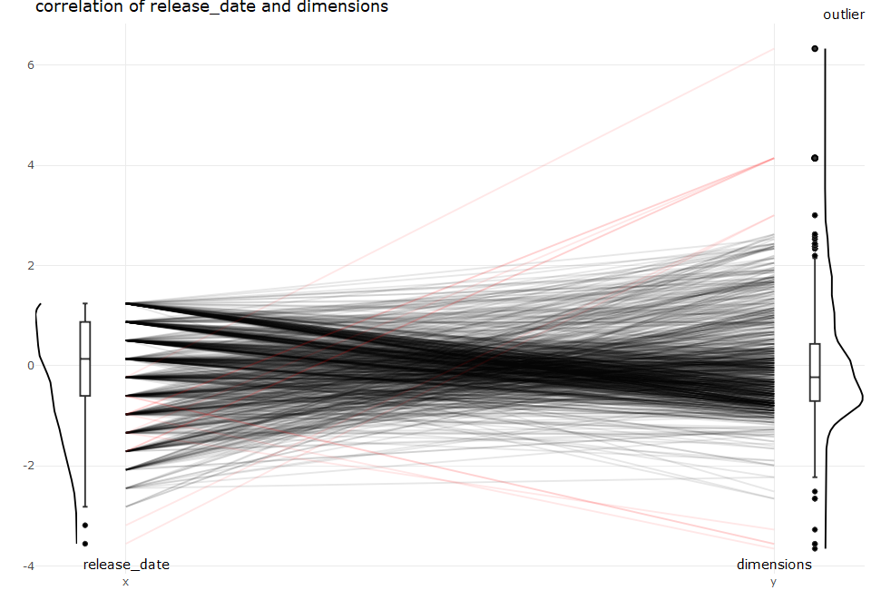

discover correlation with time for camera data set
================
Sascha Siegmund
2021-08-09

## purpose of notebook

-   \[ \]

## insights

-   

## load packages

``` r
library(tidyverse) # tidy data frame
library(ggthemes) # for extra plot themes
library(plotly) # make ggplots interactive

# individual libraries are in the according cell
```

## import data

``` r
df <- read_csv(file = '../data/camera_dataset_processed.csv') %>% column_to_rownames(var = 'model')
```

## overview

``` r
head(df)
```

    ##                        brand release_date max_resolution low_resolution
    ## Agfa ePhoto 1280        Agfa         1997           1024            640
    ## Agfa ePhoto 1680        Agfa         1998           1280            640
    ## Agfa ePhoto CL18        Agfa         2000            640             NA
    ## Agfa ePhoto CL30        Agfa         1999           1152            640
    ## Agfa ePhoto CL30 Clik!  Agfa         1999           1152            640
    ## Agfa ePhoto CL45        Agfa         2001           1600            640
    ##                        effective_pixels zoom_wide_w zoom_tele_t
    ## Agfa ePhoto 1280                      0          38         114
    ## Agfa ePhoto 1680                      1          38         114
    ## Agfa ePhoto CL18                      0          45          45
    ## Agfa ePhoto CL30                      0          35          35
    ## Agfa ePhoto CL30 Clik!                0          43          43
    ## Agfa ePhoto CL45                      1          51          51
    ##                        normal_focus_range macro_focus_range storage_included
    ## Agfa ePhoto 1280                       70                40                4
    ## Agfa ePhoto 1680                       50                NA                4
    ## Agfa ePhoto CL18                       NA                NA                2
    ## Agfa ePhoto CL30                       NA                NA                4
    ## Agfa ePhoto CL30 Clik!                 50                NA               40
    ## Agfa ePhoto CL45                       50                20                8
    ##                        weight_inc_batteries dimensions price
    ## Agfa ePhoto 1280                        420         95   179
    ## Agfa ePhoto 1680                        420        158   179
    ## Agfa ePhoto CL18                         NA         NA   179
    ## Agfa ePhoto CL30                         NA         NA   269
    ## Agfa ePhoto CL30 Clik!                  300        128  1299
    ## Agfa ePhoto CL45                        270        119   179

``` r
summary(df)
```

    ##     brand            release_date  max_resolution low_resolution
    ##  Length:1038        Min.   :1994   Min.   : 512   Min.   : 320  
    ##  Class :character   1st Qu.:2002   1st Qu.:2048   1st Qu.:1280  
    ##  Mode  :character   Median :2004   Median :2560   Median :2048  
    ##                     Mean   :2004   Mean   :2477   Mean   :1871  
    ##                     3rd Qu.:2006   3rd Qu.:3072   3rd Qu.:2560  
    ##                     Max.   :2007   Max.   :5616   Max.   :4992  
    ##                                    NA's   :1      NA's   :54    
    ##  effective_pixels  zoom_wide_w    zoom_tele_t    normal_focus_range
    ##  Min.   : 0.000   Min.   :23.0   Min.   : 28.0   Min.   :  1.00    
    ##  1st Qu.: 3.000   1st Qu.:35.0   1st Qu.:102.0   1st Qu.: 40.00    
    ##  Median : 4.000   Median :36.0   Median :111.0   Median : 50.00    
    ##  Mean   : 4.596   Mean   :35.9   Mean   :132.4   Mean   : 50.86    
    ##  3rd Qu.: 7.000   3rd Qu.:38.0   3rd Qu.:117.0   3rd Qu.: 60.00    
    ##  Max.   :21.000   Max.   :52.0   Max.   :518.0   Max.   :120.00    
    ##                   NA's   :85     NA's   :85      NA's   :137       
    ##  macro_focus_range storage_included weight_inc_batteries   dimensions   
    ##  Min.   : 1.000    Min.   :  1.0    Min.   : 100.0       Min.   : 30.0  
    ##  1st Qu.: 4.000    1st Qu.:  8.0    1st Qu.: 180.0       1st Qu.: 92.0  
    ##  Median : 7.000    Median : 16.0    Median : 230.0       Median :102.0  
    ##  Mean   : 8.875    Mean   : 19.8    Mean   : 325.9       Mean   :106.8  
    ##  3rd Qu.:10.000    3rd Qu.: 24.0    3rd Qu.: 350.0       3rd Qu.:116.0  
    ##  Max.   :85.000    Max.   :450.0    Max.   :1860.0       Max.   :240.0  
    ##  NA's   :128       NA's   :125      NA's   :23           NA's   :16     
    ##      price       
    ##  Min.   :  14.0  
    ##  1st Qu.: 149.0  
    ##  Median : 199.0  
    ##  Mean   : 457.4  
    ##  3rd Qu.: 399.0  
    ##  Max.   :7999.0  
    ## 

## correlation plot

-   

``` r
name = c('')
tmp_df <- df %>% select(release_date, 
                        max_resolution, 
                        zoom_wide_w, 
                        zoom_tele_t, 
                        normal_focus_range, 
                        weight_inc_batteries, 
                        dimensions, 
                        price) %>% 
  na.omit() %>%
  rename(date = release_date,
         max_res = max_resolution,
         z_wide = zoom_wide_w,
         z_tele = zoom_tele_t,
         focus = normal_focus_range,
         weight = weight_inc_batteries,
         dim = dimensions)

cor <- cor(tmp_df)
cor_mtest <- corrplot::cor.mtest(tmp_df, conf.level = 0.99) # combining correlogram with significance test
corrplot::corrplot(cor, method = "number", order = 'hclust', addrect = 3, p.mat = cor_mtest$p, insig = "pch") 
```

<!-- -->

``` r
corrplot::corrplot(cor, p.mat = cor_mtest$p, low = cor_mtest$lowCI, upp = cor_mtest$uppCI, 
                   order = 'hclust', sig.level = 0.01, tl.pos = 'd', addrect = 3, rect.col = 'navy', 
                   plotC = 'rect', cl.pos = 'n', insig = "p-value")
```

<!-- -->

``` r
name = c('')
tmp_df <- df %>% select(release_date, max_resolution, weight_inc_batteries, dimensions, price) %>% na.omit() %>%
  rename(date = release_date,
         max_res = max_resolution,
         weight = weight_inc_batteries,
         dim = dimensions)

cor <- cor(tmp_df)
cor_mtest <- corrplot::cor.mtest(tmp_df, conf.level = 0.99) # combining correlogram with significance test
corrplot::corrplot(cor, method = "number", order = 'hclust', addrect = 3, p.mat = cor_mtest$p, insig = "pch")
```

<!-- -->

``` r
corrplot::corrplot(cor, p.mat = cor_mtest$p, low = cor_mtest$lowCI, upp = cor_mtest$uppCI, 
                   order = 'hclust', sig.level = 0.01, tl.pos = 'd', addrect = 3, rect.col = 'navy', 
                   plotC = 'rect', cl.pos = 'n', insig = "p-value")
```

<!-- -->

## parallel coordinate plot

-   

``` r
name = c('')
tmp_df <- df %>% select(brand, 
                        release_date, 
                        max_resolution, 
                        zoom_wide_w, 
                        zoom_tele_t, 
                        normal_focus_range, 
                        weight_inc_batteries, 
                        dimensions, 
                        price) %>% 
  na.omit() %>%
  rename(date = release_date,
         max_res = max_resolution,
         z_wide = zoom_wide_w,
         z_tele = zoom_tele_t,
         focus = normal_focus_range,
         weight = weight_inc_batteries,
         dim = dimensions)


# https://r-charts.com/ranking/parallel-coordinates-ggplot2/
parcoord_plot <- GGally::ggparcoord(tmp_df,
           columns = 2:ncol(tmp_df), groupColumn = 1,
           scale='center', # scaling: center, std, robust, 
           showPoints = FALSE,
           order = 'allClass', # allClass requires na.omit 
           title = name,
           alphaLines = 0.25) +
  theme_minimal() 
parcoord_plot <- ggplotly(parcoord_plot) %>% layout(autosize=T)

parcoord_plot
```

<!-- -->

``` r
name = c('')
tmp_df <- df %>% select(release_date, 
                        max_resolution, 
                        zoom_wide_w, zoom_tele_t, 
                        normal_focus_range, 
                        weight_inc_batteries, 
                        dimensions, 
                        price) %>% 
  na.omit %>%
  rename(date = release_date,
         max_res = max_resolution,
         z_wide = zoom_wide_w,
         z_tele = zoom_tele_t,
         focus = normal_focus_range,
         weight = weight_inc_batteries,
         dim = dimensions)


outlier <- outliers::scores(tmp_df)
outlier <- outlier > 3 | outlier < -3 # more than 3 std away from mean is outlier
outlier <- outlier %>% as_tibble %>% mutate(outlier = rowMeans(.) > 0.2)
tmp_df <- bind_cols(tmp_df, outlier = outlier$outlier) %>% mutate(outlier = as.factor(outlier))

# https://r-charts.com/ranking/parallel-coordinates-ggplot2/
parcoord_plot <- GGally::ggparcoord(tmp_df,
           columns = 1:(ncol(tmp_df)-1), groupColumn = ncol(tmp_df),
           scale='center', # scaling: standardize and center variables
           showPoints = FALSE,
           order = 'Outlying', # Ordering methods
           title = name,
           alphaLines = 0.1) +
      scale_color_manual(values = c("black", "red")) +
      theme_minimal() 
parcoord_plot <- ggplotly(parcoord_plot) %>% layout(autosize=T)

parcoord_plot
```

<!-- -->

``` r
name = c('weight_inc_batteries', 'max_resolution')
tmp_df <- df %>% rename(x = weight_inc_batteries, y = max_resolution) %>% select(x, y) %>% na.omit


tmp_df <- as_tibble(scale(tmp_df)) # scaling data required to align paroord and other plots

outlier <- outliers::scores(tmp_df)
outlier <- outlier > 3 | outlier < -3 # more than 3 std away from mean is outlier
outlier <- outlier %>% as_tibble %>% mutate(outlier = x | y)
tmp_df <- bind_cols(tmp_df, outlier = outlier$outlier) %>% mutate(outlier = as.factor(outlier))

# https://r-charts.com/ranking/parallel-coordinates-ggplot2/
p1 <- GGally::ggparcoord(tmp_df,
           columns = 1:(ncol(tmp_df)-1), groupColumn = ncol(tmp_df),
           scale='globalminmax', # data already scaled
           showPoints = FALSE,
           splineFactor = TRUE,
           alphaLines = 0.1) +
    scale_color_manual(values = c("black", "red")) +
    theme_minimal() +
    ggtitle(paste("correlation of", name[1], "and", name[2], sep=" "))
p1 <- ggplotly(p1) %>% layout(yaxis = list(title = ''), xaxis = list(title = '')) %>%
  add_annotations(text = name[1], align = 'left', yref='paper', yref = 'paper', x = 1, y = 0, showarrow=FALSE) %>%
  add_annotations(text = name[2], align = 'left', yref='paper', yref = 'paper', x = 2, y = 0, showarrow=FALSE)

p2 <- tmp_df %>%
  ggplot(aes(x = y)) +
    stat_density(geom="line", trim = TRUE) + 
    scale_x_continuous(limits = c(min(tmp_df$x, tmp_df$y), max(tmp_df$x, tmp_df$y))) +
    coord_flip() +
    theme_minimal()
p2 <- ggplotly(p2) %>% layout(yaxis = list(showticklabels = FALSE, showgrid = FALSE, title = ''), 
                              xaxis = list(showticklabels = FALSE, showgrid = FALSE, title = ''))

p3 <- tmp_df %>%
  ggplot(aes(x = 1, y = y)) +
    geom_boxplot() +
    theme_minimal() 
p3 <- ggplotly(p3) %>% layout(yaxis = list(showticklabels = FALSE, showgrid = FALSE, title = ''), 
                              xaxis = list(showticklabels = FALSE, showgrid = FALSE, title = ''))

p4 <- tmp_df %>%
  ggplot(aes(x = x)) +
    stat_density(geom="line", trim = TRUE) + 
    scale_x_continuous(limits = c(min(tmp_df$x, tmp_df$y), max(tmp_df$x, tmp_df$y))) +
    coord_flip() +
    theme_minimal()
p4 <- ggplotly(p4) %>% layout(yaxis = list(showticklabels = TRUE, showgrid = TRUE, title = ''),
                              xaxis = list(showticklabels = FALSE, showgrid = FALSE, title = '', 
                                           autorange = "reversed"))

p5 <- tmp_df %>%
  ggplot(aes(x = 1, y = x)) +
    geom_boxplot() +
    theme_minimal() 
p5 <- ggplotly(p5) %>% layout(yaxis = list(showticklabels = FALSE, showgrid = FALSE, title = ''), 
                              xaxis = list(showticklabels = FALSE, showgrid = FALSE, title = ''))

# merge figures into one plot, via subplots, https://plotly-r.com/arranging-views.html
fig <- subplot(p4, p5, p1, p3, p2,  
               margin = 0, widths = c(0.05, 0.02, 0.86, 0.02, 0.05), 
               shareX = TRUE, shareY = TRUE, titleX = TRUE, titleY = TRUE) %>% layout()

fig
```

<!-- -->

``` r
name = c('low_resolution', 'max_resolution')
tmp_df <- df %>% rename(x = low_resolution, y = max_resolution) %>% select(x, y) %>% na.omit


tmp_df <- as_tibble(scale(tmp_df)) # scaling data required to align paroord and other plots

outlier <- outliers::scores(tmp_df)
outlier <- outlier > 3 | outlier < -3 # more than 3 std away from mean is outlier
outlier <- outlier %>% as_tibble %>% mutate(outlier = x | y)
tmp_df <- bind_cols(tmp_df, outlier = outlier$outlier) %>% mutate(outlier = as.factor(outlier))

# https://r-charts.com/ranking/parallel-coordinates-ggplot2/
p1 <- GGally::ggparcoord(tmp_df,
           columns = 1:(ncol(tmp_df)-1), groupColumn = ncol(tmp_df),
           scale='globalminmax', # data already scaled
           showPoints = FALSE,
           splineFactor = TRUE,
           alphaLines = 0.1) +
    scale_color_manual(values = c("black", "red")) +
    theme_minimal() +
    ggtitle(paste("correlation of", name[1], "and", name[2], sep=" "))
p1 <- ggplotly(p1) %>% layout(yaxis = list(title = ''), xaxis = list(title = '')) %>%
  add_annotations(text = name[1], align = 'left', yref='paper', yref = 'paper', x = 1, y = 0, showarrow=FALSE) %>%
  add_annotations(text = name[2], align = 'left', yref='paper', yref = 'paper', x = 2, y = 0, showarrow=FALSE)

p2 <- tmp_df %>%
  ggplot(aes(x = y)) +
    stat_density(geom="line", trim = TRUE) + 
    scale_x_continuous(limits = c(min(tmp_df$x, tmp_df$y), max(tmp_df$x, tmp_df$y))) +
    coord_flip() +
    theme_minimal()
p2 <- ggplotly(p2) %>% layout(yaxis = list(showticklabels = FALSE, showgrid = FALSE, title = ''), 
                              xaxis = list(showticklabels = FALSE, showgrid = FALSE, title = ''))

p3 <- tmp_df %>%
  ggplot(aes(x = 1, y = y)) +
    geom_boxplot() +
    theme_minimal() 
p3 <- ggplotly(p3) %>% layout(yaxis = list(showticklabels = FALSE, showgrid = FALSE, title = ''), 
                              xaxis = list(showticklabels = FALSE, showgrid = FALSE, title = ''))

p4 <- tmp_df %>%
  ggplot(aes(x = x)) +
    stat_density(geom="line", trim = TRUE) + 
    scale_x_continuous(limits = c(min(tmp_df$x, tmp_df$y), max(tmp_df$x, tmp_df$y))) +
    coord_flip() +
    theme_minimal()
p4 <- ggplotly(p4) %>% layout(yaxis = list(showticklabels = TRUE, showgrid = TRUE, title = ''),
                              xaxis = list(showticklabels = FALSE, showgrid = FALSE, title = '', 
                                           autorange = "reversed"))

p5 <- tmp_df %>%
  ggplot(aes(x = 1, y = x)) +
    geom_boxplot() +
    theme_minimal() 
p5 <- ggplotly(p5) %>% layout(yaxis = list(showticklabels = FALSE, showgrid = FALSE, title = ''), 
                              xaxis = list(showticklabels = FALSE, showgrid = FALSE, title = ''))

# merge figures into one plot, via subplots, https://plotly-r.com/arranging-views.html
fig <- subplot(p4, p5, p1, p3, p2,  
               margin = 0, widths = c(0.05, 0.02, 0.86, 0.02, 0.05), 
               shareX = TRUE, shareY = TRUE, titleX = TRUE, titleY = TRUE) %>% layout()

fig
```

<!-- -->

``` r
name = c('release_date', 'dimensions')
tmp_df <- df %>% rename(x = release_date, y = dimensions) %>% select(x, y) %>% na.omit


tmp_df <- as_tibble(scale(tmp_df)) # scaling data required to align paroord and other plots

outlier <- outliers::scores(tmp_df)
outlier <- outlier > 3 | outlier < -3 # more than 3 std away from mean is outlier
outlier <- outlier %>% as_tibble %>% mutate(outlier = x | y)
tmp_df <- bind_cols(tmp_df, outlier = outlier$outlier) %>% mutate(outlier = as.factor(outlier))

# https://r-charts.com/ranking/parallel-coordinates-ggplot2/
p1 <- GGally::ggparcoord(tmp_df,
           columns = 1:(ncol(tmp_df)-1), groupColumn = ncol(tmp_df),
           scale='globalminmax', # data already scaled
           showPoints = FALSE,
           splineFactor = TRUE,
           alphaLines = 0.1) +
    scale_color_manual(values = c("black", "red")) +
    theme_minimal() +
    ggtitle(paste("correlation of", name[1], "and", name[2], sep=" "))
p1 <- ggplotly(p1) %>% layout(yaxis = list(title = ''), xaxis = list(title = '')) %>%
  add_annotations(text = name[1], align = 'left', yref='paper', yref = 'paper', x = 1, y = 0, showarrow=FALSE) %>%
  add_annotations(text = name[2], align = 'left', yref='paper', yref = 'paper', x = 2, y = 0, showarrow=FALSE)

p2 <- tmp_df %>%
  ggplot(aes(x = y)) +
    stat_density(geom="line", trim = TRUE) + 
    scale_x_continuous(limits = c(min(tmp_df$x, tmp_df$y), max(tmp_df$x, tmp_df$y))) +
    coord_flip() +
    theme_minimal()
p2 <- ggplotly(p2) %>% layout(yaxis = list(showticklabels = FALSE, showgrid = FALSE, title = ''), 
                              xaxis = list(showticklabels = FALSE, showgrid = FALSE, title = ''))

p3 <- tmp_df %>%
  ggplot(aes(x = 1, y = y)) +
    geom_boxplot() +
    theme_minimal() 
p3 <- ggplotly(p3) %>% layout(yaxis = list(showticklabels = FALSE, showgrid = FALSE, title = ''), 
                              xaxis = list(showticklabels = FALSE, showgrid = FALSE, title = ''))

p4 <- tmp_df %>%
  ggplot(aes(x = x)) +
    stat_density(geom="line", trim = TRUE) + 
    scale_x_continuous(limits = c(min(tmp_df$x, tmp_df$y), max(tmp_df$x, tmp_df$y))) +
    coord_flip() +
    theme_minimal()
p4 <- ggplotly(p4) %>% layout(yaxis = list(showticklabels = TRUE, showgrid = TRUE, title = ''),
                              xaxis = list(showticklabels = FALSE, showgrid = FALSE, title = '', 
                                           autorange = "reversed"))

p5 <- tmp_df %>%
  ggplot(aes(x = 1, y = x)) +
    geom_boxplot() +
    theme_minimal() 
p5 <- ggplotly(p5) %>% layout(yaxis = list(showticklabels = FALSE, showgrid = FALSE, title = ''), 
                              xaxis = list(showticklabels = FALSE, showgrid = FALSE, title = ''))

# merge figures into one plot, via subplots, https://plotly-r.com/arranging-views.html
fig <- subplot(p4, p5, p1, p3, p2,  
               margin = 0, widths = c(0.05, 0.02, 0.86, 0.02, 0.05), 
               shareX = TRUE, shareY = TRUE, titleX = TRUE, titleY = TRUE) %>% layout()

fig
```

<!-- -->

``` r
name = c('release_date', 'price')
tmp_df <- df %>% rename(x = release_date, y = price) %>% select(x, y) %>% na.omit


tmp_df <- as_tibble(scale(tmp_df)) # scaling data required to align paroord and other plots

outlier <- outliers::scores(tmp_df)
outlier <- outlier > 3 | outlier < -3 # more than 3 std away from mean is outlier
outlier <- outlier %>% as_tibble %>% mutate(outlier = x | y)
tmp_df <- bind_cols(tmp_df, outlier = outlier$outlier) %>% mutate(outlier = as.factor(outlier))

# https://r-charts.com/ranking/parallel-coordinates-ggplot2/
p1 <- GGally::ggparcoord(tmp_df,
           columns = 1:(ncol(tmp_df)-1), groupColumn = ncol(tmp_df),
           scale='globalminmax', # data already scaled
           showPoints = FALSE,
           splineFactor = TRUE,
           alphaLines = 0.1) +
    scale_color_manual(values = c("black", "red")) +
    theme_minimal() +
    ggtitle(paste("correlation of", name[1], "and", name[2], sep=" "))
p1 <- ggplotly(p1) %>% layout(yaxis = list(title = ''), xaxis = list(title = '')) %>%
  add_annotations(text = name[1], align = 'left', yref='paper', yref = 'paper', x = 1, y = 0, showarrow=FALSE) %>%
  add_annotations(text = name[2], align = 'left', yref='paper', yref = 'paper', x = 2, y = 0, showarrow=FALSE)

p2 <- tmp_df %>%
  ggplot(aes(x = y)) +
    stat_density(geom="line", trim = TRUE) + 
    scale_x_continuous(limits = c(min(tmp_df$x, tmp_df$y), max(tmp_df$x, tmp_df$y))) +
    coord_flip() +
    theme_minimal()
p2 <- ggplotly(p2) %>% layout(yaxis = list(showticklabels = FALSE, showgrid = FALSE, title = ''), 
                              xaxis = list(showticklabels = FALSE, showgrid = FALSE, title = ''))

p3 <- tmp_df %>%
  ggplot(aes(x = 1, y = y)) +
    geom_boxplot() +
    theme_minimal() 
p3 <- ggplotly(p3) %>% layout(yaxis = list(showticklabels = FALSE, showgrid = FALSE, title = ''), 
                              xaxis = list(showticklabels = FALSE, showgrid = FALSE, title = ''))

p4 <- tmp_df %>%
  ggplot(aes(x = x)) +
    stat_density(geom="line", trim = TRUE) + 
    scale_x_continuous(limits = c(min(tmp_df$x, tmp_df$y), max(tmp_df$x, tmp_df$y))) +
    coord_flip() +
    theme_minimal()
p4 <- ggplotly(p4) %>% layout(yaxis = list(showticklabels = TRUE, showgrid = TRUE, title = ''),
                              xaxis = list(showticklabels = FALSE, showgrid = FALSE, title = '', 
                                           autorange = "reversed"))

p5 <- tmp_df %>%
  ggplot(aes(x = 1, y = x)) +
    geom_boxplot() +
    theme_minimal() 
p5 <- ggplotly(p5) %>% layout(yaxis = list(showticklabels = FALSE, showgrid = FALSE, title = ''), 
                              xaxis = list(showticklabels = FALSE, showgrid = FALSE, title = ''))

# merge figures into one plot, via subplots, https://plotly-r.com/arranging-views.html
fig <- subplot(p4, p5, p1, p3, p2,  
               margin = 0, widths = c(0.05, 0.02, 0.86, 0.02, 0.05), 
               shareX = TRUE, shareY = TRUE, titleX = TRUE, titleY = TRUE) %>% layout()

fig
```

<!-- -->
