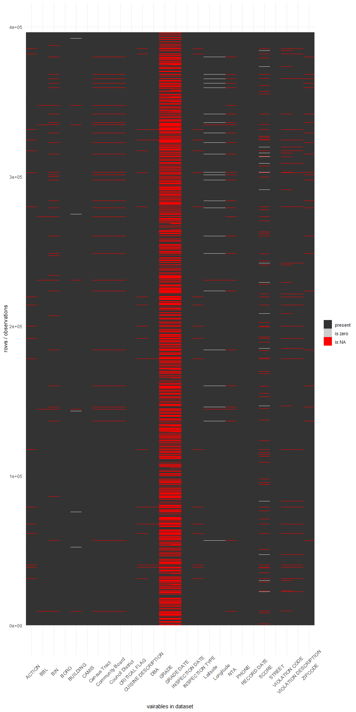
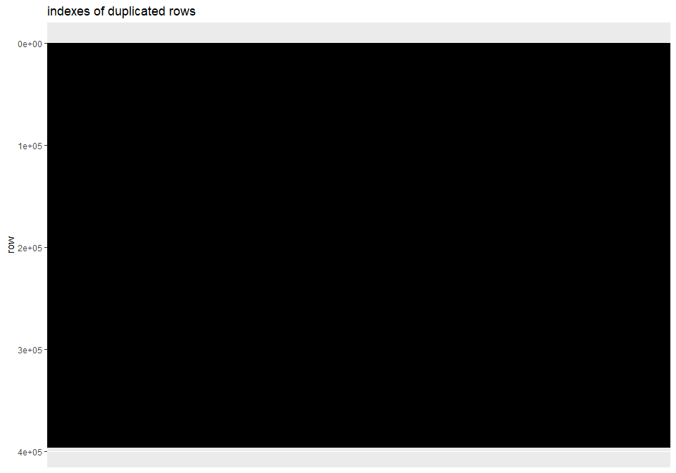

cleaning for New York City Restaurant Inspection Results
================
Sascha Siegmund
2021-09-04

## purpose of notebook

-   [x] initial look at data to get a basic understanding and gather
    todos -&gt; df\_raw
-   [x] tidy up and cleaning of data set -&gt; df
-   [x] all processing of the data set happens here and is saved to
    pre-/processed csv-&gt; df

## observations

-   a lot of missing values in grade and grade date but often with
    reason, there is a pattern that latitude, longitude and nta are
    missing together so also not MAR, furthermore some rows miss most
    column values since they are not initially inspected
    (inspection\_date == 01/01/1900)
-   some duplicated rows, which need to be removed; also note, that
    visualization is note working appropriately for big data sets and a
    fair amount of duplicates
-   cleaning:
    -   clean names
    -   removed columns with no valuable information (-building,
        -zipcode, -phone, -record\_date, -community\_board,
        -council\_district, -census\_tract, -bin, -bbl)
    -   date to correct format. removed duplicated rows
    -   categorical variables as factors (even though it can’t be saved
        in csv)
    -   shorten often repeated long description of factor levels
-   added variables: non yet

## load packages

``` r
library(tidyverse) # tidy data frame
library(lubridate) # functions to work with date-times and time-spans
library(scrubr) # like dplyr but specifically for occurrence data
library(janitor) # expedite the initial data exploration and cleaning that comes with any new data set
library(plotly)
```

## import data

``` r
df_raw <- read_csv(file = '../data/DOHMH_New_York_City_Restaurant_Inspection_Results.csv') 
df <- df_raw
```

## first look at data

``` r
head(df_raw, 25)
```

    ## # A tibble: 25 x 26
    ##      CAMIS DBA        BORO  BUILDING STREET   ZIPCODE PHONE  `CUISINE DESCRIPTI~
    ##      <dbl> <chr>      <chr> <chr>    <chr>      <dbl> <chr>  <chr>              
    ##  1  5.00e7 LA CHACRA  Broo~ 1928     BATH AV~   11214 71875~ Peruvian           
    ##  2  4.14e7 MING'S RE~ Manh~ 413415   9 AVENUE      NA 21286~ Chinese            
    ##  3  4.13e7 T BAAR     Broo~ 4823     8 AVENUE   11220 34735~ Juice, Smoothies, ~
    ##  4  5.01e7 GRAB AND ~ Manh~ 20       WEST   ~   10036 64626~ Jewish/Kosher      
    ##  5  5.00e7 BHATTI IN~ Manh~ 100      LEXINGT~   10016 21268~ Indian             
    ##  6  4.11e7 JADE GARD~ Quee~ 170-12A  HILLSID~   11432 71865~ Chinese            
    ##  7  4.07e7 LENNY'S B~ Manh~ 2601     BROADWAY   10025 21222~ Bagels/Pretzels    
    ##  8  5.00e7 ROKC       Manh~ 3452     BROADWAY   10031 34774~ Japanese           
    ##  9  5.01e7 TWIST      Broo~ 4202     3 AVENUE   11232 64663~ Seafood            
    ## 10  5.01e7 WOODHAVEN~ Quee~ 10509    CROSSBA~   11417 71852~ Pizza              
    ## # ... with 15 more rows, and 18 more variables: INSPECTION DATE <chr>,
    ## #   ACTION <chr>, VIOLATION CODE <chr>, VIOLATION DESCRIPTION <chr>,
    ## #   CRITICAL FLAG <chr>, SCORE <dbl>, GRADE <chr>, GRADE DATE <chr>,
    ## #   RECORD DATE <chr>, INSPECTION TYPE <chr>, Latitude <dbl>, Longitude <dbl>,
    ## #   Community Board <dbl>, Council District <chr>, Census Tract <chr>,
    ## #   BIN <dbl>, BBL <dbl>, NTA <chr>

``` r
tail(df_raw)
```

    ## # A tibble: 6 x 26
    ##     CAMIS DBA        BORO    BUILDING STREET   ZIPCODE PHONE  `CUISINE DESCRIPT~
    ##     <dbl> <chr>      <chr>   <chr>    <chr>      <dbl> <chr>  <chr>             
    ## 1  5.01e7 KENNEDY F~ Queens  8905C    165TH ST   11432 51682~ Chicken           
    ## 2  5.01e7 YUMMY CHI~ Queens  1717     CORNELI~   11385 71838~ Chinese           
    ## 3  5.01e7 YUMMY CHI~ Queens  1717     CORNELI~   11385 71838~ Chinese           
    ## 4  5.00e7 NAGLE BAK~ Manhat~ 121B     NAGLE A~   10040 64647~ Bakery Products/D~
    ## 5  5.01e7 TWO BROTH~ Staten~ 95       PAGE AV~   10309 71894~ Pizza             
    ## 6  5.01e7 LAN ZHOU ~ Brookl~ 6301     8TH AVE    11220 34749~ Chinese           
    ## # ... with 18 more variables: INSPECTION DATE <chr>, ACTION <chr>,
    ## #   VIOLATION CODE <chr>, VIOLATION DESCRIPTION <chr>, CRITICAL FLAG <chr>,
    ## #   SCORE <dbl>, GRADE <chr>, GRADE DATE <chr>, RECORD DATE <chr>,
    ## #   INSPECTION TYPE <chr>, Latitude <dbl>, Longitude <dbl>,
    ## #   Community Board <dbl>, Council District <chr>, Census Tract <chr>,
    ## #   BIN <dbl>, BBL <dbl>, NTA <chr>

``` r
summary(df_raw)
```

    ##      CAMIS              DBA                BORO             BUILDING        
    ##  Min.   :30075445   Length:396356      Length:396356      Length:396356     
    ##  1st Qu.:41434827   Class :character   Class :character   Class :character  
    ##  Median :50011359   Mode  :character   Mode  :character   Mode  :character  
    ##  Mean   :46356493                                                           
    ##  3rd Qu.:50061258                                                           
    ##  Max.   :50114443                                                           
    ##                                                                             
    ##     STREET             ZIPCODE         PHONE           CUISINE DESCRIPTION
    ##  Length:396356      Min.   :10000   Length:396356      Length:396356      
    ##  Class :character   1st Qu.:10022   Class :character   Class :character   
    ##  Mode  :character   Median :10469   Mode  :character   Mode  :character   
    ##                     Mean   :10680                                         
    ##                     3rd Qu.:11229                                         
    ##                     Max.   :30339                                         
    ##                     NA's   :6183                                          
    ##  INSPECTION DATE       ACTION          VIOLATION CODE     VIOLATION DESCRIPTION
    ##  Length:396356      Length:396356      Length:396356      Length:396356        
    ##  Class :character   Class :character   Class :character   Class :character     
    ##  Mode  :character   Mode  :character   Mode  :character   Mode  :character     
    ##                                                                                
    ##                                                                                
    ##                                                                                
    ##                                                                                
    ##  CRITICAL FLAG          SCORE           GRADE            GRADE DATE       
    ##  Length:396356      Min.   :  0.00   Length:396356      Length:396356     
    ##  Class :character   1st Qu.: 11.00   Class :character   Class :character  
    ##  Mode  :character   Median : 15.00   Mode  :character   Mode  :character  
    ##                     Mean   : 20.17                                        
    ##                     3rd Qu.: 26.00                                        
    ##                     Max.   :164.00                                        
    ##                     NA's   :18864                                         
    ##  RECORD DATE        INSPECTION TYPE       Latitude       Longitude     
    ##  Length:396356      Length:396356      Min.   : 0.00   Min.   :-74.25  
    ##  Class :character   Class :character   1st Qu.:40.69   1st Qu.:-73.99  
    ##  Mode  :character   Mode  :character   Median :40.73   Median :-73.96  
    ##                                        Mean   :40.10   Mean   :-72.80  
    ##                                        3rd Qu.:40.76   3rd Qu.:-73.90  
    ##                                        Max.   :40.91   Max.   :  0.00  
    ##                                        NA's   :449     NA's   :449     
    ##  Community Board Council District   Census Tract            BIN         
    ##  Min.   :101.0   Length:396356      Length:396356      Min.   :1000000  
    ##  1st Qu.:105.0   Class :character   Class :character   1st Qu.:1043794  
    ##  Median :301.0   Mode  :character   Mode  :character   Median :3007516  
    ##  Mean   :248.5                                         Mean   :2510113  
    ##  3rd Qu.:401.0                                         3rd Qu.:4001993  
    ##  Max.   :595.0                                         Max.   :5799501  
    ##  NA's   :7029                                          NA's   :8846     
    ##       BBL                NTA           
    ##  Min.   :1.000e+00   Length:396356     
    ##  1st Qu.:1.010e+09   Class :character  
    ##  Median :3.002e+09   Mode  :character  
    ##  Mean   :2.399e+09                     
    ##  3rd Qu.:4.002e+09                     
    ##  Max.   :5.270e+09                     
    ##  NA's   :901

## missing values

-   a lot of missing values in grade and grade date but often with
    reason, there is a pattern that latitude, longitude and nta are
    missing together so also not MAR, furthermore some rows miss most
    column values since they are not initially inspected
    (inspection\_date == 01/01/1900)

``` r
#create data frame with information on whether the value in each cell is zero
tmp_df <- df_raw == 0
missing_by_column <- tmp_df %>%
  as_tibble %>% # convert to data frame
  mutate(row_number = 1:nrow(.)) %>% # add a column with the row number
  gather(variable, is_missing, -row_number) # turn wide data into narrow data

# plot the missing values in our data frame
ggplot(missing_by_column, aes(x = variable, y = row_number, fill =  is_missing)) +
  geom_tile() +
  theme_minimal() +
  scale_fill_grey(name = "",
                  labels = c("present", "is zero", "is NA")) +
  theme(axis.text.x = element_text(angle=45, vjust=0.7, size=10)) +
  labs(x = "vairables in dataset",
       y = "rows / observations")
```

<!-- -->

## duplicated rows

-   some duplicated rows, which need to be removed; also note, that
    visualization is note working appropriately for big data sets and a
    fair amount of duplicates

``` r
# get row number of duplicated rows
duplicated_rows <- tibble(duplicated = duplicated(df_raw), row = 1:nrow(df_raw)) %>%
  filter(duplicated == T)

# plot duplicated rows as black lines
ggplot(duplicated_rows, aes(xintercept = row)) +
  geom_vline(aes(xintercept = row)) + # plot a black line for each duplicated row
  ggtitle("indexes of duplicated rows") + # add title
  coord_flip() + # flip x and y axis
  scale_x_reverse() # reverse x axis
```

<!-- -->

## cleaning

-   clean names, removed columns with no valuable information
    (-building, -zipcode, -phone, -record\_date, -community\_board,
    -council\_district, -census\_tract, -bin, -bbl), date to correct
    format. removed duplicated rows, categorical variables as factors
    (even though it can’t be saved in csv), shorten often repeated long
    description of factor levels

``` r
df <- df %>%
  clean_names() %>% # get clean column names with janitor package
  select(-building, -zipcode, -phone, -record_date, -community_board, -council_district, -census_tract, -bin, -bbl) %>% # remove columns with no valuable information
  mutate(inspection_date = mdy(inspection_date)) %>% # date to correct format
  mutate(grade_date = mdy(grade_date)) %>% # date to correct format
  distinct() # remove duplicated rows

# categorical col as factor 
df <- df %>%
  mutate(boro = factor(boro)) %>%
  mutate(cuisine_description = factor(cuisine_description)) %>%
  mutate(violation_code = factor(violation_code)) %>%
  mutate(critical_flag = factor(critical_flag)) %>%
  mutate(grade = factor(grade)) %>%
  mutate(nta = factor(nta)) %>%
  mutate(inspection_type = factor(inspection_type)) %>%
  mutate(action = factor(action)) 

# shorten often repeated long description
df <- df %>%
  mutate(action = recode_factor(action, `Violations were cited in the following area(s).` = "violations")) %>%
  mutate(action = recode_factor(action, `Establishment Closed by DOHMH. Violations were cited in the following area(s) and those requiring immediate action were addressed.` = "closed")) %>%
  mutate(action = recode_factor(action, `No violations were recorded at the time of this inspection.` = "no_violations")) %>%
  mutate(action = recode_factor(action, `Establishment re-closed by DOHMH.` = "re_closed")) %>%
  mutate(action = recode_factor(action, `Establishment re-opened by DOHMH.` = "re_opened"))

df <- df %>%
  mutate(cuisine_description = recode_factor(cuisine_description, `Not Listed/Not Applicable` = 'Other'))  %>%
  mutate(cuisine_description = recode_factor(cuisine_description, `Sandwiches/Salads/Mixed Buffet` = 'Mixed Buffet')) %>%
  mutate(cuisine_description = recode_factor(cuisine_description, `Juice, Smoothies, Fruit Salads` = 'Smoothies/Fruit Salads'))
  
df <- df %>%
  mutate(critical_flag = recode_factor(critical_flag, `Not Applicable` = NA_character_)) %>%
  mutate(critical_flag = recode_factor(critical_flag, `Critical` = '1')) %>%
  mutate(critical_flag = recode_factor(critical_flag, `Not Critical` = '0'))
```

## additional variables

-   non yet

``` r
# check results from cleaning and added variables
head(df)
```

    ## # A tibble: 6 x 17
    ##     camis dba        boro    street    cuisine_descript~ inspection_date action 
    ##     <dbl> <chr>      <fct>   <chr>     <fct>             <date>          <fct>  
    ## 1  5.00e7 LA CHACRA  Brookl~ BATH AVE~ Peruvian          2017-03-30      violat~
    ## 2  4.14e7 MING'S RE~ Manhat~ 9 AVENUE  Chinese           2017-08-08      violat~
    ## 3  4.13e7 T BAAR     Brookl~ 8 AVENUE  Smoothies/Fruit ~ 2018-07-18      violat~
    ## 4  5.01e7 GRAB AND ~ Manhat~ WEST   4~ Jewish/Kosher     2020-01-09      violat~
    ## 5  5.00e7 BHATTI IN~ Manhat~ LEXINGTO~ Indian            2018-05-23      violat~
    ## 6  4.11e7 JADE GARD~ Queens  HILLSIDE~ Chinese           2016-09-06      violat~
    ## # ... with 10 more variables: violation_code <fct>,
    ## #   violation_description <chr>, critical_flag <fct>, score <dbl>, grade <fct>,
    ## #   grade_date <date>, inspection_type <fct>, latitude <dbl>, longitude <dbl>,
    ## #   nta <fct>

``` r
summary(df)
```

    ##      camis              dba                       boro       
    ##  Min.   :30075445   Length:372829      0            :   140  
    ##  1st Qu.:41435182   Class :character   Bronx        : 34624  
    ##  Median :50011580   Mode  :character   Brooklyn     : 93738  
    ##  Mean   :46362209                      Manhattan    :146338  
    ##  3rd Qu.:50061322                      Queens       : 85788  
    ##  Max.   :50114443                      Staten Island: 12201  
    ##                                                              
    ##     street              cuisine_description inspection_date     
    ##  Length:372829      American      : 70926   Min.   :1900-01-01  
    ##  Class :character   Chinese       : 39268   1st Qu.:2018-02-02  
    ##  Mode  :character   Pizza         : 23168   Median :2018-12-10  
    ##                     Coffee/Tea    : 18152   Mean   :2017-05-25  
    ##                     Latin American: 16697   3rd Qu.:2019-08-12  
    ##                     (Other)       :200040   Max.   :2021-08-18  
    ##                     NA's          :  4578                       
    ##            action       violation_code   violation_description critical_flag
    ##  re_opened    :  3998   10F    : 52273   Length:372829         0   :162993  
    ##  re_closed    :    71   08A    : 41182   Class :character      1   :202908  
    ##  no_violations:  4708   04L    : 27389   Mode  :character      NA's:  6928  
    ##  closed       : 14678   06D    : 25337                                      
    ##  violations   :344797   06C    : 22071                                      
    ##  NA's         :  4577   (Other):195169                                      
    ##                         NA's   :  9408                                      
    ##      score            grade          grade_date        
    ##  Min.   :  0.00   A      :146878   Min.   :2011-05-27  
    ##  1st Qu.: 11.00   B      : 23913   1st Qu.:2018-02-12  
    ##  Median : 15.00   C      :  9153   Median :2018-12-10  
    ##  Mean   : 20.36   N      :  3636   Mean   :2018-10-29  
    ##  3rd Qu.: 26.00   P      :  2431   3rd Qu.:2019-08-01  
    ##  Max.   :164.00   (Other):   746   Max.   :2021-08-18  
    ##  NA's   :18548    NA's   :186072   NA's   :189701      
    ##                                           inspection_type      latitude    
    ##  Cycle Inspection / Initial Inspection            :216784   Min.   : 0.00  
    ##  Cycle Inspection / Re-inspection                 : 86955   1st Qu.:40.69  
    ##  Pre-permit (Operational) / Initial Inspection    : 27954   Median :40.73  
    ##  Pre-permit (Operational) / Re-inspection         : 11226   Mean   :40.10  
    ##  Administrative Miscellaneous / Initial Inspection:  6896   3rd Qu.:40.76  
    ##  (Other)                                          : 18437   Max.   :40.91  
    ##  NA's                                             :  4577   NA's   :430    
    ##    longitude           nta        
    ##  Min.   :-74.25   MN17   : 22380  
    ##  1st Qu.:-73.99   MN23   : 11080  
    ##  Median :-73.96   MN13   : 10469  
    ##  Mean   :-72.80   MN24   : 10319  
    ##  3rd Qu.:-73.90   MN27   :  9253  
    ##  Max.   :  0.00   (Other):302714  
    ##  NA's   :430      NA's   :  6614

## save processed data

``` r
df %>% write_csv(file = '../data/restaurants_data_processed.csv')
```
