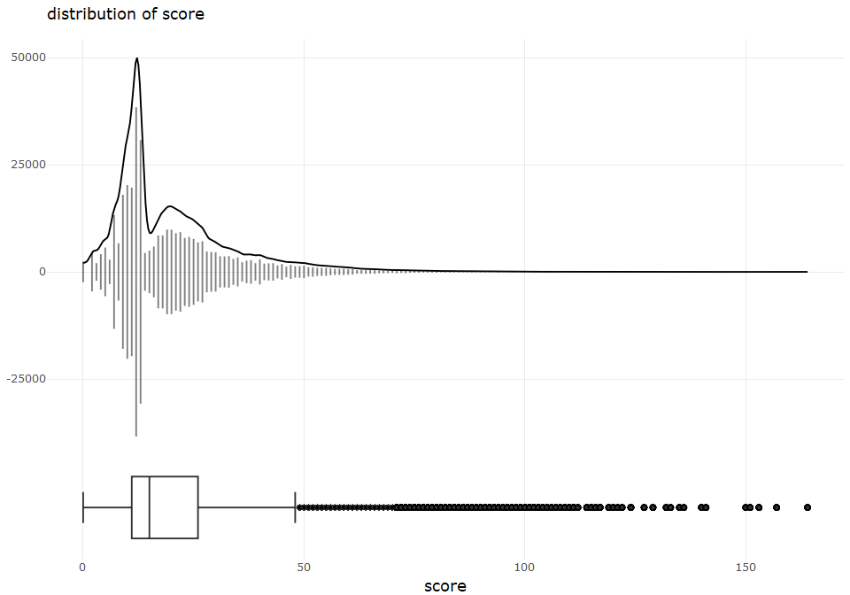

describe univariate for New York City Restaurant Inspection Results
================
Sascha Siegmund
2021-09-04

## purpose of notebook

-   [x] describe & visualize single variables (univariate)
-   [x] gather interesting observations for further investigation
-   [x] gather possible new features for extraction

## insights

-   camis: there are some few numbers starting with 3, which are also
    very low in count (&lt; 12), and a lot of numbers starting with 4 or
    5, which vary in count (40 - 90), for 5 the numbers are very dense
    or high in count
-   boro: most restaurants are in Manhattan (40%), equally many in
    Brooklyn and Queens (23% each), only few in Bronx and Staten Island
    (both &lt; 14%)
-   street: top 3 are Broadway, 3 Avenue, 5 Avenue, 2 Avenue;
    distribution looks exponential
-   cuisine\_description: top 3 are American, Chinese, Pizza;
    distribution looks exponential
-   action: almost all observations are violations, but be aware that
    one inspection might yield multiple violations as observations in
    the data set, second is closed and third is no\_violations;
    -   to have a better view, we need to make the inspection date per
        camis unique to only have one observation per inspection: still
        violations are almost all observations, but ratio closed to
        re\_opened is quite equal now, sadly more closed then
        no\_violations
-   violation\_code: distribution is exponential with some big steps,
    top is 10F and second 08A by far
    -   10F = Non-food contact surface improperly constructed.
        Unacceptable material used. Non-food contact surface or
        equipment improperly maintained and/or not properly sealed,
        raised, spaced or movable to allow accessibility for cleaning on
        all sides, above and underneath the unit.
    -   08A = Facility not vermin proof. Harborage or conditions
        conducive to attracting vermin to the premises and/or allowing
        vermin to exist.
-   critical\_flag: 55% are critical and 44% are not critical
    observations, only very few NAs (not MAR)
-   score: half of the data has a score lower than 15, and upper fence
    is at 48, but there are a lot of outliers up to 164, distribution
    looks negative binomial
-   grade\_date: there are more inspections with increasing time, but a
    gap from 2020-03-14 till 2021-07-19 with only a very few
    observations, mostly due to covid lookdown
-   inspection\_type: most are Cycle Inspection / Initial inspection and
    second Cycle Inspection / Re-Inspection, distribution looks
    exponential
-   nta: distribution looks exponential, top 4 are MN17, MN23, MN13,
    MN24

## load packages

``` r
library(tidyverse) # tidy data frame
library(plotly) # make ggplots interactive
```

## import data

``` r
df <- read_csv(file = '../data/restaurants_data_processed.csv')
```

## overview

``` r
head(df)
```

    ## # A tibble: 6 x 17
    ##     camis dba        boro    street    cuisine_descript~ inspection_date action 
    ##     <dbl> <chr>      <chr>   <chr>     <chr>             <date>          <chr>  
    ## 1  5.00e7 LA CHACRA  Brookl~ BATH AVE~ Peruvian          2017-03-30      violat~
    ## 2  4.14e7 MING'S RE~ Manhat~ 9 AVENUE  Chinese           2017-08-08      violat~
    ## 3  4.13e7 T BAAR     Brookl~ 8 AVENUE  Smoothies/Fruit ~ 2018-07-18      violat~
    ## 4  5.01e7 GRAB AND ~ Manhat~ WEST   4~ Jewish/Kosher     2020-01-09      violat~
    ## 5  5.00e7 BHATTI IN~ Manhat~ LEXINGTO~ Indian            2018-05-23      violat~
    ## 6  4.11e7 JADE GARD~ Queens  HILLSIDE~ Chinese           2016-09-06      violat~
    ## # ... with 10 more variables: violation_code <chr>,
    ## #   violation_description <chr>, critical_flag <dbl>, score <dbl>, grade <chr>,
    ## #   grade_date <date>, inspection_type <chr>, latitude <dbl>, longitude <dbl>,
    ## #   nta <chr>

``` r
summary(df)
```

    ##      camis              dba                boro              street         
    ##  Min.   :30075445   Length:372829      Length:372829      Length:372829     
    ##  1st Qu.:41435182   Class :character   Class :character   Class :character  
    ##  Median :50011580   Mode  :character   Mode  :character   Mode  :character  
    ##  Mean   :46362209                                                           
    ##  3rd Qu.:50061322                                                           
    ##  Max.   :50114443                                                           
    ##                                                                             
    ##  cuisine_description inspection_date         action          violation_code    
    ##  Length:372829       Min.   :1900-01-01   Length:372829      Length:372829     
    ##  Class :character    1st Qu.:2018-02-02   Class :character   Class :character  
    ##  Mode  :character    Median :2018-12-10   Mode  :character   Mode  :character  
    ##                      Mean   :2017-05-25                                        
    ##                      3rd Qu.:2019-08-12                                        
    ##                      Max.   :2021-08-18                                        
    ##                                                                                
    ##  violation_description critical_flag       score           grade          
    ##  Length:372829         Min.   :0.000   Min.   :  0.00   Length:372829     
    ##  Class :character      1st Qu.:0.000   1st Qu.: 11.00   Class :character  
    ##  Mode  :character      Median :1.000   Median : 15.00   Mode  :character  
    ##                        Mean   :0.555   Mean   : 20.36                     
    ##                        3rd Qu.:1.000   3rd Qu.: 26.00                     
    ##                        Max.   :1.000   Max.   :164.00                     
    ##                        NA's   :6928    NA's   :18548                      
    ##    grade_date         inspection_type       latitude       longitude     
    ##  Min.   :2011-05-27   Length:372829      Min.   : 0.00   Min.   :-74.25  
    ##  1st Qu.:2018-02-12   Class :character   1st Qu.:40.69   1st Qu.:-73.99  
    ##  Median :2018-12-10   Mode  :character   Median :40.73   Median :-73.96  
    ##  Mean   :2018-10-29                      Mean   :40.10   Mean   :-72.80  
    ##  3rd Qu.:2019-08-01                      3rd Qu.:40.76   3rd Qu.:-73.90  
    ##  Max.   :2021-08-18                      Max.   :40.91   Max.   :  0.00  
    ##  NA's   :189701                          NA's   :430     NA's   :430     
    ##      nta           
    ##  Length:372829     
    ##  Class :character  
    ##  Mode  :character  
    ##                    
    ##                    
    ##                    
    ## 

## univariate numeric/nominal camis

-   camis: there are some few numbers starting with 3, which are also
    very low in count (&lt; 12), and a lot of numbers starting with 4 or
    5, which vary in count (40 - 90), for 5 the numbers are very dense
    or high in count

``` r
# one variable, continuous x, show distribution
name = 'camis'
tmp_df <- df %>% rename(value = camis) %>% select(value) %>% add_count(value) %>% na.omit()

p1 <- tmp_df %>%
  ggplot(aes(x = value)) +
    geom_spoke(aes(y = -n, radius = 2*n, angle = pi/2, text = paste0("value: ", value, "\ncount: ", n)),
               alpha = 0.5, stat = "unique") +  # y = 0, radius = n for one-sided spoke plot
    stat_density(aes(y =..scaled.. * max(tmp_df$n) * 2), geom = 'line', position = 'identity') +
    theme_minimal()  
p1 <- ggplotly(p1, tooltip = 'text') %>% layout()

p2 <- tmp_df %>%
  ggplot(aes(x = 1, y = value)) +
    geom_boxplot() +
    theme_minimal() +
    coord_flip() +
    ggtitle(paste("distribution of", name, sep=" ")) 
p2 <- ggplotly(p2) %>% layout(yaxis = list(showticklabels = FALSE, showgrid = FALSE))

# https://plotly.com/r/subplots/
fig <- subplot(p1, p2, nrows = 2, margin = 0, heights = c(0.8, 0.2), shareX = TRUE) %>% 
  layout(xaxis = list(title = name))

fig
```

<!-- -->

## univariate categorical boro

-   boro: most restaurants are in Manhattan (40%), equally many in
    Brooklyn and Queens (23% each), only few in Bronx and Staten Island
    (both &lt; 14%)

``` r
# one variable, categorical x, show distribution
name = 'boro'
tmp_df <- df %>% rename(value = boro) %>% select(value)

p1 <- tmp_df %>%
  ggplot(aes(x = fct_infreq(value))) +
    geom_bar() +
    theme_minimal() +
    theme(axis.text.x = element_text(angle=45, vjust=0.7, size=10))
p1 <- ggplotly(p1) %>% layout()

p2 <- tmp_df %>%
  ggplot(aes(x = 1, y = fct_infreq(value))) +
    geom_boxplot(fill = 'lightgrey') +
    theme_minimal() +
    coord_flip() +
    ggtitle(paste("distribution of", name, sep=" ")) +
    theme(axis.text.x = element_text(angle=45, vjust=0.7, size=10))
p2 <- ggplotly(p2) %>% layout(yaxis = list(showticklabels = FALSE, showgrid = FALSE))

# https://plotly.com/r/subplots/
fig <- subplot(p1, p2, nrows = 2, margin = 0, heights = c(0.9, 0.1), shareX = TRUE) %>% 
  layout(xaxis = list(title = name))

fig
```

<!-- -->

## univariate categorical street

-   street: top 3 are Broadway, 3 Avenue, 5 Avenue, 2 Avenue;
    distribution looks exponential

``` r
# one variable, categorical x, show distribution
name = 'street'
tmp_df <- df %>% rename(value = street) %>% select(value)

p1 <- tmp_df %>%
  ggplot(aes(x = fct_infreq(value))) +
    geom_bar() +
    theme_minimal() +
    theme(axis.text.x = element_text(angle=45, vjust=0.7, size=10))
p1 <- ggplotly(p1) %>% layout()

p2 <- tmp_df %>%
  ggplot(aes(x = 1, y = fct_infreq(value))) +
    geom_boxplot(fill = 'lightgrey') +
    theme_minimal() +
    coord_flip() +
    ggtitle(paste("distribution of", name, sep=" ")) +
    theme(axis.text.x = element_text(angle=45, vjust=0.7, size=10))
p2 <- ggplotly(p2) %>% layout(yaxis = list(showticklabels = FALSE, showgrid = FALSE))

# https://plotly.com/r/subplots/
fig <- subplot(p1, p2, nrows = 2, margin = 0, heights = c(0.9, 0.1), shareX = TRUE) %>% 
  layout(xaxis = list(title = name))

fig
```

<!-- -->

## univariate categorical cuisine\_description

-   cuisine\_description: top 3 are American, Chinese, Pizza;
    distribution looks exponential

``` r
# one variable, categorical x, show distribution
name = 'cuisine_description'
tmp_df <- df %>% rename(value = cuisine_description) %>% select(value)

p1 <- tmp_df %>%
  ggplot(aes(x = fct_infreq(value))) +
    geom_bar() +
    theme_minimal() +
    theme(axis.text.x = element_text(angle=45, vjust=0.7, size=10))
p1 <- ggplotly(p1) %>% layout()

p2 <- tmp_df %>%
  ggplot(aes(x = 1, y = fct_infreq(value))) +
    geom_boxplot(fill = 'lightgrey') +
    theme_minimal() +
    coord_flip() +
    ggtitle(paste("distribution of", name, sep=" ")) +
    theme(axis.text.x = element_text(angle=45, vjust=0.7, size=10))
p2 <- ggplotly(p2) %>% layout(yaxis = list(showticklabels = FALSE, showgrid = FALSE))

# https://plotly.com/r/subplots/
fig <- subplot(p1, p2, nrows = 2, margin = 0, heights = c(0.9, 0.1), shareX = TRUE) %>% 
  layout(xaxis = list(title = name))

fig
```

<!-- -->

## univariate numeric inspection\_date

-   inspection\_date: there are more inspections with increasing time,
    but a gap from 2020-03-14 till 2021-07-19 with only a very few
    observations, mostly due to covid lookdown

``` r
# one variable, continuous x, show distribution
name = 'inspection_date'
tmp_df <- df %>% rename(value = inspection_date) %>% select(value) %>% add_count(value) %>% 
  filter(value != '1900-01-01')

p1 <- tmp_df %>%
  ggplot(aes(x = value)) +
    geom_spoke(aes(y = -n, radius = 2*n, angle = pi/2, text = paste0("value: ", value, "\ncount: ", n)),
               alpha = 0.5, stat = "unique") +  # y = 0, radius = n for one-sided spoke plot
    stat_density(aes(y =..scaled.. * max(tmp_df$n) * 1.5), geom = 'line', position = 'identity') +
    theme_minimal()  
p1 <- ggplotly(p1, tooltip = 'text') %>% layout()

p2 <- tmp_df %>%
  ggplot(aes(x = 1, y = value)) +
    geom_boxplot() +
    theme_minimal() +
    coord_flip() +
    ggtitle(paste("distribution of", name, sep=" ")) 
p2 <- ggplotly(p2) %>% layout(yaxis = list(showticklabels = FALSE, showgrid = FALSE))

# https://plotly.com/r/subplots/
fig <- subplot(p1, p2, nrows = 2, margin = 0, heights = c(0.8, 0.2), shareX = TRUE) %>% 
  layout(xaxis = list(title = name))

fig
```

<!-- -->

## univariate categorical action

-   action: almost all observations are violations, but be aware that
    one inspection might yield multiple violations as obsrevations in
    the data set, second is closed and third is no\_violations;
    -   to have a better view, we need to make the inspection date per
        camis unique to only have one observation per inspection: still
        violations are almost all observations, but ratio closed to
        re\_opened is quite equal now, sadly more closed then
        no\_violations

``` r
# one variable, categorical x, show distribution
name = 'action'
tmp_df <- df %>% rename(value = action) %>% select(value)

p1 <- tmp_df %>%
  ggplot(aes(x = fct_infreq(value))) +
    geom_bar() +
    theme_minimal() +
    theme(axis.text.x = element_text(angle=45, vjust=0.7, size=10))
p1 <- ggplotly(p1) %>% layout()

p2 <- tmp_df %>%
  ggplot(aes(x = 1, y = fct_infreq(value))) +
    geom_boxplot(fill = 'lightgrey') +
    theme_minimal() +
    coord_flip() +
    ggtitle(paste("distribution of", name, sep=" ")) +
    theme(axis.text.x = element_text(angle=45, vjust=0.7, size=10))
p2 <- ggplotly(p2) %>% layout(yaxis = list(showticklabels = FALSE, showgrid = FALSE))

# https://plotly.com/r/subplots/
fig <- subplot(p1, p2, nrows = 2, margin = 0, heights = c(0.9, 0.1), shareX = TRUE) %>% 
  layout(xaxis = list(title = name))

fig
```

<!-- -->

``` r
# one variable, categorical x, show distribution
name = 'action'
tmp_df <- df %>% distinct(inspection_date, camis, .keep_all = TRUE) %>% rename(value = action) %>% select(value)

p1 <- tmp_df %>%
  ggplot(aes(x = fct_infreq(value))) +
    geom_bar() +
    theme_minimal() +
    theme(axis.text.x = element_text(angle=45, vjust=0.7, size=10))
p1 <- ggplotly(p1) %>% layout()

p2 <- tmp_df %>%
  ggplot(aes(x = 1, y = fct_infreq(value))) +
    geom_boxplot(fill = 'lightgrey') +
    theme_minimal() +
    coord_flip() +
    ggtitle(paste("distribution of", name, sep=" ")) +
    theme(axis.text.x = element_text(angle=45, vjust=0.7, size=10))
p2 <- ggplotly(p2) %>% layout(yaxis = list(showticklabels = FALSE, showgrid = FALSE))

# https://plotly.com/r/subplots/
fig <- subplot(p1, p2, nrows = 2, margin = 0, heights = c(0.9, 0.1), shareX = TRUE) %>% 
  layout(xaxis = list(title = name))

fig
```

<!-- -->

## univariate categorical violation\_code

-   violation\_code: distribution is exponential with some big steps,
    top is 10F and second 08A by far
    -   10F = Non-food contact surface improperly constructed.
        Unacceptable material used. Non-food contact surface or
        equipment improperly maintained and/or not properly sealed,
        raised, spaced or movable to allow accessibility for cleaning on
        all sides, above and underneath the unit.
    -   08A = Facility not vermin proof. Harborage or conditions
        conducive to attracting vermin to the premises and/or allowing
        vermin to exist.

``` r
# one variable, categorical x, show distribution
name = 'violation_code'
tmp_df <- df %>% rename(value = violation_code) %>% select(value)

p1 <- tmp_df %>%
  ggplot(aes(x = fct_infreq(value))) +
    geom_bar() +
    theme_minimal() +
    theme(axis.text.x = element_text(angle=45, vjust=0.7, size=10))
p1 <- ggplotly(p1) %>% layout()

p2 <- tmp_df %>%
  ggplot(aes(x = 1, y = fct_infreq(value))) +
    geom_boxplot(fill = 'lightgrey') +
    theme_minimal() +
    coord_flip() +
    ggtitle(paste("distribution of", name, sep=" ")) +
    theme(axis.text.x = element_text(angle=45, vjust=0.7, size=10))
p2 <- ggplotly(p2) %>% layout(yaxis = list(showticklabels = FALSE, showgrid = FALSE))

# https://plotly.com/r/subplots/
fig <- subplot(p1, p2, nrows = 2, margin = 0, heights = c(0.9, 0.1), shareX = TRUE) %>% 
  layout(xaxis = list(title = name))

fig
```

<!-- -->

## univariate categorical critical\_flag

-   critical\_flag: 55% are critical and 44% are not critical
    observations, only very few NAs (not MAR)

``` r
# one variable, categorical x, show distribution
name = 'critical_flag'
tmp_df <- df %>% rename(value = critical_flag) %>% select(value) %>% mutate(value = as.factor(value))

p1 <- tmp_df %>%
  ggplot(aes(x = fct_infreq(value))) +
    geom_bar() +
    theme_minimal() +
    theme(axis.text.x = element_text(angle=45, vjust=0.7, size=10))
p1 <- ggplotly(p1) %>% layout()

p2 <- tmp_df %>%
  ggplot(aes(x = 1, y = fct_infreq(value))) +
    geom_boxplot(fill = 'lightgrey') +
    theme_minimal() +
    coord_flip() +
    ggtitle(paste("distribution of", name, sep=" ")) +
    theme(axis.text.x = element_text(angle=45, vjust=0.7, size=10))
p2 <- ggplotly(p2) %>% layout(yaxis = list(showticklabels = FALSE, showgrid = FALSE))

# https://plotly.com/r/subplots/
fig <- subplot(p1, p2, nrows = 2, margin = 0, heights = c(0.9, 0.1), shareX = TRUE) %>% 
  layout(xaxis = list(title = name))

fig
```

<!-- -->

## univariate numeric score

-   score: half of the data has a score lower than 15, and upper fence
    is at 48, but there are a lot of outliers up to 164, distribution
    looks negative binomial

``` r
# one variable, continuous x, show distribution
name = 'score'
tmp_df <- df %>% rename(value = score) %>% select(value) %>% add_count(value)

p1 <- tmp_df %>%
  ggplot(aes(x = value)) +
    geom_spoke(aes(y = -n, radius = 2*n, angle = pi/2, text = paste0("value: ", value, "\ncount: ", n)),
               alpha = 0.5, stat = "unique") +  # y = 0, radius = n for one-sided spoke plot
    stat_density(aes(y =..scaled.. * max(tmp_df$n) * 1.3), geom = 'line', position = 'identity') +
    theme_minimal()  
p1 <- ggplotly(p1, tooltip = 'text') %>% layout()

p2 <- tmp_df %>%
  ggplot(aes(x = 1, y = value)) +
    geom_boxplot() +
    theme_minimal() +
    coord_flip() +
    ggtitle(paste("distribution of", name, sep=" ")) 
p2 <- ggplotly(p2) %>% layout(yaxis = list(showticklabels = FALSE, showgrid = FALSE))

# https://plotly.com/r/subplots/
fig <- subplot(p1, p2, nrows = 2, margin = 0, heights = c(0.8, 0.2), shareX = TRUE) %>% 
  layout(xaxis = list(title = name))

fig
```

<!-- -->

## univariate numeric grade\_date

-   grade\_date: there are more inspections with increasing time, but a
    gap from 2020-03-14 till 2021-07-19 with only a very few
    observations, mostly due to covid lookdown

``` r
# one variable, continuous x, show distribution
name = 'grade_date'
tmp_df <- df %>% rename(value = grade_date) %>% select(value) %>% add_count(value) %>% na.omit()

p1 <- tmp_df %>%
  ggplot(aes(x = value)) +
    geom_spoke(aes(y = -n, radius = 2*n, angle = pi/2, text = paste0("value: ", value, "\ncount: ", n)),
               alpha = 0.5, stat = "unique") +  # y = 0, radius = n for one-sided spoke plot
    stat_density(aes(y =..scaled.. * max(tmp_df$n) * 1.5), geom = 'line', position = 'identity') +
    theme_minimal()  
p1 <- ggplotly(p1, tooltip = 'text') %>% layout()

p2 <- tmp_df %>%
  ggplot(aes(x = 1, y = value)) +
    geom_boxplot() +
    theme_minimal() +
    coord_flip() +
    ggtitle(paste("distribution of", name, sep=" ")) 
p2 <- ggplotly(p2) %>% layout(yaxis = list(showticklabels = FALSE, showgrid = FALSE))

# https://plotly.com/r/subplots/
fig <- subplot(p1, p2, nrows = 2, margin = 0, heights = c(0.8, 0.2), shareX = TRUE) %>% 
  layout(xaxis = list(title = name))

fig
```

<!-- -->

## univariate categorical inspection\_type

-   inspection\_type: most are Cycle Inspection / Initial inspection and
    second Cycle Inspection / Re-Inspection, distribution looks
    exponential

``` r
# one variable, categorical x, show distribution
name = 'inspection_type'
tmp_df <- df %>% rename(value = inspection_type) %>% select(value) %>% mutate(value = as.factor(value))

p1 <- tmp_df %>%
  ggplot(aes(x = fct_infreq(value))) +
    geom_bar() +
    theme_minimal() +
    theme(axis.text.x = element_text(angle=45, vjust=0.7, size=10))
p1 <- ggplotly(p1) %>% layout()

p2 <- tmp_df %>%
  ggplot(aes(x = 1, y = fct_infreq(value))) +
    geom_boxplot(fill = 'lightgrey') +
    theme_minimal() +
    coord_flip() +
    ggtitle(paste("distribution of", name, sep=" ")) +
    theme(axis.text.x = element_text(angle=45, vjust=0.7, size=10))
p2 <- ggplotly(p2) %>% layout(yaxis = list(showticklabels = FALSE, showgrid = FALSE))

# https://plotly.com/r/subplots/
fig <- subplot(p1, p2, nrows = 2, margin = 0, heights = c(0.9, 0.1), shareX = TRUE) %>% 
  layout(xaxis = list(title = name))

fig
```

<!-- -->

## univariate categorical nta

-   nta: distribution looks exponential, top 4 are MN17, MN23, MN13,
    MN24

``` r
# one variable, categorical x, show distribution
name = 'nta'
tmp_df <- df %>% rename(value = nta) %>% select(value) %>% mutate(value = as.factor(value))

p1 <- tmp_df %>%
  ggplot(aes(x = fct_infreq(value))) +
    geom_bar() +
    theme_minimal() +
    theme(axis.text.x = element_text(angle=45, vjust=0.7, size=10))
p1 <- ggplotly(p1) %>% layout()

p2 <- tmp_df %>%
  ggplot(aes(x = 1, y = fct_infreq(value))) +
    geom_boxplot(fill = 'lightgrey') +
    theme_minimal() +
    coord_flip() +
    ggtitle(paste("distribution of", name, sep=" ")) +
    theme(axis.text.x = element_text(angle=45, vjust=0.7, size=10))
p2 <- ggplotly(p2) %>% layout(yaxis = list(showticklabels = FALSE, showgrid = FALSE))

# https://plotly.com/r/subplots/
fig <- subplot(p1, p2, nrows = 2, margin = 0, heights = c(0.9, 0.1), shareX = TRUE) %>% 
  layout(xaxis = list(title = name))

fig
```

<!-- -->
